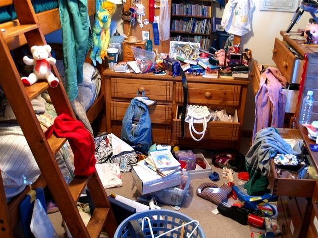
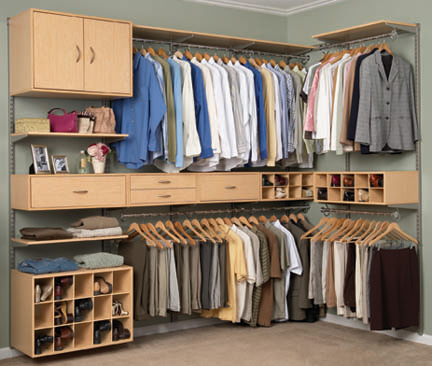
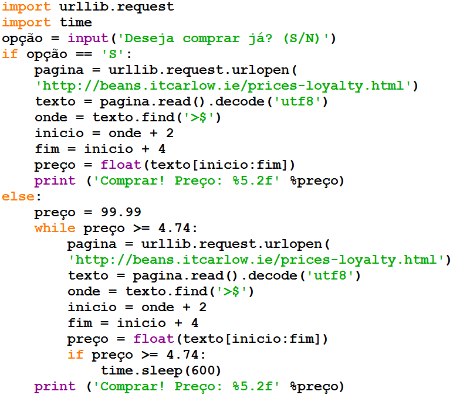
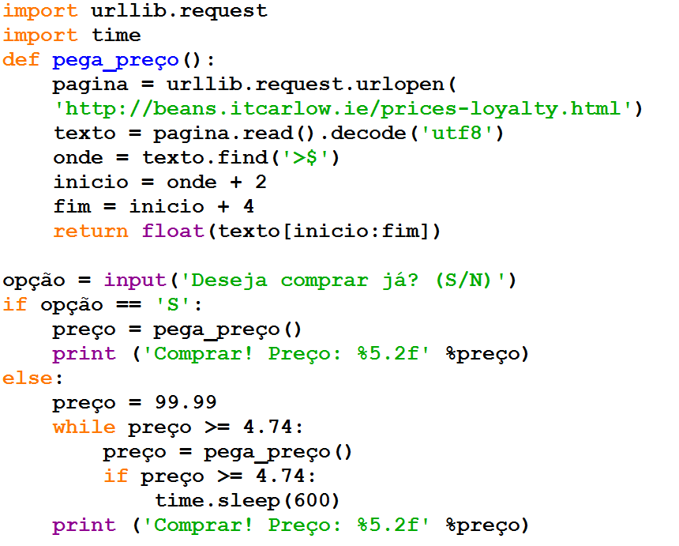
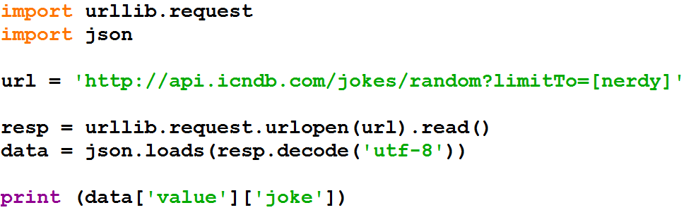

===============
Revisão Funções
===============

<número>

Sejamos mais organizados
========================

Sejamos mais organizados
========================

Sejamos organizados
===================

+ Quando os programas crescem, geralmente o código fica mais complexo
+ Uma forma de gerenciar essa complexidade é usar funções
+ Elas permitem separar ações comuns, assim seu código fica mais fácil
  de ler e mais fácil de manter

O Starbuzz está sem grãos
=========================

+ O diretor da Starbuzz quer uma opção para compra rápida, sem esperar
  abaixar o preço
+ Ao rodar o programa irei perguntar se quer comprar já ou não
+ Se o usuário responder sim, então irei pegar o preço atual e comprar
+ Caso negativo, irei esperar abaixar para menos que 4.74

Sugestão de novo programa
=========================

Programa feio...
================

+ Não duplique seu código...
+ Isso leva ao excesso de código, tornando a manutenção do seu código
  difícil
+ Procure reutilizar seu código
+ Definindo funções faremos reuso de código
+ Qual é a diferença?
+ Se eu tiver que mudar algo, irei alterar em apenas um lugar

Funções
=======

+ Funções são códigos compartilháveis
+ Defino um nome e chamo a função ao longo do programa
+ A função deve ser definida antes de você chamá-la
+ Se você quiser retornar um valor para quem chamou a função deverá
  utilizar o comando return

Não existem perguntas idiotas
=============================

+ O comando return é igual ao print? Não, print exibe algo na tela,
  enquanto return devolve um valor para quem chamou a função.
+ Se eu não der return dentro da função, o que ela retorna? None
+ Return sempre deve vir no final da função? Nem sempre, depende da
  lógica da função
+ Uma função pode devolver mais de um valor? Sim, inclusive listas ou
  dicionários.

+ `http://json.org/`_
+ Independente de linguagem
+ Pares nome/valor
+ Lista ordenada
+ Muito adotado atualmente
+ Alternativa para o XML

  +

    + –XML mais verbosa
    + –XML menor legibilidade

.. _/: http://json.org/

