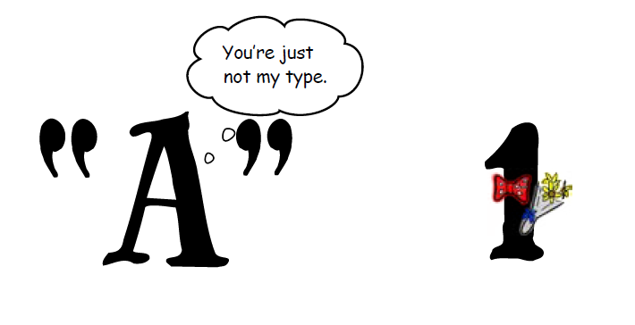

============================
Variables y entrada de datos
============================

Primer programa
=================

.. code-block:: python

    >>> print ("¡hola mundo!")
    ¡hola mundo!

+ Este programa tiene solo una línea de código
+ Tenga en cuenta que las comillas no aparecen en la salida
+ Necesitamos marcar o limitar el comienzo y el final de nuestros mensajes 
  con un símbolo, en este caso, las comillas

**¡Ahora inténtelo por su propia cuenta!**

+ Escriba ``print("primer mensaje")`` en el intérprete de abajo y compruebe que recibe la salida de su mensaje sin comillas.

.. only:: html

   .. raw:: html
      :file: _static/interpreter.html

Primer mensaje de error
=========================

+ Las letras mayúsculas y minúsculas son diferentes
+ ``print()`` es diferente de ``Print()``

.. code-block:: python

    >>> Print ("¡hola mundo!")
    Traceback (most recent call last):
      File "<stdin>", line 1, in <module>
    NameError: name 'Print' is not defined

**¡Ahora inténtelo por su propia cuenta!**

.. raw:: html
   :file: _static/interpreter.html

+ Si no usamos comillas, la computadora interpretará nuestro mensaje
  como un comando de Python, generando un error de sintaxis
+ ``"hola mundo"`` es diferente de ``hola mundo``

.. code-block:: python

    >>> print (hola mundo)
      File "<stdin>", line 1
        print (hola mundo)
                        ^
    SyntaxError: invalid syntax

**¡Ahora inténtelo por su propia cuenta!**

.. only:: html

   .. raw:: html
      :file: _static/interpreter.html

+ En la versión de Python que usamos (Python 3), los paréntesis no son opcionales al usar ``print()``
+ ``print("hola mundo")`` es diferente de ``print "hola mundo"``

.. code-block:: python

    >>> print "hola mundo"
      File "<stdin>", line 1
        print "hola mundo"
              ^
    SyntaxError: missing parenthesis in call to 'print'

**¡Ahora inténtelo por su propia cuenta!**

.. only:: html

   .. raw:: html
      :file: _static/interpreter.html

+ Los espacios iniciales tienen un significado en Python que veremos
  más adelante, en este caso genera nuevamente un error de sintaxis
+ Estos espacios se llaman indentaciones o sangrías

.. code-block:: python

    >>>   print("primer mensaje!")
      File "<stdin>", line 1
        print "hola mundo"
      ^      
    SyntaxError: unexpected indent

**¡Ahora inténtelo por su propia cuenta!**

.. only:: html

   .. raw:: html
      :file: _static/interpreter.html

Intérprete de Python
====================

+ El intérprete es un programa que acepta comandos escritos en Python
  y los ejecuta línea por línea
+ El intérprete verifica que hayamos escrito el programa correctamente,
  mostrando mensajes de error si hay un problema
+ Hay dos modos del intérprete de Python: modo interactivo y edición
+ En los ejemplos anteriores usamos el modo interactivo
+ Una ventaja del modo interactivo es poder probar los comandos y obtener
  la respuesta al instante

Modo de edición
====================

.. activecode:: ac_l05_1
   :nocodelens:

   Intente dar un enter dentro del bloque en modo de edición.
   Note que no sucede nada al escribir enter al final de la línea.
   En modo de edición es necesario "ejecutar" el programa (Para esto presione el botón de Run).
   
   ~~~~
   print("primer mensaje")

Precauciones al escribir programas
==================================

+ Las letras mayúsculas y minúsculas son diferentes
+ Las comillas son muy importantes y no deben pasarse por alto. Cada vez
  que abres comillas, no olvides cerrarlas
+ Los paréntesis no son opcionales en Python. Cada paréntesis abierto debe
  estar cerrado
+ Los espacios son muy importantes. El lenguaje Python se basa en
  cantidad de espacios en blanco antes del comienzo de cada línea para
  realizar diferentes operaciones. Esto se le conoce como indentación.

Calculadora en el intérprete
============================

.. code-block:: python

    >>> 2+3 # No te olvides de dar enter
    5
    >>> 5-3
    2
    >>> 10-4+2
    8
    >>> 2*10 # Asterisco para la multiplicación
    20
    >>> 10/4 # Barra inclinada para la división
    2.5
    >>> 2**3 # Exponenciación
    8
    >>> 10%3 # Residuo de la división (módulo)
    1
    >>> 16%7
    2

**¡Ahora inténtelo por su propia cuenta!**
Escriba estas operaciones en el intérprete y use el modo interactivo como una calculadora

.. only:: html

   .. raw:: html
      :file: _static/interpreter.html

Conceptos sobre variables y asignación
======================================

+ Las variables se utilizan para almacenar valores y nombrar
  un área de la memoria de la computadora
+ El símbolo para la asignación es el igual (``=``)

.. codelens:: cl_l05_1
    
    a = 2
    b = 3
    print(a + b)

+ Como en matemáticas, pasamos parámetros o valores para una función usando paréntesis
+ Una función ``f(x)``, donde ``f`` es el nombre de la función y ``x`` es un parámetro
+ En el ejemplo anterior, ``print`` es el nombre de la función y ``a + b`` el valor pasado como parámetro
+ También podemos usar el modo interactivo **¡Pruebelo aquí!**

.. only:: html

   .. raw:: html
      :file: _static/interpreter.html

+ Las dos primeras líneas no envían nada a la pantalla, así que solo se muestra el resultado de la tercera línea

Otras alternativas
******************

+ Quizás se pregunte ¿por qué creamos dos variables, ``a`` y
  ``b``, para sumar dos números?
+ Podríamos haber logrado el mismo resultado de varias maneras.

.. codelens:: cl_l05_2
    
    print(2 + 3)
    print(5)

+ ¿Cuál es la diferencia entre el primer modo y los dos últimos?
+ El primer caso incluye la lógica que usamos para obtener el
  resultado
+ De este modo, hacemos explícito el algoritmo que utilizamos mentalmente para
  resolver este problema
+ En los últimos dos casos, solo ordenamos a la computadora que imprima
  algo concreto, sin dejar en claro la lógica para llegar a ese resultado

Nombres de variables
====================

+ En Python, los nombres de las variables deben comenzar con un
  letra o guión bajo ``_``
+ ¡Acentos están permitidos!
+ Ejemplo de nombres válidos: ``precio``, ``acción``, ``salario``, ``_x``,
  ``año_2011``, ``salario_promedio``

.. code-block:: python

    >>> a = 2
    >>> precio = 500
    >>> print(a)
    2
    >>> print(precio)
    500

+ Ejemplo de nombres no válidos: ``salario promedio``, ``3x``, ``1er``, ``@``, ``$``

.. code-block:: python

    >>> 3x = "texto"
      File "<stdin>", line 1
        3x = "texto"
        ^
    SyntaxError: invalid syntax

**Defina variables válidas e invalidas a continuación**

.. only:: html

   .. raw:: html
      :file: _static/interpreter.html

Tipos de variables
==================

+ El contenido de una variable tiene un tipo
+ El tipo define la naturaleza de los datos que almacena la variable
+ Los tipos más comunes son los enteros, números de coma flotante y cadenas (texto)
+ Además de poder almacenar números y letras, las variables de Python también almacenan valores como Verdadero y Falso

Variables numéricas
===================

+ Los enteros no tienen decimales: ``42``, ``-7``
+ Los valores del tipo entero en Python se llaman ``int``
+ Los números en coma flotante tienen decimales: ``1.0``, ``3.1415``,
  ``1234.56``
+ Tenga en cuenta que ``1.0``, incluso teniendo cero en la parte decimal, es un número en
  punto flotante
+ Los valores de tipo coma flotante en Python se llaman ``float``.

Representación de valores numéricos
===================================

+ Internamente todos los números son representados con el
  sistema binario
+ Este sistema permite solo los dígitos ``0`` o ``1``
+ Los números en punto flotante pueden no tener una correcta representación
  en el sistema binario
+ Tecleando en el intérprete ``3 * 0.1`` tendremos como respuesta: ``0.30000000000000004``

**¡Pruebelo aquí!**

.. only:: html

   .. raw:: html
      :file: _static/interpreter.html

Variables de tipo lógico
========================

+ Podemos almacenar verdadero y falso 
+ Las variables de este tipo se llaman lógicas o booleanas
+ En Python podemos inicializar variables de este tipo con ``True`` o ``False``
+ Tenga en cuenta que la T y la F están en mayúsculas, cualquier otra forma genera
  un error de sintaxis

Operadores relacionales
=======================

.. table:: **Operadores relacionales**
   :widths: auto

   ======== ============== ==============================
   Operador Operación      Símbolo matemático equivalente
   ======== ============== ==============================
   ==       igual          =
   >        mayor que      >
   <        menor que      <
   !=       diferente      <>
   >=       mayor o igual  >=
   <=       menor o igual  <=
   ======== ============== ==============================

+ Tenga en cuenta que el operador de igualdad son dos iguales (``==``)

Ejemplos:
=========

.. codelens:: cl_l05_3
    
    a = 1
    b = 5
    c = 2
    d = 1
    print(a == b)
    print(b > a)
    print(a < b)
    print(a == d)
    print(b >= a)
    print(c <= b)
    print(d != a)
    print(d != b)

Ejemplo importante
==================

+ >= o <= para valores iguales

.. codelens:: cl_l05_4
    
    print(5 >= 5)
    print(5 <= 5)

Ejemplo
=======

+ Podemos usar operadores relacionales para inicializar variables del
  tipo lógico

.. codelens:: cl_l05_5
    
    nota = 8
    promedio = 6
    aprobado = nota > promedio
    print(aprobado)

Operadores lógicos
==================

+ Tenemos tres operadores básicos: ``not``, ``and`` y ``or``

Uso del operador ``not``
************************

.. codelens:: cl_l05_6
    
    print(not True)
    print(not False)

Uso del operador ``and``
************************

.. codelens:: cl_l05_7
    
    print(True and True)
    print(True and False)
    print(False and True)
    print(False and False)

Uso del operador ``or``
************************

.. codelens:: cl_l05_8
    
    print(True or True)
    print(True or False)
    print(False or True)
    print(False or False)

Expresiones lógicas
===================

+ Podemos combinar los operadores lógicos para formar expresiones lógicas complejas
+ El orden de evaluación es: ``not`` > ``and`` > ``or``. Esto significa que en una 
  expresión se evalúa primero el operador lógico ``not``, después ``and`` y por último ``or``.

Veamos un ejemplo

.. codelens:: cl_l05_9

   print(not False or False and True)
   print(False or True and True)
   print(not False and True or False)

Ejemplo
=======

+ La condición para otorgar un préstamo de compra de una motocicleta son: tener un
  salario mayor que $1,000.00 y ser mayor de 18 años. Compruebe si José puede obtener el
  préstamo

.. codelens:: cl_l05_10
    
    salario = 500.0
    edad = 20
    print(salario > 1000 and edad > 18)

Ejemplo
=======

+ Verifique si un estudiante aprobó dado que obtuvo una puntuación promedio de 5.8 en
  el programa de ejercicios y obtuvo un puntaje promedio de 7 en las pruebas

.. codelens:: cl_l05_11
    
    ep = 5.8
    p = 7
    aprobado = ep >= 6 and p >= 6
    print(aprobado)

Variable String
================

+ Almacene cadenas como nombres y texto en general
+ Llamamos cadenas a una secuencia de símbolos como
  letras, números, signos de puntuación, etc.
+ Para diferenciar sus comandos de una cadena, usamos comillas en
  principio y fin

.. codelens:: cl_l05_12
    
    texto = "Joaquin y Maria comen pan"
    print(texto)

+ Tenga en cuenta que no hay problema al usar espacios para separar palabras
+ Una cadena tiene una longitud asociada
+ Podemos obtener el tamaño a través de la función de ``len`` incorporada en Python

.. codelens:: cl_l05_13
    
    texto = "Joaquin y Maria comen pan"
    print(len(texto))

+ Podemos acceder a los caracteres en la cadena usando un número entero
  para representar su posición en la cadena
+ Este número se llama índice y comenzamos a contar desde cero
+ Accedemos al carácter proporcionando el índice entre corchetes ``[]``

.. codelens:: cl_l05_14
    
    texto = "Joaquin y Maria comen pan"
    print(texto[0])
    print(texto[2])
    print(texto[5])
    print(texto[10])
    print(texto[15])

+ **Precaución**: no podemos acceder a un índice mayor que la cantidad de
  caracteres de cadena

.. codelens:: cl_l05_15
    
    texto = "Juan y Maria comen pan"
    print(texto[22])

Operaciones con strings
=======================

+ Las operaciones básicas son corte, concatenación y composición.
+ La operación corte le permite usar parte de la cadena
+ La operación concatenación en cambio sirve para unir dos o más cadenas
+ Por último la composición se usa mucho cuando enviamos mensajes a la pantalla
  y consiste en usar cadenas como patrones donde podemos insertar datos

Concatenación
=============

.. codelens:: cl_l05_16
    
    a = "Papa"
    b = "cuando nace"
    print(a + b)
    print(a * 3)

Composición
============

+ Unir cadenas múltiples no siempre es práctico
+ Podemos usar marcadores de posición para reemplazar valores dentro de cadenas

.. codelens:: cl_l05_17
    
    edad = 20
    print("Juan tiene %d años" % edad)

+ Los marcadores principales son ``%d`` para números enteros, ``%s`` para
  cadenas y ``%f`` para números de punto flotante
+ % 03d completo con ceros adicionales
+ % 3d significa tres posiciones sin ceros adicionales

.. codelens:: cl_l05_18
    
    edad = 20
    print("[%03d]" % edad)
    print("[%3d]" % edad)

+ ``%5.2f`` significa 5 caracteres en total y 2 decimales

.. codelens:: cl_l05_19
    
    print("$%5.2f pesos" % 23)

f-strings
=========

+ Otra manera de unir cadenas es mediante las f-strings
+ Todo lo que esté entre llaves {} se reemplazará si se definió anteriormente. En el ejemplo .2f significa dos lugares decimales.

.. activecode:: ac_l05_2
   :nocodelens:
   :stdin:

   precio = 10.123
   print(f"El precio es: ${precio:.2f}")

Corte
=====

+ Podemos realizar la operación de corte utilizando ``[indice_comienzo:indice_fin]``

.. codelens:: cl_l05_20
    
    x = "0123456789"
    print(x[0:2])
    print(x[1:2])
    print(x[2:4])
    print(x[0:5])
    print(x[1:8])

+ Podemos omitir índices, sustituyendo el índice correspondiente y
  también podemos tener índices negativos: -1 último, -2 penúltimo

.. codelens:: cl_l05_21
    
    x = "0123456789"
    print(x[:2])
    print(x[4:])
    print(x[4:-1])
    print(x[-4:-1])
    print(x[:])

Cambiar variables a lo largo del tiempo
=======================================

+ Un programa se ejecuta línea por línea.
+ Por lo tanto, las variables pueden cambiar a lo largo de la ejecución de su
  programa

.. codelens:: cl_l05_22
    
    deuda = 0 
    compra = 100
    deuda = deuda + compra
    compra = 200
    deuda = deuda + compra
    compra = 300
    deuda = deuda + compra
    print(deuda)

Prueba de escritorio o simulación
=================================

+ Comprender que el valor de las variables puede cambiar durante la ejecución de
  un programa no es tan natural, pero es fundamental a la hora de programar
+ Un programa no puede leerse como texto, sino con cuidado
  analizando línea por línea
+ Puedes entrenar con lápiz, borrador y papel

Prueba de escritorio o simulación
=================================

.. table:: **Prueba de mesa o simulación**
   :widths: auto

   ====== ====== ====
   deuda  compra Tela
   ====== ====== ====
   -0-    -100-    600
   -100-  -200-
   -300-    300
   600
   ====== ====== ====

No tengas prisa por la prueba de escritorio
===========================================

.. image:: img/TWP05_035.jpeg
   :height: 13.6cm
   :width: 20.42cm
   :align: center
   :alt: 

Entrada de datos
================

+ Hasta ahora nuestros programas han trabajado con valores conocidos.
+ Comenzaremos a obtener los valores durante la ejecución de los programas.

.. activecode:: ac_l05_3
   :nocodelens:
   :stdin:

   nombre = input("Escriba su nombre: ")
   print(f"Hola {nombre}!")

Conversión de entrada de datos
==============================

+ La función ``input`` solo devuelve cadenas
+ Usamos la función ``int()`` y ``float()`` para convertir un valor a un entero o
  a un valor de punto flotante respectivamente

.. activecode:: ac_l05_4
   :nocodelens:
   :stdin:

   valor_unitario = float(input("Valor de una rosquilla: "))
   n = int(input("Número de rosquillas: "))
   print(f"Valor total: ${(n * valor_unitario)}")

Error común
===========

+ Abrir dos paréntesis y cerrar solo uno.
+ Esto mismo nos puede ocurrir con las llaves, corchetes, comillas, entre otros caracteres. ``{}``,``[]``,``""`` siempre que abrimos uno debemos acordarnos de cerrarlo.
+ El error terminará en lo siguiente:

.. code-block:: python

    >>> valor_unitario = float(input("Valor de una rosquilla: ")
    File <string>, line 1
    valor_unitario = float(input("Valor de una rosquilla: ")
                           ^
    SyntaxError: '( was never closed

+ Siempre que la línea parezca correcta, consulte la línea inmediatamente anterior

Lista de Ejercicios
===================

#. Su salario actual es de $6500. Haga un programa que
   calcule su nuevo salario con un aumento del 5%
#. Escriba un programa que muestre su nombre en la pantalla
#. Calcule la suma de tres variables
#. ¿Qué sucede si escribo textos en las tres variables anteriores?
#. Indique el tipo de los siguientes valores: ``5``, ``5.0``, ``4.3``, ``-2``,
   ``100``, ``1.333``, ``"10"``
#. Experimente en el intérprete interactivo de Python utilizar ``type(x)`` donde ``x``
   es cada uno de los valores anteriores
#. ¿Es posible calcular 2 elevado a un millón?

Utilice el intérprete de modo interactivo aquí abajo para solucionar estos ejercicios.

.. only:: html

   .. raw:: html
      :file: _static/interpreter.html

“La vida es como andar en bicicleta. Para mantener el equilibrio, debes seguir moviéndote ”. - Einstein
