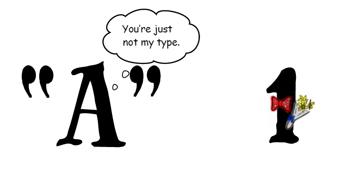

Tipos de variables
==================

+ El contenido de una variable tiene un tipo
+ El tipo define la naturaleza de los datos que almacena la variable
+ Los tipos más comunes son:
    + **Numéricas:** numeros enteros, números de coma flotante.
    + **Cadenas o texto:** poder almacenar números, letras y otros caracteres.
    + **Lógicas:** almacenan valores como Verdadero y Falso.
