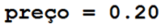
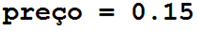

===========
Condiciones
===========

.. image:: img/TWP10_001.jpeg
   :height: 15.125cm
   :width: 9.382cm
   :align: center
   :alt: 

Condiciones
===========

<número>

.. codelens:: Example2_1

        print("¡Bienvenido a mi programa!")
        print("¡Vuelva siempre!")

.. image:: img/TWP10_002.jpg
   :height: 5.524cm
   :width: 22.859cm
   :align: center
   :alt: 

+ Tus programas no siempre serán simples secuencias de comandos

Condiciones
===========

+ “¿Correr o no correr? Esa es la cuestión..."
+ En general no ejecuto todas las líneas del programa
+ Ir a través de las líneas de un programa es como viajar en automóvil en una ciudad
+ Hay puntos donde decidimos qué camino elegir

Condiciones
===========

.. image:: img/TWP10_004.png
   :height: 13.389cm
   :width: 20.001cm
   :align: center
   :alt: 

if
==

+ Lea dos valores enteros e imprima el más grande

.. codelens:: Example2_2

        a = 8
        b = 5
        if a>b:
                print("El primer número es el más grande")
        if b>a:
                print("¡El segundo número es el más grande!")

Dos puntos y sangría
====================

if
==

+ Verificar si un auto es nuevo o viejo
+ Si el auto tiene al menos tres años, es nuevo

.. codelens:: Example2_3

        edad = 10
        if edad <= 3:
                print("Su auto es nuevo")
        if edad > 3:
                print("Su auto es viejo")

if
==

+ Pregunte la velocidad de un automóvil, suponiendo un número entero. Caso
   supera los 110 km / h, muestra un mensaje que dice que el usuario ha sido
   multado En este caso, muestre el monto de la multa, cobrando $5,00 por km
   por encima de 110.

if
==

.. codelens:: Example2_4

        v = 120
        if v > 110:
                print("Usted a sido multado")
                multa = (v-110)*5
                print("Valor de la multa : $ %5.2f " % multa)

else
====

+ ¿Qué hacer cuando la condición if es falsa?
+ Los dos códigos a continuación hacen lo mismo:

.. codelens:: Example2_5

        idade = 1
        if idade <= 3:
                print("Su auto es nuevo")
        if idade > 3:
                print("Su auto es viejo")

.. codelens:: Example2_6

        idade = 6
        if idade <= 3:
                print("Su auto es nuevo")
        else:
                print("Su auto es viejo")

if / else
=========

.. image:: img/TWP10_009.jpg
   :height: 9.754cm
   :width: 22.859cm
   :align: center
   :alt: 

Estructuras anidadas
====================

.. image:: img/TWP10_011.jpg
   :height: 9.754cm
   :width: 22.859cm
   :align: center
   :alt: 

+ Considere la compañía telefónica Bye. Por debajo de 200 minutos, el
   la empresa cobra $ 0,20 por minuto. Entre 200 y 400 minutos, el precio es
   $ 0,18. Por encima de 400 minutos, el precio por minuto es de $ 0,15. Calcular
   tu factura de teléfono

Estruturas anidadas
====================

.. codelens:: Example2_7

        minutos = 800
        if minutos < 200:
                precio = 0.20
        else:
                if minutos <= 400:
                        precio = 0.18
                else:
                        precio = 0.15
        print("Cuenta telefonica : $%6.2f"%(minutos*precio))

Estruturas anidadas
====================

.. image:: img/TWP10_011.jpg
   :height: 10.826cm
   :width: 22.859cm
   :align: center
   :alt: 

.. image:: img/TWP10_013.png
   :height: 0.899cm
   :width: 5.397cm
   :alt: 

Estruturas anidadas
====================

+ 12Modificar el programa de la compañía Tchau para una promoción donde el
   la tarifa es de $ 0.08 cuando usa más de 800 minutos

Estruturas aninhadas
====================

.. codelens:: Example2_8

        minutos = 1000
        if minutos < 200:
                precio = 0.2
        else:
                if minutos <= 400:
                        precio = 0.18
                else:
                        if minutos <= 800:
                                precio = 0.15
                        else:
                                precio = 0.08
        print("Cuenta telefonica : $%6.2f"%(minutos*precio))

elif
====

+ La cláusula elif reemplaza a else y if

.. codelens:: Example2_9

        minutos = 1000
        if minutos < 200:
                precio = 0.2
        elif minutos <= 400:
                precio = 0.18
        elif minutos <= 800:
                precio = 0.15
        else:
                precio = 0.08
        print("Cuenta telefonica : $%6.2f"%(minutos*precio))

Lista de Ejercicios “again”
===========================

.. image:: img/TWP05_041.jpeg
   :height: 12.571cm
   :width: 9.411cm
   :align: center
   :alt: 

+ La vida es como andar en bicicleta. Para mantener el equilibrio, debes seguir moviéndote ”. - Einstein

