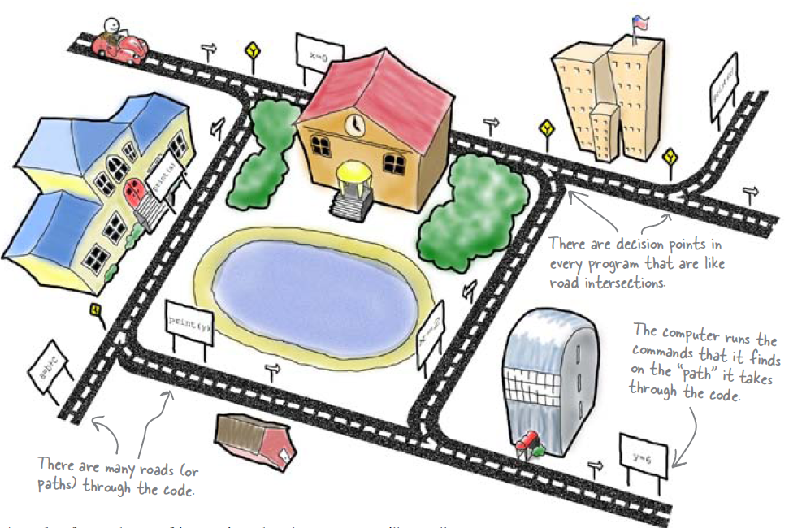
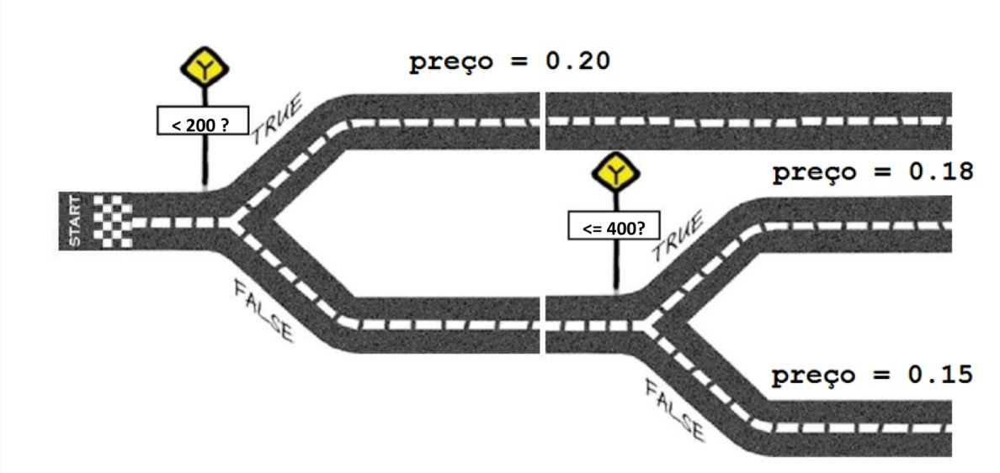

=========
Condições
=========

.. image:: img/TWP10_001.jpeg
   :height: 15.125cm
   :width: 9.382cm
   :align: center
   :alt: 

Condições
=========

.. codelens:: Example2_1

        print("Bem vindo ao meu programa!")
        print("Volte sempre!")

.. image:: img/TWP10_002.jpg
   :height: 5.524cm
   :width: 22.859cm
   :align: center
   :alt: 

+ Seus programas nem sempre serão seqüências simples de comandos

Condições
=========

+ “Executar ou não executar? Eis a questão...”
+ Em geral não executo todas as linhas do programa
+ Passar pelas linhas de um programa é como andar de carro numa cidade
+ Existem pontos onde decidimos qual caminho escolher

Condições
=========

if
==

+ Ler dois valores inteiros e imprimir o maior deles

.. codelens:: Example2_2

        a = 8
        b = 5
        if a>b:
                print("O promeiro numero e o maior!")
        if b>a:
                print("O segundo numero e o maior!")

Dois pontos e identação
=======================

if
==

+ Verificar se um carro é novo ou velho
+ Se o carro tiver pelo menos três anos é novo

.. codelens:: Example2_3

        idade = 10
        if idade <= 3:
                print("Seu carro e novo")
        if idade > 3:
                print("Seu carro e velho")

if
==

+ Pergunte a velocidade de um carro, supondo um valor inteiro. Caso
  ultrapasse 110 km/h, exiba uma mensagem dizendo que o usuário foi
  multado. Neste caso, exiba o valor da multa, cobrando R$ 5,00 por km
  acima de 110.

if
==

.. codelens:: Example2_4

        v = 120
        if v > 110:
                print("Voce foi multado!")
                multa = (v-110)*5
                print("Valor da multa : R$ %5.2f " % multa)

else
====

+ O que fazer quando a condição do if é falsa?
+ Os dois códigos abaixo fazem a mesma coisa:

.. codelens:: Example2_5

        idade = 1
        if idade <= 3:
                print("Seu carro e novo")
        if idade > 3:
                print("Seu carro e velho")

.. codelens:: Example2_6

        idade = 6
        if idade <= 3:
                print("Seu carro e novo")
        else:
                print("Seu carro e velho")

if / else
=========

.. image:: img/TWP10_009.jpg
   :height: 9.754cm
   :width: 22.859cm
   :align: center
   :alt: 

Estrutura aninhadas
===================

+ Considere a empresa de telefonia Tchau. Abaixo de 200 minutos, a
  empresa cobra R$ 0,20 por minuto. Entre 200 e 400 minutos, o preço é
  R$ 0,18. Acima de 400 minutos o preço por minuto é R$ 0,15. Calcule
  sua conta de telefone.

Estruturas aninhadas
====================

.. codelens:: Example2_7

        minutos = 800
        if minutos < 200:
                preco = 0.20
        else:
                if minutos <= 400:
                        preco = 0.18
                else:
                        preco = 0.15
        print("Conta telefonica : R$%6.2f"%(minutos*preco))

Estruturas aninhadas
====================

Estruturas aninhadas
====================

+ Modifique o programa da empresa Tchau para uma promoção onde a
  tarifa é de R$ 0,08 quando você utiliza mais que 800 minutos

Estruturas aninhadas
====================

.. codelens:: Example2_8

        minutos = 1000
        if minutos < 200:
                preco = 0.2
        else:
                if minutos <= 400:
                        preco = 0.18
                else:
                        if minutos <= 800:
                                preco = 0.15
                        else:
                                preco = 0.08
        print("Conta telefonica : R$%6.2f"%(minutos*preco))

elif
====

+ A cláusula elif substitui um par else if

.. codelens:: Example2_9

        minutos = 1000
        if minutos < 200:
                preco = 0.2
        elif minutos <= 400:
                preco = 0.18
        elif minutos <= 800:
                preco = 0.15
        else:
                preco = 0.08
        print("Costa telefonica : R$%6.2f"%(minutos*preco))

Lista de Exercícios “again”
===========================

.. image:: img/TWP05_041.jpeg
   :height: 12.571cm
   :width: 9.411cm
   :align: center
   :alt: 

+ “A vida é como andar de bicicleta. Para manter o equilíbrio, é preciso se manter em movimento”. - Einstein.

Links de Palestras em Vídeo:
============================

.. youtube:: vyRXFoZEaJw
      :height: 315
      :width: 560
      :align: left

.. youtube:: wuX0ImNSWWQ
      :height: 315
      :width: 560
      :align: center

.. youtube:: noGG5WgVdoE
      :height: 315
      :width: 560
      :align: center

.. youtube:: ZOIdBqOdBQA
      :height: 315
      :width: 560
      :align: center

.. youtube:: pjOJYIzvh3w
      :height: 315
      :width: 560
      :align: center

.. youtube:: QHwldWkIJ9o
      :height: 315
      :width: 560
      :align: center

.. disqus::
   :shortname: pyzombis
   :identifier: lecture2