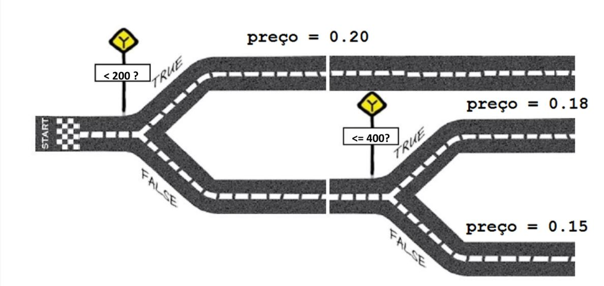

Estructuras anidadas
====================

+ Considere la compañía telefónica "Chao". Por debajo de 200 minutos, la empresa cobra ``$0.20`` por minuto. Entre 200 y 400 minutos, el precio es de ``$0.18``. Por encima de 400 minutos, el precio por minuto es de ``$0.15``. Calcular tu factura de teléfono con estas condiciones.
+ Las condiciones de la compañía, puede verse representado visualmente con la ruta de una carretera como la siguiente imagen.

+ Pueden crearse condiciones anidadas.
+ Recuerda identar las porciones de código que se encuentren anidadas.

.. codelens:: cl_l10_5a

    minutos = 800
    if minutos < 200:
        precio = 0.20
    else:
        if minutos <= 400:
            precio = 0.18
        else:
            precio = 0.15
    print("Cuenta telefonica : $%6.2f" % (minutos * precio))

+ Note la doble identación para cumplir la segunda condición.
+ Ahora modificamos el programa de la compañía "Chao" para una promoción dónde la tarifa es de ``$0.08`` cuando usa más de 800 minutos.

.. codelens:: cl_l10_5b

    minutos = 1000
    if minutos < 200:
        precio = 0.2
    else:
        if minutos <= 400:
            precio = 0.18
        else:
            if minutos <= 800:
                precio = 0.15
            else:
                precio = 0.08
    print("Cuenta telefonica : $%6.2f" % (minutos * precio))

+ Note que las estructuras anidadas pueden crecer.
+ Python dada sus características proporciona la clausula ``elif``.
+ Se utiliza para verificar múltiples condiciones.
