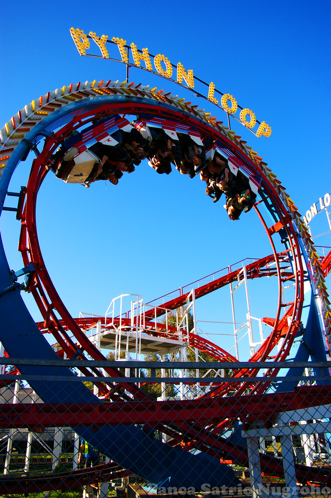

==========
Repetições
==========

.. image:: img/TWP10_001.jpeg
   :height: 14.925cm
   :width: 9.258cm
   :align: center
   :alt: 

Repetições
==========

.. image:: img/TWP15_001.jpg
   :height: 15.602cm
   :width: 16.801cm
   :alt: 

Imprimindo de 1 a 3
===================

+ Forma simples

.. codelens:: Example3_1

        print(1)
        print(2)
        print(3)

+ Usando uma variável

.. codelens:: Example3_2

        x=1
        print(x)
        x=2
        print(x)
        x=3
        print(x)

Imprimindo de 1 a 3
===================

+ Incrementando a variável

.. codelens:: Example3_3

        x=1
        print(x)
        x=x+1
        print(x)
        x=x+1
        print(x)

+ Usando while

.. codelens:: Example3_4

        x=1
        while x <= 3:
        	print(x)
        	x=x+1

Imprimindo de 1 a 3
===================

.. image:: img/TWP15_007.jpg
   :height: 14.804cm
   :width: 22.181cm
   :align: center
   :alt: 

Teste de mesa
=============

.. codelens:: Example3_5

        x=1
        while x <= 3:
        	print(x)
        	x=x+1

Contadores
==========

+ Agora imprima de 1 até um número digitado pelo usuário

.. activecode:: Example3_6
   :nocodelens:
   :stdin:

   fim = int(input("Digite o último número: "))
   x = 1
   while x <= fim:
    print(x)
    x=x+1

Contadores
==========

+ Imprimir os números pares entre 0 e um número fornecido usando if

.. activecode:: Example3_7
   :nocodelens:
   :stdin:

   fim = int(input("Digite o último número: "))
   x = 0
   while x <= fim:
    if x%2 == 0:
    	print(x)
    x=x+1

Contadores
==========

+ Imprimir os números pares entre 0 e um número fornecido sem utilizar
  o if

.. activecode:: Example3_8
   :nocodelens:
   :stdin:

   fim = int(input("Digite o último número: "))
   x = 0
   while x <= fim:
   	print(x)
    x = x+2

Contadores
==========

+ Modifique o programa anterior para imprimir de 1 até o número
  digitado pelo usuário, mas dessa vez apenas os números ímpares
+ Reescreva o programa anterior para escrever os 10 primeiros
  múltiplos de 3

Acumuladores
============

+ A diferença entre um contador e um acumulador é que nos contadores o
  valor adicionado é constante e, nos acumuladores, variável
+ Cálculo da soma de dez números inteiros

.. activecode:: Example3_9
   :nocodelens:
   :stdin:
    
   n = 1
   soma = 0
   while n <= 10:
   	x = int(input("Digite o %d número: " %n))
   	soma = soma + x
   	n = n + 1
   print("Soma: %d" %soma)

Acumuladores
============

+ Calcule a média de 10 números inteiros

.. activecode:: Example3_10
   :nocodelens:
   :stdin:

   n = 1
   soma = 0
   while n <= 10:
    x = int(input("Digite o %d número: " %n))
    soma = soma + x
    n = n + 1
   print("Soma: %5.2f" %(soma/n))

Acumuladores
============

+ Calcule o fatorial de dez

.. codelens:: Example3_11

        i = 1
        fat = 1
        while i <= 10:
        	fat = fat*i
        	i = i+1
        print("Fat(10) = %d" %fat)

Acumuladores
============

+ Calcule o fatorial de um número inteiro n

.. activecode:: Example3_12
   :nocodelens:
   :stdin:

   i = 1
   fat = 1
   n = int(input("Digite n: "))
   while i <= n:
    fat = fat*i
    i = i+1
   print("Fat(%d) = %d" %(n,fat))

Interrompendo a repetição
=========================

+ Calcule a soma de números inteiros até ser digitado zero

.. activecode:: Example3_13
   :nocodelens:
   :stdin:

   soma = 0
   while True:
    x = int(input("Digite o número (0 sai): "))
    if x == 0:
    	break
    soma = soma + x
   print("Soma: %d" %soma)

Interrompendo a repetição
=========================

+ Calcule a média de números até ser digitado zero

.. activecode:: Example3_14
   :nocodelens:
   :stdin:

   soma = 0
   n = 0
   while True:
   	x = int(input("Digite o número (0 sai): "))
	if x == 0:
		break
	else:
		n = n+1
	soma = soma + x
   print("Média: %5.2f" %(soma/n))

Repetições aninhadas
====================

+ Imprima as tabuadas de 1 a 10

.. activecode:: Example3_15
   :nocodelens:
   :stdin:

   tabuada = 1
   while tabuada <= 10:
   		n = 1
   		print("Tabuada %d" %tabuada)
   		while  n <= 10:
   			print("%d x %d = %d" %(tabuada,n,tabuada*n))
   			n = n + 1
   		tabuada = tabuada + 1 

Lista de Exercícios “again”
===========================

.. image:: img/TWP05_041.jpeg
   :height: 12.571cm
   :width: 9.411cm
   :align: center
   :alt: 

+ “A vida é como andar de bicicleta. Para manter o equilíbrio, é preciso se manter em movimento”. - Einstein.

Links de Palestras em Vídeo:
============================

.. youtube:: ef9LpwS-UHk
      :height: 315
      :width: 560
      :align: center

.. youtube:: w_1WhWzCnhk
      :height: 315
      :width: 560
      :align: center

.. youtube:: a8uN4Sxxih4
      :height: 315
      :width: 560
      :align: center

.. youtube:: bnUiJhfgzHk
      :height: 315
      :width: 560
      :align: center

.. youtube:: 1i9w5Sbuylc
      :height: 315
      :width: 560
      :align: center

.. youtube:: viLE8vc9XH8
      :height: 315
      :width: 560
      :align: center

.. youtube:: HmS66jBu_po
      :height: 315
      :width: 560
      :align: center

.. youtube:: 7hfRJPKOlo8
      :height: 315
      :width: 560
      :align: center

.. youtube:: Xa_sl8Ttp1A
      :height: 315
      :width: 560
      :align: center

.. disqus::
   :shortname: pyzombis
   :identifier: lecture3