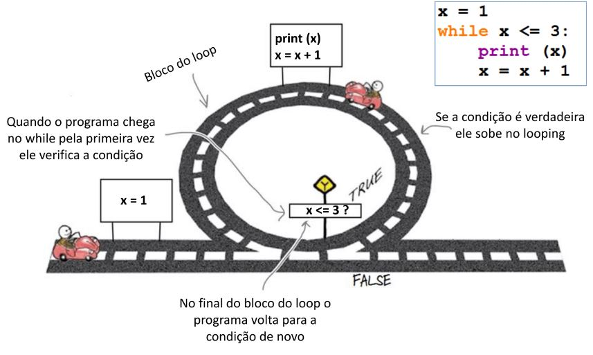

Printing from 1 to 3
====================

Simple way
**********

.. codelens:: cl_l15_2a_en

   print(1)
   print(2)
   print(3)

Using a variable
*****************

.. codelens:: cl_l15_2b_en

   x = 1
   print(x)
   x = 2
   print(x)
   x = 3
   print(x)

Incrementing the variable
**************************

.. codelens:: cl_l15_2c_en

   x = 1
   print(x)
   x = x + 1
   print(x)
   x = x + 1
   print(x)

Using ``while``
****************

.. codelens:: cl_l15_2d_en

   x = 1
   while x <= 3:
       print(x)
       x = x +1

Desk checking
-------------

.. code-block:: python

   x = 1
   while x <= 3:
       print(x)
       x = x + 1

.. table:: **Desk checking**
   :widths: auto
   :align: left

   ====== ========
     x    Screen
   ====== ========
   -1-    1
   -2-    2
   -3-    3
   4
   ====== ========

.. codelens:: cl_l15_2e_en

   x = 1
   while x <= 3:
       print(x)
       x = x + 1