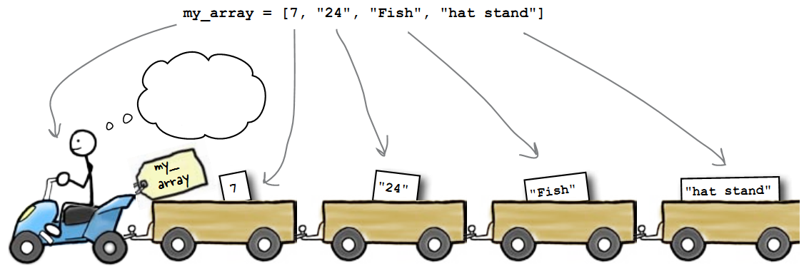
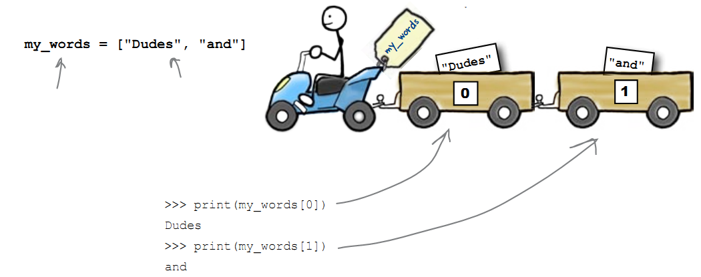
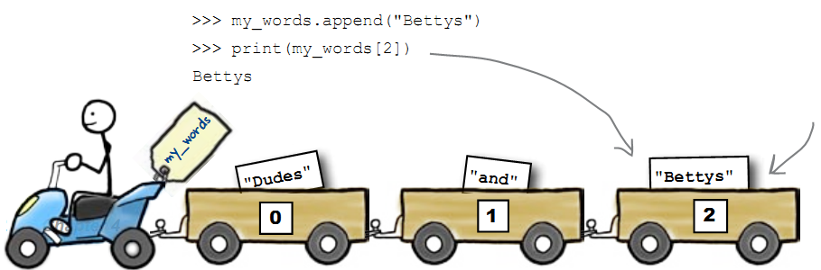

======
Listas
======

.. image:: img/TWP10_001.jpeg
   :height: 14.925cm
   :width: 9.258cm
   :align: center
   :alt: 

.. youtube:: IKbN7PnFqTQ
      :height: 315
      :width: 560
      :align: center

Edifício
========

+ Edifício de apartamentos

.. codelens:: Example4_1

        edifício_térreo = "Família Souza"
        edifício_1o_andar = "Família Brito"
        edifício_2o_andar = "Sr Jorge"
        edifício_3o_andar = "Família Tanaka"

Edifício
========

+ Podemos associar o térreo ao andar zero, o primeiro é o andar 1 e
  assim por diante

.. codelens:: Example4_2

        edifício = ["Família Souza","Família Brito","Sr Jorge","Família Tanaka"]
        print(edifício[0])
        print(edifício[1])
        print(edifício[2])
        print(edifício[3])

Trem de dados
=============

Trem de dados
=============

+ O trem de dados my_array é uma única variável

Posso engatar vagões
====================

+ Como posso acrescentar um vagão com "Bettys"?

Posso engatar vagões com append
===============================

Listas
======

+ Uma lista vazia

.. codelens:: Example4_3

        lista = []

+ Uma lista com três notas

.. codelens:: Example4_4

        notas = [7.5,9,8.3]

+ Acessando uma nota

.. codelens:: Example4_5

        notas = [7.5,9,8.3]
        print(notas[0])

+ Mudando a primeira nota

.. codelens:: Example4_6
         
        notas = [7.5,9,8.3]
        notas[0] = 8.7
        print(notas[0])

Listas
======

+ Calcule a média de 5 notas

.. codelens:: Example4_7

        notas = [6,7,5,8,9]
        soma = 0
        x = 0
        while x < 5:
         soma += notas[x]
         x+=1
        print("Média : %5.2f" %(soma/x))

+ Obs : x+=1 é o mesmo que x = x + 1 

.. youtube:: 5fnldRu9D8I
      :height: 315
      :width: 560
      :align: center

Listas
======

+ Faça um programa que leia um vetor de 5 números inteiros e mostre o
  vetor

.. activecode:: Example4_8
   :nocodelens:
   :stdin:

   vector = []
   i = 1
   while i <= 5:
      n = int(input("Digite um número: "))
      vector.append(n)
      i = i + 1
   print("Vector lido :", vector)

.. youtube:: n4wutespgbM
      :height: 315
      :width: 560
      :align: center

Listas
======

+ Faça um programa que leia um vetor de dez números reais e mostre-os
  na ordem inversa

.. activecode:: Example4_9
   :nocodelens:
   :stdin:

   vector = []
   i = 1
   while i <= 10:
      n = float(input("Digite um número: "))
      vector.append(n)
      i += 1
   i = 9
   while i >= 0:
      print(vector[i])
      i -= 1

.. youtube:: _ezpAhoU5B4
      :height: 315
      :width: 560
      :align: center

Listas
======

+ Faça um programa que leia quatro notas, mostre as notas e a média na
  tela

.. activecode:: Example4_10
   :nocodelens:
   :stdin:

   notas = []
   i = 1
   while i <= 4:
      n = float(input("Nota: "))
      notas.append(n)
      i += 1
   soma = 0
   i = 0
   while i <= 3:
      soma += notas[i]
      i += 1
   print("Notas:",notas)
   print("Média : %4.2f" %(soma/4))

.. youtube:: f0tF-EIl3Mk
      :height: 315
      :width: 560
      :align: center

Listas
======

+ Outra forma de fazer o mesmo

.. activecode:: Example4_11
   :nocodelens:
   :stdin:

   notas = []
   i = 1
   soma = 0
   while i <= 4:
      n = float(input("Nota: "))
      notas.append(n)
      soma += n
      i += 1
   print("Notas:",notas)
   print("Média : %4.2f" %(soma/4))

Listas
======

+ Faça um Programa que leia um vetor de 10 caracteres minúsculos, e
  diga quantas consoantes foram lidas.

.. activecode:: Example4_12
   :nocodelens:
   :stdin:

   letras = []
   i = 1
   while i <= 10:
      letras.append(input("Letra: "))
      i+=1
   i = 0
   cont = 0
   while i <= 9:
      if letras[i] not in "aeiou":
         cont += 1
      i += 1
   print("Foram lidos %d consoantes" %cont)

.. youtube:: tO8CsxgBn1g
      :height: 315
      :width: 560
      :align: center

Lista de Exercícios “again”
===========================

.. image:: img/TWP05_041.jpeg
   :height: 12.571cm
   :width: 9.411cm
   :align: center
   :alt: 

+ “A vida é como andar de bicicleta. Para manter o equilíbrio, é preciso se manter em movimento”. - Einstein.

.. disqus::
   :shortname: pyzombis
   :identifier: lecture4

