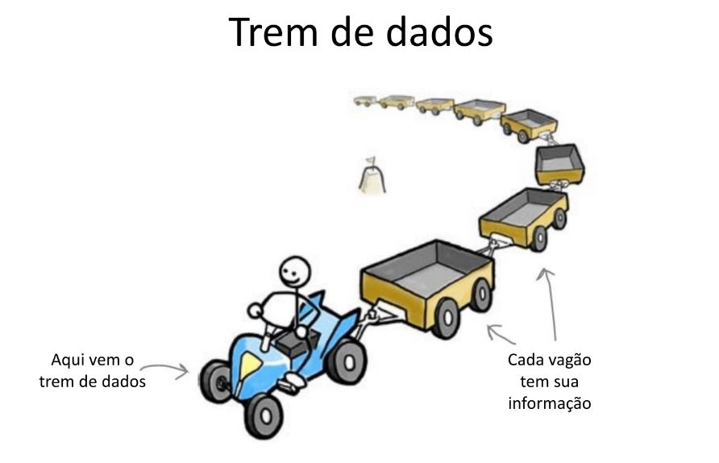

======
Listas
======

.. image:: img/TWP10_001.jpeg
   :height: 14.925cm
   :width: 9.258cm
   :align: center
   :alt: 

Edificio
========

+ Edificio de apartamentos

.. codelens:: Example4_1

        edifício_térreo = "La Familia Souza"
        edifício_1o_andar = "La Familia Brito"
        edifício_2o_andar = "El Sr Jorge"
        edifício_3o_andar = "La Familia Tanaka"

Edificio
========

+ Podemos asociar la planta baja con la planta baja, la primera es la planta 1 y
  etc.

.. codelens:: Example4_2

        edificio = ["La Familia Souza","La Familia Brito","El Sr Jorge","La Familia Tanaka"]
        print(edificio[0])
        print(edificio[1])
        print(edificio[2])
        print(edificio[3])

Tren de datos
=============

Tren de datos
=============

+ El tren de datos my_array es una variable única

Puedo enganchar vagones
=======================

+ ¿Cómo puedo agregar un vagón con "Bettys"?

Puedo conectar los vagones con agregar
======================================

Listas
======

+ Una lista vacia

.. codelens:: Example4_3

        lista = []

+ Una lista con tres notas.

.. codelens:: Example4_4

        notas = [7.5,9,8.3]

+ Accediendo a una nota

.. codelens:: Example4_5

        notas = [7.5,9,8.3]
        print(notas[0])

+ Cambiar la primera nota

.. codelens:: Example4_6
         
        notas = [7.5,9,8.3]
        notas[0] = 8.7
        print(notas[0])

Listas
======

+ Promedio de 5 notas

.. codelens:: Example4_7

        notas = [6,7,5,8,9]
        suma = 0
        x = 0
        while x < 5:
         suma += notas[x]
         x+=1
        print("Media : %5.2f" %(suma/x))

+ Nota: x + = 1 es lo mismo que x = x + 1

Listas
======

+Haga un programa que lea un vector de 5 números enteros y muestre
 vector

.. activecode:: Example4_8
   :nocodelens:
   :stdin:

   vector = []
   i = 1
   while i <= 5:
      n = int(input("Ingrese un numero: "))
      vector.append(n)
      i = i + 1
   print("Vector de lectura :", vector)

Listas
======

+ Haga un programa que lea un vector de diez números reales y los muestre
  en orden inverso

.. activecode:: Example4_9
   :nocodelens:
   :stdin:

   vector = []
   i = 1
   while i <= 10:
      n = float(input("Ingrese un numero: "))
      vector.append(n)
      i += 1
   i = 9
   while i >= 0:
      print(vector[i])
      i -= 1

Listas
======

+ Haga un programa que lea cuatro notas, muestre las notas y el promedio en
  pantalla

.. activecode:: Example4_10
   :nocodelens:
   :stdin:

   notas = []
   i = 1
   while i <= 4:
      n = float(input("Nota: "))
      notas.append(n)
      i += 1
   suma = 0
   i = 0
   while i <= 3:
      suma += notas[i]
      i += 1
   print("Notas:",notas)
   print("Media : %4.2f" %(suma/4))

Listas
======

+ Otra forma de hacer lo mismo.

.. activecode:: Example4_11
   :nocodelens:
   :stdin:

   notas = []
   i = 1
   suma = 0
   while i <= 4:
      n = float(input("Nota: "))
      notas.append(n)
      suma += n
      i += 1
   print("Notas:",notas)
   print("Media : %4.2f" %(suma/4))

Listas
======

+ Haga un programa que lea un vector de 10 caracteres en minúscula, y
  diga cuántas consonantes se leyeron.

.. activecode:: Example4_12
   :nocodelens:
   :stdin:

   letras = []
   i = 1
   while i <= 10:
      letras.append(input("Letra: "))
      i+=1
   i = 0
   cont = 0
   while i <= 9:
      if letras[i] not in "aeiou":
         cont += 1
      i += 1
   print("Fueron leídos %d consonantes" %cont)

Lista de Ejercícios “again”
===========================

.. image:: img/TWP05_041.jpeg
   :height: 12.571cm
   :width: 9.411cm
   :align: center
   :alt: 

+ “La vida es como andar en bicicleta. Para mantener el equilibrio, debes seguir moviéndote” - Einstein

