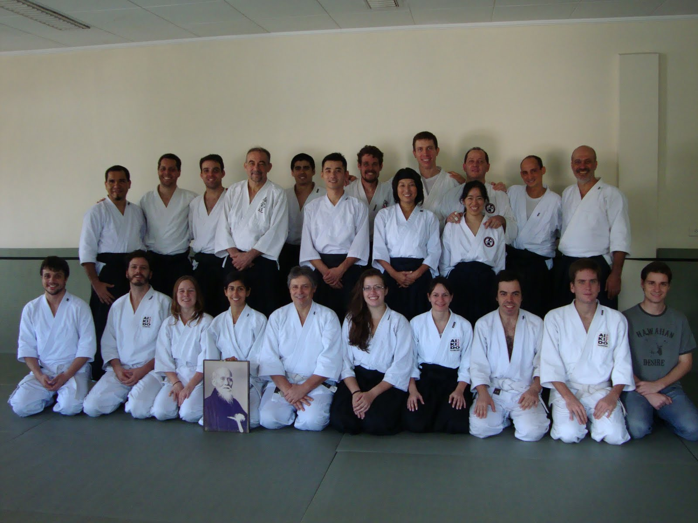
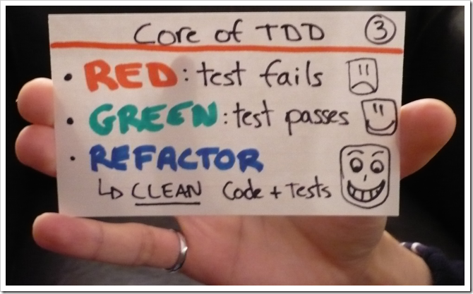
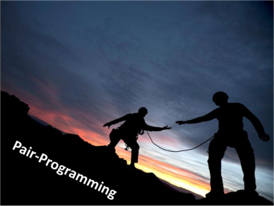

=======
Strings
=======

.. image:: img/TWP10_001.jpeg
    :height: 14.925cm
    :width: 9.258cm
    :align: center
    :alt: 

Comillas de varios tipos.
=========================

+ ¿Puedo usar comillas simples, dobles o triples?

.. codelens:: cl_l18_1
         
    x = 'aguacate'
    print(x)
    y = "McDonald's"
    print(y)
    formulario = """
    <html>
    <head>
        <title> Prueba </title>
    </head>
    <body>
        
Probando

    </body>
    <html>"""

Rebanar
=======

+ Rebanada del primer índice al anterior del segundo

.. codelens:: cl_l18_2
         
    x = "0123456789"
    print(x[0:2])
    print(x[1:2])
    print(x[2:4])
    print(x[0:5])
    print(x[1:8])

Rebanar
========

+ Podemos omitir índices, sustituyendo el extremo correspondiente y
  también podemos tener índices negativos: -1 último, -2 penúltimo

.. codelens:: cl_l18_3
         
    x = "0123456789"
    print(x[:2])
    print(x[4:])
    print(x[4:-1])
    print(x[-4:-1])
    print(x[:])

Incremento en el corte
=======================

+ Puedo usar un incremento al cortar el string

.. codelens:: cl_l18_4
       
    texto = "papa cuando nace"
    print(texto[::2])
    print(texto[::-1])

Incremento en el corte
=======================

+ Comprobar si una palabra es palíndrome

.. activecode:: ac_l18_1
    :nocodelens:
    :stdin:

    palabra = input("Palabra: ")
    if palabra == palabra[::-1]:
        print("%s es palíndrome" % palabra)
    else:
        print("%s no es un palíndrome" % palabra)

String no se puede modificar
============================

.. activecode:: ac_l18_2
    :nocodelens:
    :stdin:

    texto = " Hola mundo!"
    texto[0] = "@"

Puedo crear nuevos strings
==========================

+ Usando la concatenación resolvemos este problema

.. activecode:: ac_l18_3
    :nocodelens:
    :stdin:

    texto = "Hola mundo"
    texto = "@" + texto[1:]
    print(texto)

Concentración
=============

+ Ejemplo de un programa que lee una palabra y reemplaza las vocales por ``"*"``.
  La función ``lower`` transforma las letras en minúsculas.

.. activecode:: ac_l18_4
    :nocodelens:
    :stdin:

    palabra = input("Palabra: ")
    k = 0
    intercambio = ""
    while k < len(palabra):
        if palabra[k].lower() in "aeiou":
            intercambio = intercambio + "*"
        else:
            intercambio = intercambio + palabra[k]
        k += 1
    print("Nueva palabra %s" % intercambio)

.. activecode:: ac_l18_5
    :nocodelens:
    :stdin:
   
    Ahora haga un programa que lea una palabra, la guarde en la variable ``palabra``, 
    y reemplace las consonantes con ``"*"``. Guardar el resultado en la variable ``intercambio``. 
    Puede apoyarse en el programa anterior.
   
    ~~~~
    # Utilice la función input para leer la palabra del usuario.
   
      
    ====
    from unittest.gui import TestCaseGui

    class myTests(TestCaseGui):
        def testOne(self):
            self.assertEqual(
                intercambio,
                "".join(["*" if c.lower() not in "aeiou" else c for c in palabra]),
                "Probando que intercambio esté asignado correctamente",
            )

    myTests().main()
   

Verificación parcial de strings
===============================

.. codelens:: cl_l18_5
         
    archivo = "prog.py"
    print(archivo.startswith("p"))
    print(archivo.endswith("p"))
    contestar = "Si"
    print(contestar.lower())
    print(contestar.upper())
    print(contestar.lower() in "si no yes no")

Funciones ``find`` y ``replace``
================================

.. codelens:: cl_l18_6
         
    s = "un tigre, dos tigres, tres tigres"
    print(s.find("tigre"))
    print(s.find("tigre", 4))
    print(s.find("tigre", 16))
    print(s.replace("tigre", "gato"))
    s = s.replace("tigre", "gato")
    print(s)

Funciones ``split`` y ``join``
==============================

.. codelens:: cl_l18_7
         
    texto = "papa cuando nace"
    print(texto.split())
    fecha = "21/02/2011"
    print(fecha.split("/"))
    ip = "198.188.10.144"
    print(ip.split("."))
    lugares = ["Palmeiras", "Santos", "Corintios"]
    print("/".join(lugares))

Ejercicio
=========

.. activecode:: ac_l18_6
    :nocodelens:
    :stdin:
   
    Haga un programa que solicite la fecha de nacimiento en formato "dd/mm/aaaa" y 
    convierta esta fecha a formato "<día> de <mes> de <año>" usando la lista ``meses`` 
    que ya está escrita. Guardar el resultado en la variable ``fecha_de_nacimiento`` e 
    imprimir esta variable. Recordar que ``.split()`` regresa una lista y se le puede pasar 
    como argumento el caracter con el cual separar un string. Guardar el día, mes y el año en formato de cadena 
    en las variables ``dia``, ``mes`` y ``anio``.
   
    ~~~~
    fecha = input("fecha (dd/mm/aaaa): ").split("/")
    meses = [
        "enero",
        "febrero",
        "marzo",
        "abril",
        "mayo",
        "junio",
        "julio",
        "agosto",
        "septiembre",
        "octubre",
        "noviembre",
        "diciembre",
    ]
    
    ====
    from unittest.gui import TestCaseGui

    class myTests(TestCaseGui):
        def testOne(self):
            self.assertEqual(
                fecha_de_nacimiento,
                "{} de {} de {}".format(dia, meses[int(mes) - 1], anio),
                "Probando que fecha_de_nacimiento esté asignada correctamente",
            )
            self.assertEqual(dia, fecha[0], "Probando que dia esté asignada correctamente")
            self.assertEqual(mes, fecha[1], "Probando que mes esté asignado correctamente")
            self.assertEqual(anio, fecha[2], "Probando que anio esté asignado correctamente")

    myTests().main()

Dojo de codificación
====================

Dojo de codificación
=====================

+ Desarrollo basado en pruebas
+ Pasos de bebé
+ Programación de pares

Desarrollo basado en pruebas
============================

Pasos de bebé
=============

.. image:: img/TWP18_017.jpeg
    :height: 12.624cm
    :width: 17.704cm
    :align: center
    :alt: 

Programación en pareja
======================

