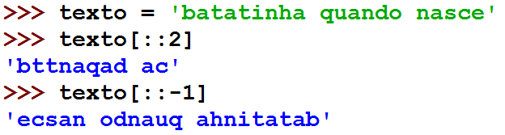
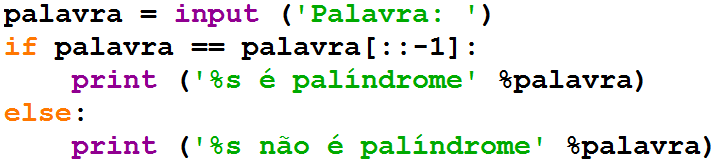

=======
Strings
=======

.. image:: img/TWP10_001.jpeg
   :height: 14.925cm
   :width: 9.258cm
   :alt: 

<número>

Aspas de vários tipos
=====================

+ Posso usar aspas simples, duplas ou triplas

Fatiamento
==========

+ Fatia do primeiro índice até o anterior do segundo

Fatiamento
==========

+ Podemos omitir índices, substituindo pelo extremo correspondente e
  também podemos ter índices negativos: -1 último, -2 penúltimo

Incremento no fatiamento
========================

+ Posso usar um incremento ao fatiar a string

Incremento no fatiamento
========================

+ Verifique se uma palavra é palíndrome

Strings são imutáveis
=====================

Posso criar novas strings
=========================

+ Usando concatenação resolvemos esse problema

Concatenação
============

+ Faça um programa que leia uma palavra e troque as vogais por “*”

Verificação parcial de strings
==============================

find and replace
================

split and join
==============

Exercício
=========

+ Faça um programa que solicite a data de nascimento (dd/mm/aaaa) e
  imprima com o nome do mês por extenso

Coding Dojo
===========

.. image:: img/TWP18_015.jpeg
   :height: 14.251cm
   :width: 19.001cm
   :alt: 

Coding Dojo
===========

+ Desenvolvimento guiado por testes
+ Passos de bebê
+ Pair programming

Desenvolvimento guiado por testes
=================================

.. image:: img/TWP18_016.png
   :height: 11.032cm
   :width: 17.726cm
   :alt: 

Baby Steps
==========

Pair Programming
================

.. image:: img/TWP18_018.png
   :height: 13.711cm
   :width: 18.201cm
   :alt: 

Video Lectures Links:
=====================

.. youtube:: t5sE9ruRHHM
      :height: 315
      :width: 560
      :align: left
.. youtube:: TQkvGiwXhdQ
      :height: 315
      :width: 560
      :align: left
.. youtube:: __OGe-uUBmg
      :height: 315
      :width: 560
      :align: left
.. youtube:: OInhmFfmNXE
      :height: 315
      :width: 560
      :align: left
.. youtube:: zOp-YBp3yzI
      :height: 315
      :width: 560
      :align: left
.. youtube:: DR4CuztiMpY
      :height: 315
      :width: 560
      :align: left

