======================
Arquivos e Dicionários
======================

.. image:: img/TWP10_001.jpeg
   :height: 14.925cm
   :width: 9.258cm
   :alt: 

<número>

+ Até agora nossos dados desapareciam ao sair do IDLE
+ Arquivos servem para armazenamento permanente
+ Um arquivo é uma área em disco onde podemos ler ou gravar
  informações
+ Acessamos o arquivo pelo seu nome
+ Para acessar um arquivo é preciso abri-lo

+ Ao abrir o arquivo informamos seu nome, diretório onde fica (se
  necessário) e que operações iremos executar: leitura e/ou escrita
+ A função que abre os arquivo é open e os modos são: r – leitura, w –
  escrita, a – append, b – binário, + (atualização)
+ Os métodos para ler ou escrever são read e write
+ Os arquivos devem ser fechados com close

+ Caso você execute este programa nada aparecerá na tela
+ Procure no diretório c:\Python3x o arquivo números.txt
+ O modo w cria o arquivo se ele não existir, caso exista ele será
  apagado e reescrito

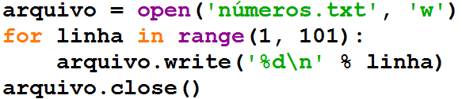

+ readlines gera uma lista onde cada elemento é uma linha lida
+ Arquivos textos são simples e possuem um caracter de controle no
  final para pular linha
+ Se quisermos tirar esse caracter do final podemos usar
  print(linha.rstrip())

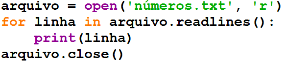

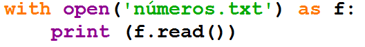

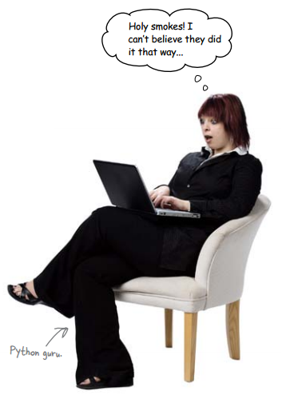

+ Leia mensagem.txt e grave cripto.txt com todas as vogais trocadas
  por ‘*’

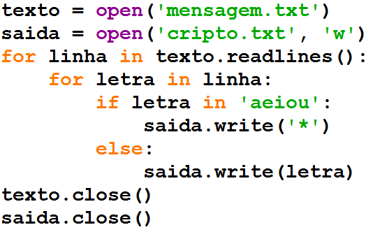

IPS.txt

200.135.80.9

192.168.1.1

8.35.67.74

257.32.4.5

85.345.1.2

1.2.3.4

9.8.284.5

192.168.0.256

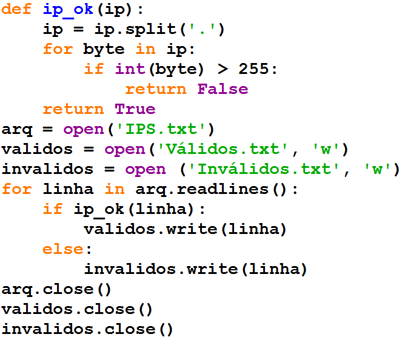

+ Páginas web são escritas em HTML (Hypertext Mark-up Language)
+ Tags HTML começam com < e terminam com >
+ A página web é escrita entre <html> e </html> que é a tag de maior
  nível
+ Normalmente inserimos código javascript
+ Javascript não é um subconjunto de Java

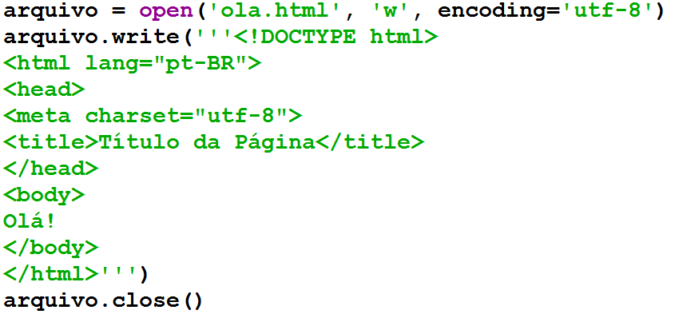

+ O dicionário em si consiste em relacionar uma chave a um valor
  específico
+ Diferentemente das listas, onde o índice é um número, dicionários
  utilizam suas chaves como índice
+ Para adicionar novos elementos não preciso de append, basta fazer a
  atribuição

  +

    + –Se a chave já existe: o valor associado é alterado
    + –Se a chave não existe: a nova chave é adicionada

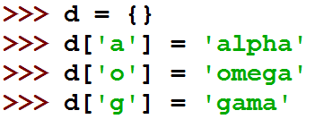

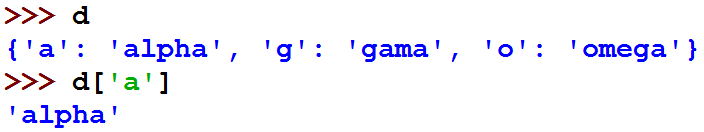

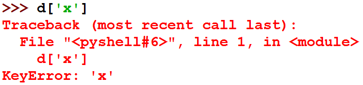

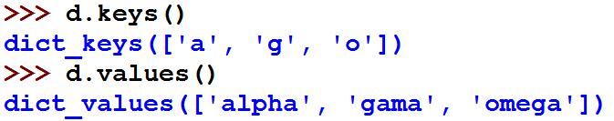

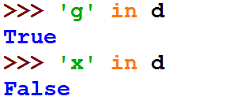

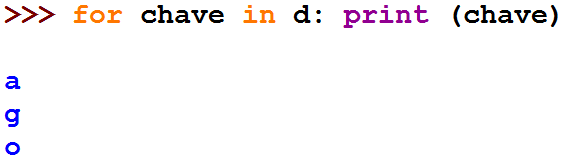

+ Faça um programa que leia o arquivo alice.txt e conte o número de
  ocorrências de cada palavra no texto. Obs.: para saber os caracteres
  especiais use import string e utilize string.punctuation
+ `http://www.gutenberg.org/cache/epub/11/pg11.txt`_

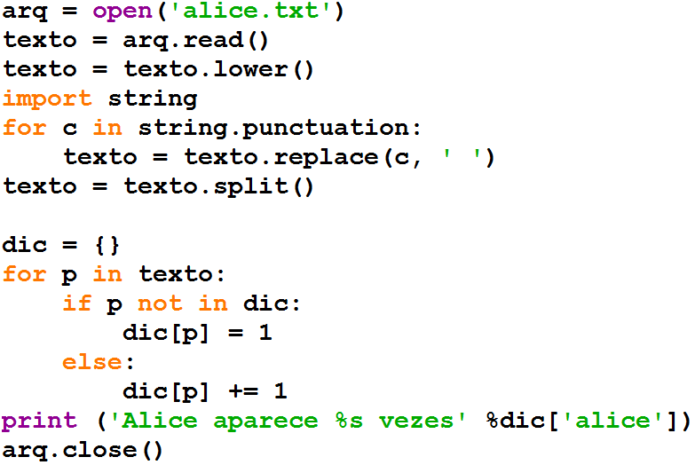

Exercício Programa 1
====================

.. image:: img/TWP05_041.jpeg
   :height: 12.571cm
   :width: 9.411cm
   :alt: 

.. _http://www.gutenberg.org/cache/epub/11/pg11.txt: http://www.gutenberg.org/cache/epub/11/pg11.txt

Video Lectures Links:
=====================

.. youtube:: C9_DTR1lCIs
      :height: 315
      :width: 560
      :align: left
.. youtube:: 5z6zqyeLxjg
      :height: 315
      :width: 560
      :align: left
.. youtube:: iy6lC_n-C8Y
      :height: 315
      :width: 560
      :align: left
.. youtube:: 8LPKBWfGgEM
      :height: 315
      :width: 560
      :align: left
.. youtube:: 6Bez4QcGtak
      :height: 315
      :width: 560
      :align: left
.. youtube:: 9no41i9UDRI
      :height: 315
      :width: 560
      :align: left
.. youtube:: ZhDQIL5bgEU
      :height: 315
      :width: 560
      :align: left
.. youtube:: vvfc3BAbmo0
      :height: 315
      :width: 560
      :align: left

