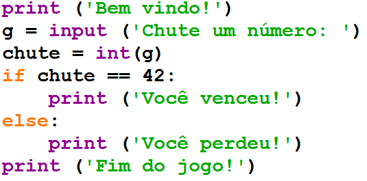
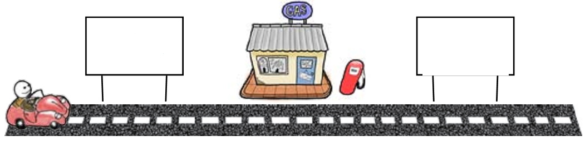
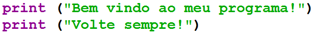
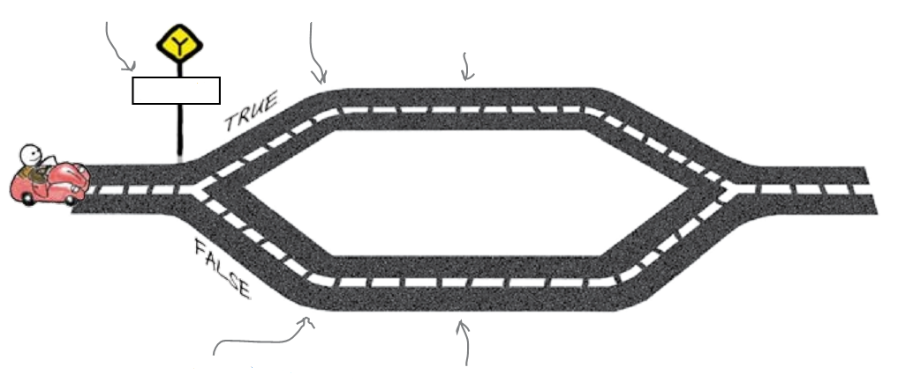
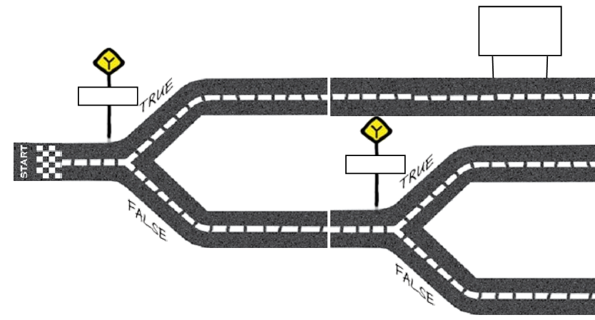
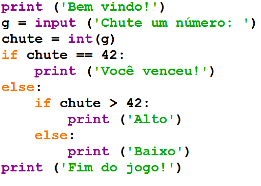
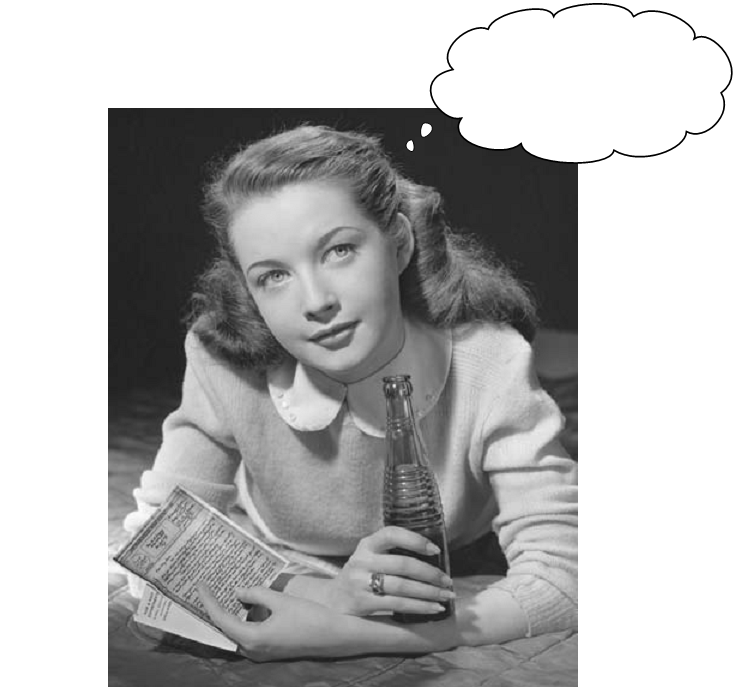
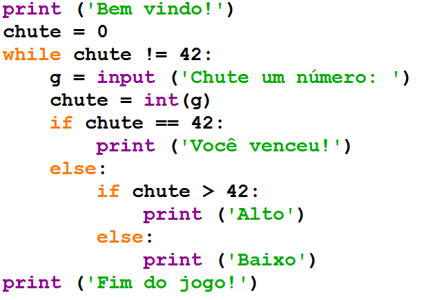
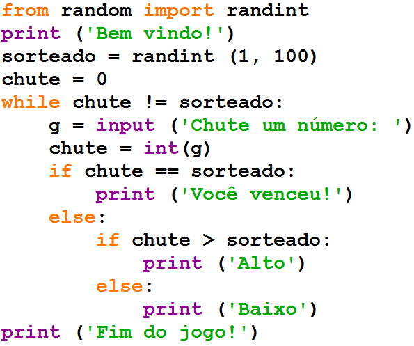

===============
Revisão Geral 1
===============

.. image:: img/TWP10_001.jpeg
   :height: 14.925cm
   :width: 9.258cm
   :alt: 

<número>

Acabamos o primeiro livro
=========================

.. image:: img/TWP30_001.jpeg
   :height: 14.384cm
   :width: 10cm
   :alt: 

Vamos começar o segundo
=======================

.. image:: img/TWP30_002.jpeg
   :height: 13.801cm
   :width: 13.801cm
   :alt: 

O que aprendemos
================

+ Variáveis e entrada de dados
+ Condições
+ Repetições
+ Listas
+ Strings
+ Funções
+ Arquivos
+ Dicionários
+ Classes e Objetos

Agora só faltam seus exercícios
===============================

.. image:: img/TWP05_041.jpeg
   :height: 12.571cm
   :width: 9.411cm
   :alt: 

O que vamos aprender no segundo?
================================

+ As mesmas coisas!
+ Fazendo jogos
+ Acessando sites para ver a cotação do café
+ Usando interfaces gráficas
+ Tratando exceções
+ Usando banco de dados de surfistas
+ Mixando músicas

Encontrando seu caminho
=======================

+ Se você só usar o software dos outros, sempre estará limitado àquilo
  que outras pessoas acham que você deseja fazer
+ Escreva seus próprios programas
+ Você deseja ser programado ou ser o programador?
+ Você pode assumir o controle

Adivinhando números
===================

Adivinhando números
===================

Adivinhando números
===================

Adivinhando números
===================

Adivinhando números
===================

Adivinhando números
===================

Adivinhando números
===================

As partes do seu programa
=========================

+ Funções embutidas (built in functions) são chamadas pelo seu nome e
  exigem parênteses

+ Strings se diferenciam dos comandos do programa por estarem dentro
  de aspas

+ Variáveis controlam dados na memória e possuem tipos diferentes

+ Diretivas são comandos da linguagem

As partes do seu programa
=========================

+ A identação separa blocos de comandos

  +

    + –“Cada um no seu quadrado”

+ Um igual (=) significa atribuição

    + –Ex.: chute = int(g) (chute recebe inteiro de g)

+ Dois iguais (==) significa comparação

    + –Ex.: chute == 42 (chute é igual a 42?)

+ Dois pontos abrem blocos de instruções

    + –Coloque no banheiro, caderno, geladeira:
    + –“Eu amo dois pontos!”

Quais os tipos de erro?
=======================

+ Erros de sintaxe

  +

    + –Uma linguagem de programação é formal, diferente das linguagens
      naturais possui sintaxe rígida

+ Erros em tempo de execução
+ Erros semânticos (mais difíceis de achar)

Como achar e tratar erros?
==========================

+ Sintáticos: muita atenção e prática
+ Em tempo de execução: tratamento de exceções
+ Semânticos: teste de mesa ou simulação

Então, como você executa seu código?
====================================

+ Há duas coisas para executar o programa de adivinhação: um editor e
  um interpretador
+ O editor salva o código escrito em um arquivo no disco

.. image:: img/TWP30_004.png
   :height: 4.867cm
   :width: 10.979cm
   :alt: 

Então, como você executa seu código?
====================================

+ Computadores não podem processar textos pois somente entendem
  binário (zeros e uns)
+ O interpretador transforma o código fonte em um arquivo binário para
  o computador

.. image:: img/TWP30_005.png
   :height: 5.921cm
   :width: 13.2cm
   :alt: 

Então, como você executa seu código?
====================================

+ O interpretador Python atua em dois modos: interativo e edição
+ O modo interativo é ótimo para testar comandos e obter respostas
  instantâneas
+ Porém o modo edição é o mais utilizado para desenvolver os programas

  +

    + –Nomes dos arquivos geralmente terminam com “.py”
    + –Caso utilize outra extensão perderá as cores...

Um programa é mais que uma lista de comandos

O programa é uma rede viária
============================

.. image:: img/TWP10_004.png
   :height: 12.571cm
   :width: 18.78cm
   :alt: 

Na rede você escolhe seu caminho
================================

Dando dicas
===========

+ O programa somente diz se acertou ou não
+ Para ajudar você dirá “Alto” ou “Baixo” caso a pessoa erre
+ Como ficaria a estrada?

Dando dicas
===========

.. image:: img/TWP30_007.png
   :height: 5.137cm
   :width: 10.6cm
   :alt: 

Dando dicas
===========

Os usuários ainda não gostam
============================

Repetições
==========

Repetições
==========

.. image:: img/TWP15_007.png
   :height: 14.804cm
   :width: 22.181cm
   :alt: 

Repetições
==========

Os usuários ainda não gostam
============================

Sortear o número a ser adivinhado
=================================

Agora sim!
==========

Resumo
======

+ Você criou um game!
+ Comandos fazem coisas
+ Desvios decidem coisas
+ Laços repetem coisas
+ As condições ajudam você a decidir se algo é True ou False
+ A atribuição define um nome para um dado

Ferramentas do Python
=====================

+ Desvios if/else
+ Laços while
+ Operador de atribuição =
+ Operador de igualdade ==
+ Operador diferente !=
+ Exibir uma mensagem print
+ Ler a entrada input
+ Converter para inteiro int
+ Sortear um número inteiro randint

Lista VI com testes!
====================

.. image:: img/TWP05_041.jpeg
   :height: 12.571cm
   :width: 9.411cm
   :alt: 

Video Lectures Links:
=====================

.. youtube:: EnRWAg09wKs
      :height: 315
      :width: 560
      :align: left
.. youtube:: c8BEn0WiBpw
      :height: 315
      :width: 560
      :align: left
.. youtube:: e2XxWz37n5M
      :height: 315
      :width: 560
      :align: left
.. youtube:: BxlJpsyIilc
      :height: 315
      :width: 560
      :align: left
.. youtube:: wS9zn6yZY9s
      :height: 315
      :width: 560
      :align: left
.. youtube:: xXWOqrCTDys
      :height: 315
      :width: 560
      :align: left
.. youtube:: iYMDEXWEDxU
      :height: 315
      :width: 560
      :align: left
.. youtube:: a-herW9SXjo
      :height: 315
      :width: 560
      :align: left
.. youtube:: -ePLZkuEQic
      :height: 315
      :width: 560
      :align: left
.. youtube:: 7KaRKhiXrJY
      :height: 315
      :width: 560
      :align: left
.. youtube:: uoDAUDJetA0
      :height: 315
      :width: 560
      :align: left

