.. raw:: html

    
    
    
    

.. role:: red
.. role:: purple
.. role:: green
.. role:: yellow

==================
Revisión general 1
==================

.. image:: img/TWP10_001.jpeg
   :height: 14.925cm
   :width: 9.258cm
   :align: center
   :alt: 

Terminamos el primer libro
==========================

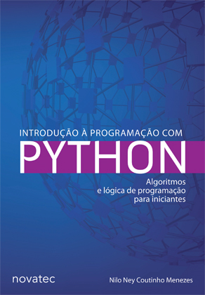

Empecemos el segundo
====================

.. image:: img/TWP30_002.jpeg
   :height: 13.801cm
   :width: 13.801cm
   :align: center
   :alt: 

Lo que aprendemos
=================

+ Variables y entrada de datos
+ Condiciones
+ Repeticiones
+ Listas
+ Strings
+ Funciones
+ Archivos
+ Diccionarios
+ Clases y objetos

Ahora solo faltan tus ejercicios
================================

.. image:: img/TWP05_041.jpeg
   :height: 12.571cm
   :width: 9.411cm
   :align: center
   :alt: 

+ “La vida es como andar en bicicleta. Para mantener el equilibrio, debes seguir moviéndote ”. -Einstein

¿Qué aprenderemos en el segundo?
================================

+ ¡Las mismas cosas!
+ Hacer juegos
+ Acceso a sitios web para ver el precio del café
+ Uso de interfaces gráficas
+ Manejo de excepciones
+ Uso de la base de datos de surfistas
+ Mezcla de canciones

Encontrando tu camino
=====================

+ Si solo usa el software de otros, siempre estará limitado a lo que
  lo que otras personas piensan que quieres hacer
+ Escribe tus propios programas
+ ¿Quieres ser programado o ser el programador?
+ Puedes tomar el control

Adivinhando números
===================

+ **print ()** es una función
+ **'¡Bienvenido!'** es una cadena
+ **g, patada** son variables
+ **if, else** son directivas
+ El espacio que se proporciona después de los dos puntos (:) de la instrucción if, a partir de la cual comienza la instrucción print, se llama sangría
+ **=** es el operador de asignación y se usa para asignar valores a variables
+ **==** es el operador de comparación y se usa para comparar dos variables o valores

.. activecode:: Example9_1
   :nocodelens:
   :stdin:

    print('Bienvenido!')
    g = input('Ingrese un numero: ')
    chute = int(g)
    if chute == 42:
      print('¡Ganaste!')
    else:
      print('¡Tú perdiste!')
    print('¡Fin del juego!')
    

Las partes de tu programa
=========================

+ :purple: `Las funciones incorporadas` se llaman por su nombre y requieren paréntesis

+ :green: las `strings` son diferentes de los comandos del programa porque están dentro de    	comillas

+ :red: los datos de control de `Variables` en memoria y tienen diferentes tipos

+ :yellow: `Directivas` son comandos del lenguaje

Las partes de tu programa
=========================

+ A: red: 'sangría' separa los bloques de comandos

   + "Cada uno en su cuadrado"

+ Un igual (=) significa asignación

   + Ej .: chute = int (g) (chute recibe un entero de g)

+ Dos iguales (==) significa comparación

   + Ej .: patada == 42 (¿la patada es igual a 42?)

+ Los dos puntos abre un bloque de instrucciones

+ Poner en el baño, cuaderno, heladera:
   + "¡Amo dos puntos!"

¿Qué tipos de errores?
=======================

+ Errores de sintaxis

   + Un lenguaje de programación es formal, diferente de los lenguajes naturales, tiene una sintaxis rígida

+ Errores de tiempo de ejecución
+ Errores semánticos (más difíciles de encontrar)

¿Cómo encontrar y manejar errores?
==================================

+ Sintáctica: mucha atención y práctica
+ En tiempo de ejecución: manejo de excepciones
+ Semántica: prueba de escritorio o simulación

Entonces, ¿cómo ejecutas tu código?
===================================

+ Hay dos cosas para ejecutar el programa de adivinación: un editor y
   un intérprete
+ El editor guarda el código escrito en un archivo en el disco

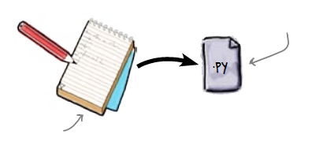

Entonces, ¿cómo ejecutas tu código?
===================================

+ Las computadoras no pueden procesar texto porque solo entienden
   binario (ceros y unos)
+ El intérprete convierte el código fuente en un archivo binario para
   la computadora

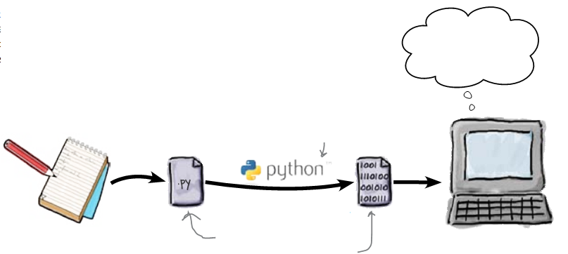

Entonces, ¿cómo ejecutas tu código?
====================================

+ El intérprete de Python funciona en dos modos: interactivo y de edición.

+ El modo interactivo es ideal para probar comandos y obtener respuestas
   instantaneo

+ Sin embargo, el modo de edición es el más utilizado para desarrollar los programas.

   + Los nombres de archivo generalmente terminan con ".py"
   + Si usa otra extensión, perderá colores ...

+ Un programa es más que una lista de comandos

.. codelens:: Example9_2

   print("¡Bienvenido a mi programa!")
   print("¡Vuelva siempre!")
   
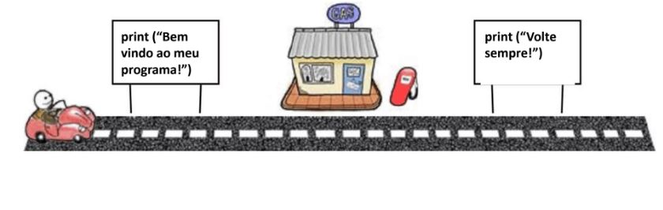

El programa es una red de carreteras.
=====================================

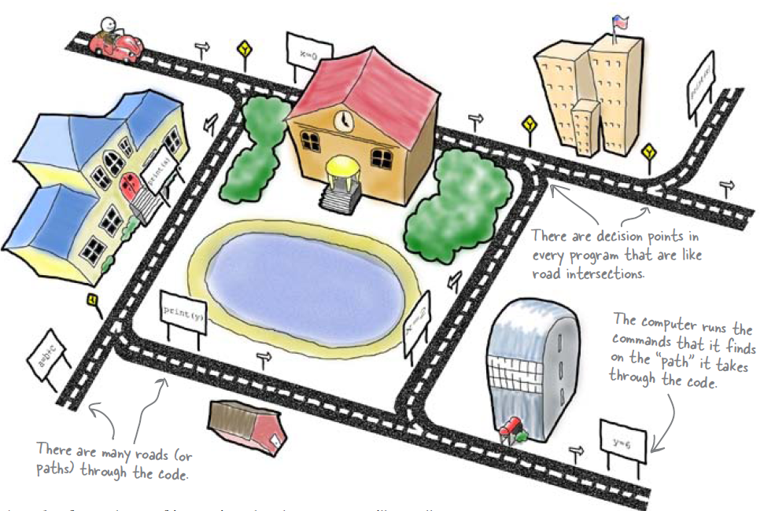

En la red eliges tu camino
==========================

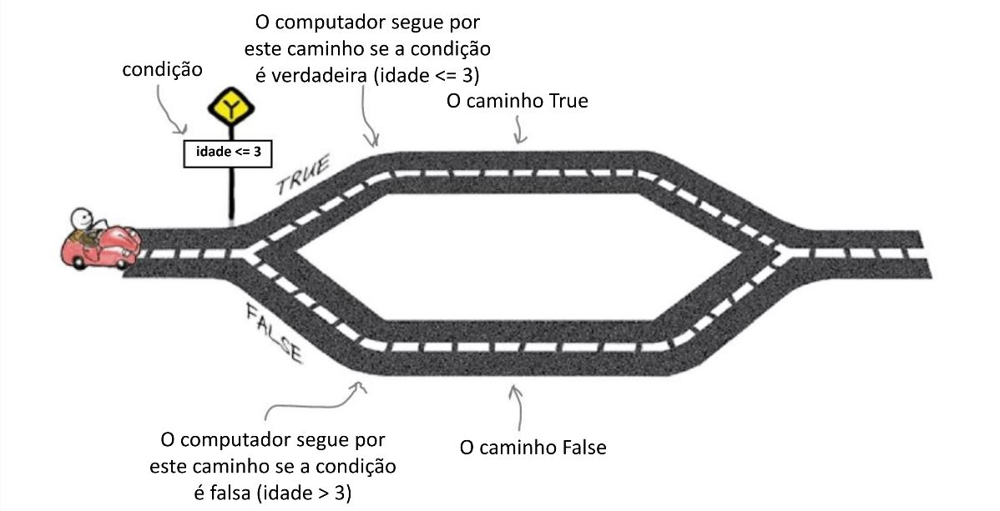

Consejos
========

+ El programa solo dice si lo hiciste bien o no
+ Para ayudarlo a decir "Alto" o "Bajo" si la persona está equivocada
+ ¿Cómo se vería el camino?

Consejos
========

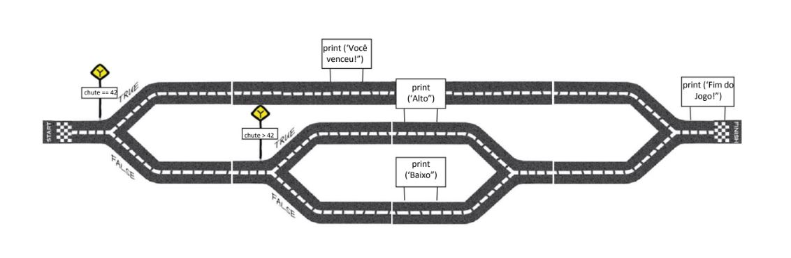

Consejos
===========

.. activecode:: Example9_3
   :nocodelens:
   :stdin:

    print('Bienvenido')
    g = input('Ingrese un numero:')
    chute = int(g)
    if chute == 42:
      print('¡Ganaste!')
    else:
      if chute > 42:
        print('Alto')
      else:
        print('Bajo')
    print('Fin del juego')

+ Use la tecla RETROCESO y la PESTAÑA para ir y venir

A los usuarios todavía no les gusta
===================================

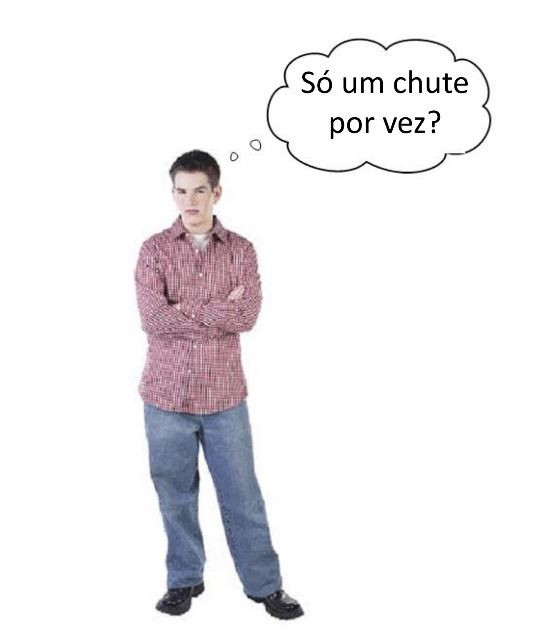

Repeticiones
============

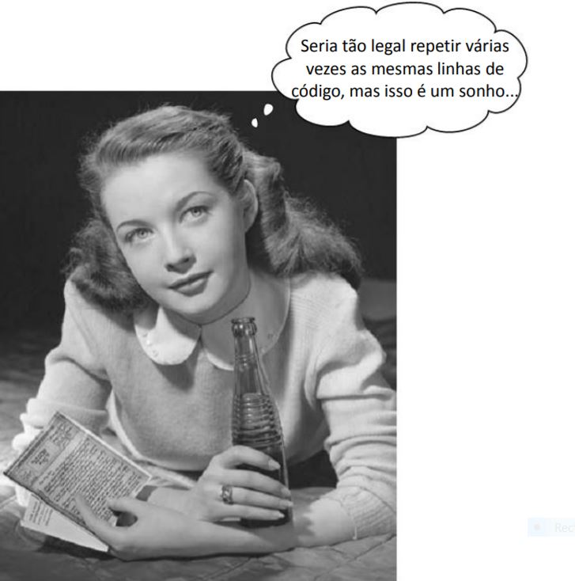

.. activecode:: Example9_4
   :nocodelens:
   :stdin:

    print('¡Bienvenido!')
    chute = 0
    while chute != 42:
      g = input('Ingrese un numero: ')
      chute = int(g)
      if chute == 42:
        print('¡Ganaste!')
      else:
        if chute > 42:
          print('Alto')
        else:
          print('Bajo')
    print('Fin del juego!')

.. image:: img/TWP15_007.jpg
   :height: 14.804cm
   :width: 22.181cm
   :align: center
   :alt: 

A los usuarios todavía no les gusta
====================================

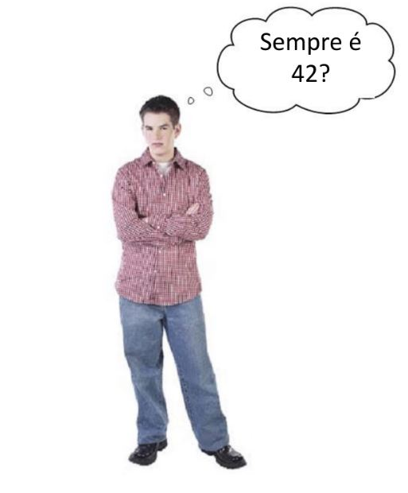

Sortear el número a adivinar
============================

.. activecode:: Example9_5
   :nocodelens:
   :stdin:

    from random import randint
    print('¡Bienvenido!')
    sorteado = randint(1,100)
    chute = 0
    while chute != sorteado:
      g = input('Ingrese un numero: ')
      chute = int(g)
      if chute == sorteado:
        print('¡Ganaste!')
      else:
        if chute > sorteado:
          print('Alto')
        else:
          print('Bajo')
    print('Fin del juego!')

¡Ahora si!
==========

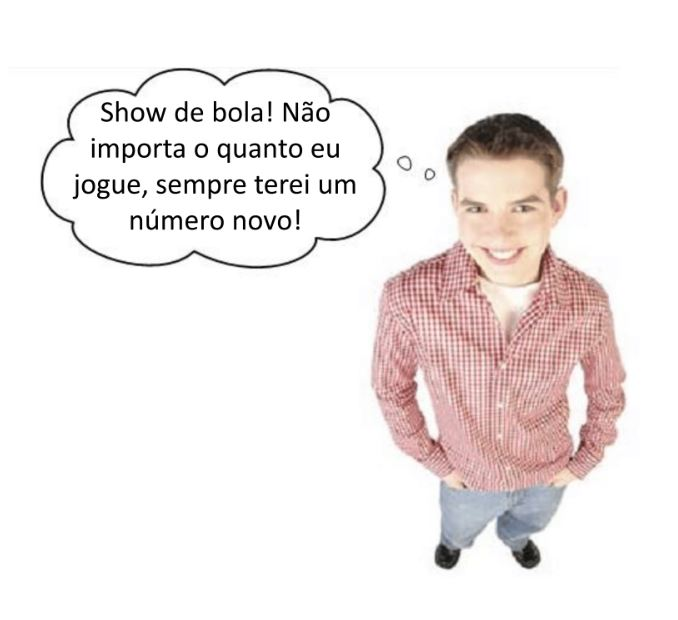

Resumen
=======

+ ¡Creaste un juego!
+ Los comandos hacen cosas
+ Las desviaciones deciden las cosas
+ Corbatas repiten cosas
+ Las condiciones te ayudan a decidir si algo es verdadero o falso
+ La asignación define un nombre para un determinado

Herramientas de Python
======================

+ Desviaciones:yellow: `if / else`
+ Corbatas:yellow: `while`
+ Operador de asignación =
+ Operador de igualdad ==
+ ¡Operador diferente!=
+ Mostrar un mensaje:purple: `print`
+ Lea la entrada:purple: `input`
+ Convertir a entero:purple: `int`
+ Dibuja un entero randint

Lista VI con las pruebas!
=========================

.. image:: img/TWP05_041.jpeg
   :height: 12.571cm
   :width: 9.411cm
   :align: center
   :alt: 

+ “La vida es como andar en bicicleta. Para mantener el equilibrio, debes seguir moviéndote ”. - Einstein

