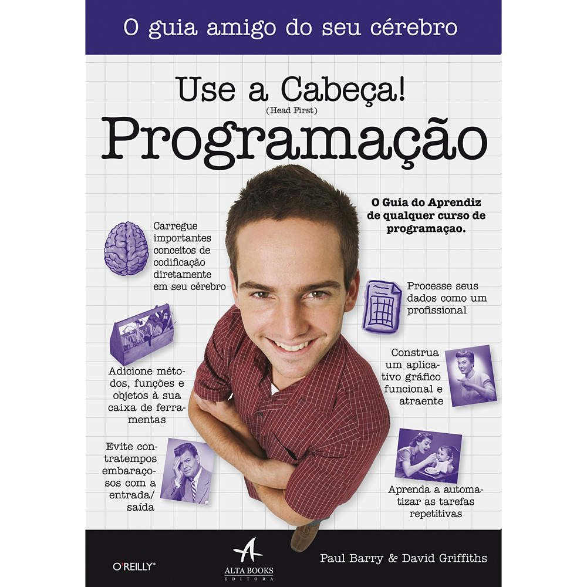
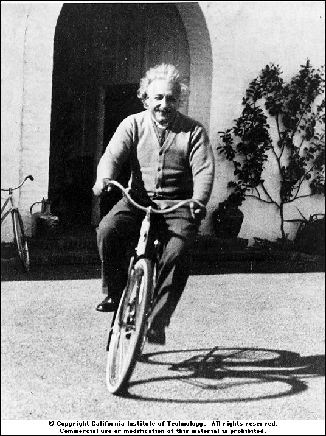

.. raw:: html

    
    
    
    

.. role:: red
.. role:: purple
.. role:: green
.. role:: yellow

===============
Revisão Geral 1
===============

.. image:: img/TWP10_001.jpeg
   :height: 14.925cm
   :width: 9.258cm
   :align: center
   :alt: 

Acabamos o primeiro livro
=========================

.. image:: img/TWP30_001.jpeg
   :height: 14.384cm
   :width: 10cm
   :align: center
   :alt: 

Vamos começar o segundo
=======================

O que aprendemos
================

+ Variáveis e entrada de dados
+ Condições
+ Repetições
+ Listas
+ Strings
+ Funções
+ Arquivos
+ Dicionários
+ Classes e Objetos

Agora só faltam seus exercícios
===============================

+ “A vida é como andar de bicicleta. Para manter o equilíbrio, é preciso se manter em movimento”. - Einstein.

O que vamos aprender no segundo?
================================

+ As mesmas coisas!
+ Fazendo jogos
+ Acessando sites para ver a cotação do café
+ Usando interfaces gráficas
+ Tratando exceções
+ Usando banco de dados de surfistas
+ Mixando músicas

Encontrando seu caminho
=======================

+ Se você só usar o software dos outros, sempre estará limitado àquilo
  que outras pessoas acham que você deseja fazer
+ Escreva seus próprios programas
+ Você deseja ser programado ou ser o programador?
+ Você pode assumir o controle

Adivinhando números
===================

+ **print()** é uma função
+ **'Bem vindo!'** é uma string
+ **g,chute** são variáveis
+ **if,else** são diretivas
+ A lacuna que é fornecida após os dois pontos (:) da instrução if, a partir da qual a instrução print é iniciada, é chamada de recuo
+ **=** é o operador de atribuição e é usado para atribuir valores a variáveis
+ **==** é o operador de comparação e é usado para comparar duas variáveis ​​ou valores

.. activecode:: Example9_1
   :nocodelens:
   :stdin:

    print('Bem vindo!')
    g = input('Chute um número: ')
    chute = int(g)
    if chute == 42:
      print('Você venceu!')
    else:
      print('Você perdeu!')
    print('Fim do jogo!')
    

As partes do seu programa
=========================

+ :purple:`Funções` embutidas (built in functions) são chamadas pelo seu nome e
  exigem parênteses

+ :green:`Strings` se diferenciam dos comandos do programa por estarem dentro
  de aspas

+ :red:`Variáveis` controlam dados na memória e possuem tipos diferentes

+ :yellow:`Diretivas` são comandos da linguagem

As partes do seu programa
=========================

+ A :red:`identação` separa blocos de comandos

  + “Cada um no seu quadrado”

+ Um igual (=) significa atribuição

  + Ex.: chute = int(g) (chute recebe inteiro de g)

+ Dois iguais (==) significa comparação

  + Ex.: chute == 42 (chute é igual a 42?)

+ Dois pontos abrem blocos de instruções

  + Coloque no banheiro, caderno, geladeira:
  + “Eu amo dois pontos!”

Quais os tipos de erro?
=======================

+ Erros de sintaxe

  + Uma linguagem de programação é formal, diferente das linguagens naturais possui sintaxe rígida

+ Erros em tempo de execução
+ Erros semânticos (mais difíceis de achar)

Como achar e tratar erros?
==========================

+ Sintáticos: muita atenção e prática
+ Em tempo de execução: tratamento de exceções
+ Semânticos: teste de mesa ou simulação

Então, como você executa seu código?
====================================

+ Há duas coisas para executar o programa de adivinhação: um editor e
  um interpretador
+ O editor salva o código escrito em um arquivo no disco

.. image:: img/TWP30_004.png
   :height: 4.867cm
   :width: 10.979cm
   :align: center
   :alt: 

Então, como você executa seu código?
====================================

+ Computadores não podem processar textos pois somente entendem
  binário (zeros e uns)
+ O interpretador transforma o código fonte em um arquivo binário para
  o computador

Então, como você executa seu código?
====================================

+ O interpretador Python atua em dois modos: interativo e edição

+ O modo interativo é ótimo para testar comandos e obter respostas
  instantâneas

+ Porém o modo edição é o mais utilizado para desenvolver os programas

  + Nomes dos arquivos geralmente terminam com “.py”
  + Caso utilize outra extensão perderá as cores...

+ Um programa é mais que uma lista de comandos

.. codelens:: Example9_2

   print("Bem vindo ao meu programa!")      
   print("Volte sempre!")      
   

O programa é uma rede viária
============================

.. image:: img/TWP10_004.png
   :height: 12.571cm
   :width: 18.78cm
   :align: center
   :alt: 

Na rede você escolhe seu caminho
================================

Dando dicas
===========

+ O programa somente diz se acertou ou não
+ Para ajudar você dirá “Alto” ou “Baixo” caso a pessoa erre
+ Como ficaria a estrada?

Dando dicas
===========

.. image:: img/TWP30_006.jpg
   :height: 5.814cm
   :width: 10.8cm
   :align: center
   :alt: 

Dando dicas
===========

.. activecode:: Example9_3
   :nocodelens:
   :stdin:

    print('Bem vindo!')
    g = input('Chute um número: ')
    chute = int(g)
    if chute == 42:
      print('Você venceu!')
    else:
      if chute > 42:
        print('Alto')
      else:
        print('Baixo')
    print('Fim do jogo!')

+ Utilize BACKSPACE e TAB para ir e voltar

Os usuários ainda não gostam
============================

.. image:: img/TWP30_009.jpg
   :height: 12.571cm
   :width: 7.946cm
   :align: center
   :alt: 

Repetições
==========

.. activecode:: Example9_4
   :nocodelens:
   :stdin:

    print('Bem vindo!')
    chute = 0
    while chute != 42:
      g = input('Chute um número: ')
      chute = int(g)
      if chute == 42:
        print('Você venceu!')
      else:
        if chute > 42:
          print('Alto')
        else:
          print('Baixo')
    print('Fim do jogo!')

.. image:: img/TWP15_007.jpg
   :height: 14.804cm
   :width: 22.181cm
   :align: center
   :alt: 

Os usuários ainda não gostam
============================

.. image:: img/TWP30_0092.jpg
   :height: 12.571cm
   :width: 7.946cm
   :align: center
   :alt: 

Sortear o número a ser adivinhado
=================================

.. activecode:: Example9_5
   :nocodelens:
   :stdin:

    from random import randint
    print('Bem vindo!')
    sorteado = randint(1,100)
    chute = 0
    while chute != sorteado:
      g = input('Chute um número: ')
      chute = int(g)
      if chute == sorteado:
        print('Você venceu!')
      else:
        if chute > sorteado:
          print('Alto')
        else:
          print('Baixo')
    print('Fim do jogo!')

Agora sim!
==========

.. image:: img/TWP30_012.jpg
   :height: 10.873cm
   :width: 14.154cm
   :alt: 

Resumo
======

+ Você criou um game!
+ Comandos fazem coisas
+ Desvios decidem coisas
+ Laços repetem coisas
+ As condições ajudam você a decidir se algo é True ou False
+ A atribuição define um nome para um dado

Ferramentas do Python
=====================

+ Desvios :yellow:`if/else`
+ Laços :yellow:`while`
+ Operador de atribuição =
+ Operador de igualdade ==
+ Operador diferente !=
+ Exibir uma mensagem :purple:`print`
+ Ler a entrada :purple:`input`
+ Converter para inteiro :purple:`int`
+ Sortear um número inteiro randint

Lista VI com testes!
====================

+ “A vida é como andar de bicicleta. Para manter o equilíbrio, é preciso se manter em movimento”. - Einstein.

Links de Palestras em Vídeo:
============================

.. youtube:: EnRWAg09wKs
      :height: 315
      :width: 560
      :align: center

.. youtube:: c8BEn0WiBpw
      :height: 315
      :width: 560
      :align: center

.. youtube:: e2XxWz37n5M
      :height: 315
      :width: 560
      :align: center

.. youtube:: BxlJpsyIilc
      :height: 315
      :width: 560
      :align: center

.. youtube:: wS9zn6yZY9s
      :height: 315
      :width: 560
      :align: center

.. youtube:: xXWOqrCTDys
      :height: 315
      :width: 560
      :align: center

.. youtube:: iYMDEXWEDxU
      :height: 315
      :width: 560
      :align: center

.. youtube:: a-herW9SXjo
      :height: 315
      :width: 560
      :align: center

.. youtube:: -ePLZkuEQic
      :height: 315
      :width: 560
      :align: center

.. youtube:: 7KaRKhiXrJY
      :height: 315
      :width: 560
      :align: center

.. youtube:: uoDAUDJetA0
      :height: 315
      :width: 560
      :align: center

.. disqus::
   :shortname: pyzombis
   :identifier: lecture9

