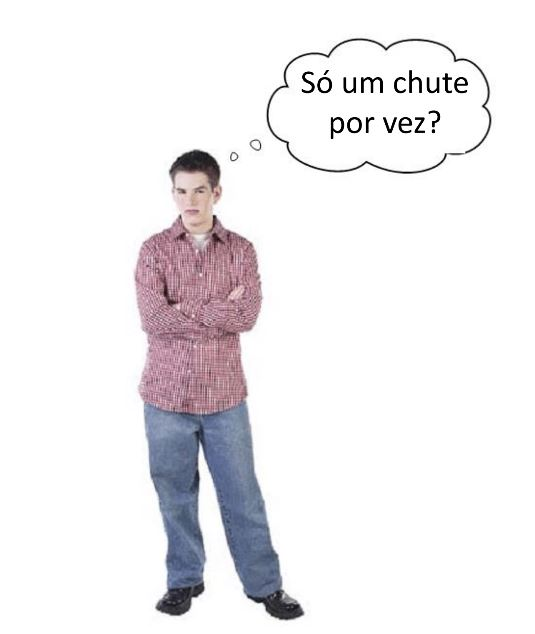

The program is a network of roads
=================================

.. codelens:: cl_l30_4

    print("Welcome to my program!")
    print("Come back anytime!")
   
.. image:: ../img/TWP10_002.jpg
    :height: 5.524cm
    :width: 22.859cm
    :align: center
    :alt: 

.. image:: ../img/TWP10_004.png
    :height: 12.571cm
    :width: 18.78cm
    :align: center
    :alt: 

In the network, you choose your path
-------------------------------------

.. image:: ../img/TWP10_009.jpg
    :height: 9.754cm
    :width: 22.859cm
    :align: center
    :alt: 

Tips
----

+ The guessing game program only tells you if you guessed correctly or not.
+ To help it say "High" or "Low" if the person is wrong, how would the path look?

.. image:: ../img/TWP30_006.jpg
    :height: 5.814cm
    :width: 10.8cm
    :align: center
    :alt: 

.. activecode:: ac_l30_4
    :nocodelens:
    :stdin:

    print("Welcome")
    g = input("Enter a number:")
    number = int(g)
    if number == 42:
        print("You won!")
    else:
        if number > 42:
            print("High")
        else:
            print("Low")
    print("End of game")

Users still don't like it
-------------------------

