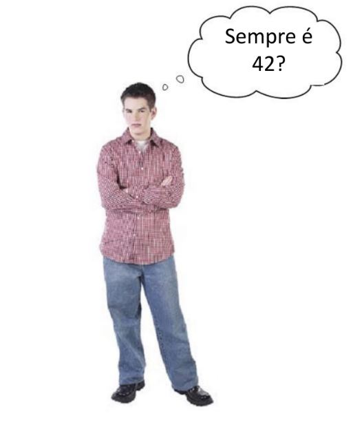

Repeticiones
============

.. image:: ../img/TWP15_001.jpg
    :height: 15.602cm
    :width: 16.801cm
    :align: center
    :alt: 

.. activecode:: ac_l30_5
    :language: python3
    :python3_interpreter: brython 

    from browser import timer

    print("¡Bienvenido!")
    numero = 0

    # Definimos lo que hará el boton cuando sea apretado
    def adivinar():
    
        global numero
        numero = int(input("Adivine el número: "))
        if numero == 42:
            print("¡Ganaste!")
        else:
            if numero > 42:
                print("Alto")
            else:
                print("Bajo")
        
        if numero != 42:
            # Si el número no se adivinó, se repite la función después de
            # 3 segundos 
            timer.set_timeout(adivinar, 3000)

    adivinar()

.. image:: ../img/TWP15_007.png
    :height: 14.804cm
    :width: 22.181cm
    :align: center
    :alt: 

A los usuarios todavía no les gusta
-----------------------------------

