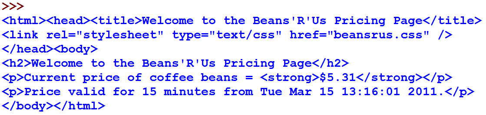

===============
Revisão Strings
===============

.. image:: img/TWP10_001.jpeg
   :height: 14.925cm
   :width: 9.258cm
   :align: center
   :alt: 

.. youtube:: VQ5vwKCi2Eg
      :height: 315
      :width: 560
      :align: center

Texto
=====

+ É difícil comunicar-se sem palavras
+ Entre os vários tipos de dados, um dos mais importantes é o texto ou
  string

   + Obs.: não é tão fácil manipular strings em algumas linguagens

+ Vamos procurar onde estão as informações num texto == scraping
+ E iremos aprender um dos conceitos mais importantes de orientação à
  objetos: métodos

Starbuzz Café
=============

.. image:: img/TWP33_001.jpg
   :height: 15.427cm
   :width: 14.801cm
   :align: center
   :alt: 

Código Starbuzz atual
=====================

.. code-block :: python
   
   import urrlib.request
   pagina = urllib.request('http://beans.itcarlow.ie/prices.html')
   texto = pagina.read().decode('utf8')
   print(texto)

O CEO quer apenas o preço
=========================

.. image:: img/TWP33_004.jpg
   :height: 6.719cm
   :width: 12.699cm
   :align: center
   :alt: 

.. youtube:: LrP4aBa8sp0
      :height: 315
      :width: 560
      :align: center

O preço está embutido no HTML
=============================

+ Este é um texto HTML “bruto”, que é o formato das páginas Web
+ O preço está embutido no HTML

Strings
=======

+ Strings são seqüências de caracteres

.. image:: img/TWP33_005.png
   :height: 2.112cm
   :width: 23.745cm
   :align: center
   :alt: 

+ Como obter apenas o preço?

.. image:: img/TWP33_006.png
   :height: 3.436cm
   :width: 22.621cm
   :align: center
   :alt: 

Strings
=======

.. image:: img/TWP33_007.jpg
   :height: 5cm
   :width: 16.051cm
   :align: center
   :alt: 

.. image:: img/TWP33_008.jpg
   :height: 6.323cm
   :width: 16.483cm
   :align: center
   :alt: 

Strings
=======

.. image:: img/TWP33_009.jpg
   :height: 5.317cm
   :width: 17.805cm
   :align: center
   :alt: 

Fatiamento
==========

.. codelens:: Example10_1
         
        time = 'Palmeiras'
        print(time[2:5])
        print(time[0:3])
        print(time[4:6])

+ Fatia do primeiro número até antes do segundo

+ Não inclui o segundo número!

Fatiamento
==========

.. image:: img/TWP33_012.jpg
   :height: 6.111cm
   :width: 13.943cm
   :align: center
   :alt: 

Fatiamento
==========

.. code-block :: python
   
   import urrlib.request
   pagina = urllib.request('http://beans.itcarlow.ie/prices.html')
   texto = pagina.read().decode('utf8')
   print(texto[234:238])

O CEO está feliz!
=================

.. image:: img/TWP33_015.jpg
   :height: 6.402cm
   :width: 14.922cm
   :align: center
   :alt: 

.. youtube:: IgRFQhA-gXM
      :height: 315
      :width: 560
      :align: center

Não existem perguntas idiotas
=============================

+ Posso colocar qualquer página web neste código?

   + Sim. Fique à vontade, mas não esqueça o decode
   + Por exemplo, o site abaixo usa iso8859
   + `Link for the same <http://www.ime.usp.br/~pf/algoritmos/dicios/br>`_

+ O que urllib.request faz?

   + Permite conversar com a internet

+ Posso acessar uma página diretamente no navegador?

   + Sim. Digite no modo interativo “import antigravity”

Descontos para clientes fiéis
=============================

.. image:: img/TWP33_016.jpg
   :height: 12.571cm
   :width: 17.458cm
   :align: center
   :alt: 

.. youtube:: 1hqmBgnJoNU
      :height: 315
      :width: 560
      :align: center

Programa de fidelidade
======================

.. code-block :: python
   
   import urrlib.request
   pagina = urllib.request('http://beans.itcarlow.ie/prices-loyalty.html')
   texto = pagina.read().decode('utf8')
   print(texto[234:238])

+ Não deu certo! Apareceu “bean” no lugar do preço. Por quê será?

.. youtube:: hX9MWdrYusY
      :height: 315
      :width: 560
      :align: center

O preço se moveu
================

+ As páginas são diferentes e o preço muda de posição na string

.. image:: img/TWP33_018.jpg
   :height: 5.416cm
   :width: 16.122cm
   :align: center
   :alt: 

Os dados do Python são espertos
===============================

+ As linguagens de programação fornecem uma funcionalidade embutida
  nos dados para ajudá-lo

+ Os dados do Python são espertos: eles podem fazer coisas

.. codelens:: Example10_2
         
        string = "batatinha quando nasce"
        print(string.upper())
        print(string.split())

Método find
===========

+ Métodos find para strings

.. codelens:: Example10_3
         
      string = "Palmeiras"
      print(string.find("P"))
      print(string.find("lmei"))
      print(string.find("Pa"))

+ Para saber os métodos que possuo dar ctrl + espaço após ponto

Método find
===========

.. code-block :: python
   
   import urrlib.request
   pagina = urllib.request('http://beans.itcarlow.ie/prices-loyalty.html')
   texto = pagina.read().decode('utf8')
   onde = texto.find('>$')
   inicio = onde + 2
   fim = inicio + 4
   print(texto[inicio:fim])

Só quando for menos que 4.74
============================

.. youtube:: S3U_-K43EeA
      :height: 315
      :width: 560
      :align: center

.. image:: img/TWP33_025.jpg
   :height: 15.444cm
   :width: 8.6cm
   :align: center
   :alt: 

Só quando for menos que 4.74
============================

.. youtube:: TQ5aGZ2azfM
      :height: 315
      :width: 560
      :align: center

.. code-block :: python
   
   import urrlib.request
   pagina = urllib.request('http://beans.itcarlow.ie/prices-loyalty.html')
   texto = pagina.read().decode('utf8')
   onde = texto.find('>$')
   inicio = onde + 2
   fim = inicio + 4
   if texto[inicio:fim] < 4.74:
      print(texto[inicio:fim])

Strings são diferentes de números
=================================

.. image:: img/TWP33_028.jpg
   :height: 9.324cm
   :width: 17.401cm
   :align: center
   :alt: 

Convertendo para float
======================

.. code-block :: python
   
   import urrlib.request
   pagina = urllib.request('http://beans.itcarlow.ie/prices-loyalty.html')
   texto = pagina.read().decode('utf8')
   onde = texto.find('>$')
   inicio = onde + 2
   fim = inicio + 4
   if float(texto[inicio:fim]) < 4.74:
      print('Comprar! float(texto[inicio:fim]): %5.2f' %float(texto[inicio:fim]))

Ele pode ficar testando o preço?
================================

.. image:: img/TWP33_029.jpg
   :height: 15.444cm
   :width: 8.6cm
   :align: center
   :alt: 

Ele pode ficar tentando?
========================

.. youtube:: Vjrk-_NsMFo
      :height: 315
      :width: 560
      :align: center

.. code-block :: python
   
   import urrlib.request
   preco = 99.99
   while preco >= 4.74:
      pagina = urllib.request('http://beans.itcarlow.ie/prices-loyalty.html')
      texto = pagina.read().decode('utf8')
      onde = texto.find('>$')
      inicio = onde + 2
      fim = inicio + 4
      preco = float(texto[inicio:fim])
   print('Comprar! preco: %5.2f' %preco)

O CEO está muito feliz!
=======================

.. image:: img/TWP33_030.jpg
   :height: 9.762cm
   :width: 11.561cm
   :align: center
   :alt: 

Aconteceu algum problema
========================

.. image:: img/TWP33_032.jpg
   :height: 15.268cm
   :width: 15.201cm
   :align: center
   :alt: 

Acusação de DDoS
================

+ DDoS – Distributed Denial of Service

.. image:: img/TWP33_033.jpg
   :height: 13.596cm
   :width: 15.201cm
   :align: center
   :alt: 

Recebemos uma mensagem
======================

.. image:: img/TWP33_034.jpg
   :height: 13.191cm
   :width: 22.685cm
   :align: center
   :alt: 

Biblioteca time
===============

+ Hora atual em segundos time.clock()
+ Estou no horário de verão? time.daylight()
+ Dormir alguns segundos time.sleep(secs)
+ Fuso horário time.timezone()

10 minutos entre cada acesso
============================

.. code-block :: python
   
   import urrlib.request
   import time
   preco = 99.99
   while preco >= 4.74:
      pagina = urllib.request('http://beans.itcarlow.ie/prices-loyalty.html')
      texto = pagina.read().decode('utf8')
      onde = texto.find('>$')
      inicio = onde + 2
      fim = inicio + 4
      preco = float(texto[inicio:fim])
      if preco >= 4.74:
         time.sleep(600)
   print('Comprar! preco: %5.2f' %preco)

Resumo
======

.. youtube:: 8cjrzMfFb3Y
      :height: 315
      :width: 560
      :align: center

+ Strings são seqüências de caracteres
+ Acessamos os caracteres individuais pelo índice, que começa com zero
+ Métodos são funções embutidas nas variáveis
+ Existem bibliotecas de programação com código pronto
+ Os dados possuem um tipo, como int ou string

Ferramentas Python
==================

+ texto[4] acessa o 5º caracter
+ texto[4:9] acessa do 5º ao 9º caracter
+ O método texto.find() procura um substring
+ float() converte algo para ponto flutuante
+ Bibliotecas: urllib.request e time

.. disqus::
   :shortname: pyzombis
   :identifier: lecture10

