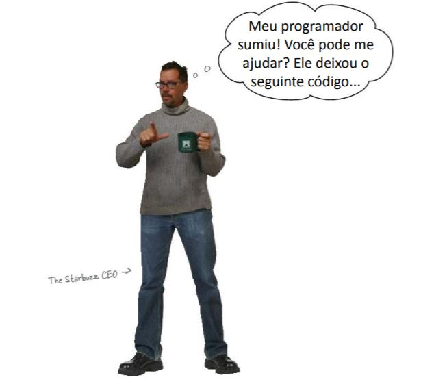
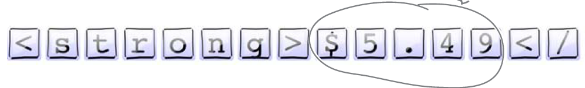
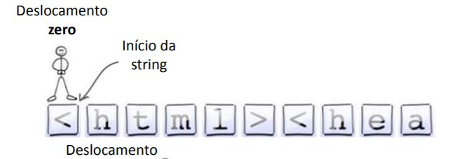
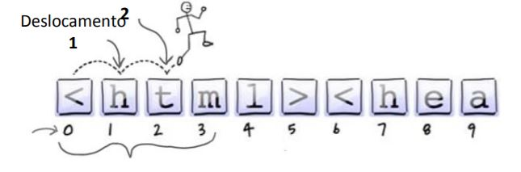
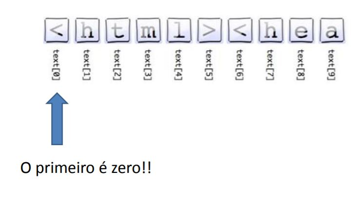
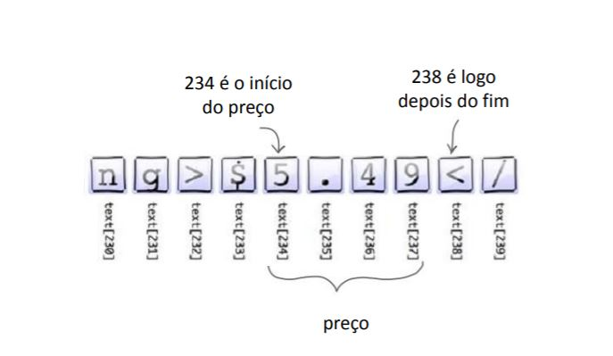
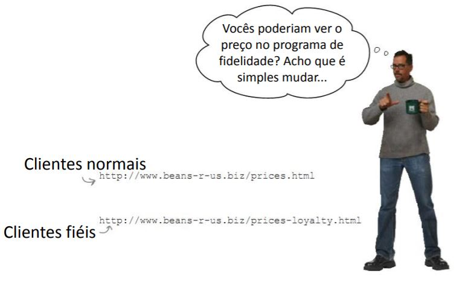
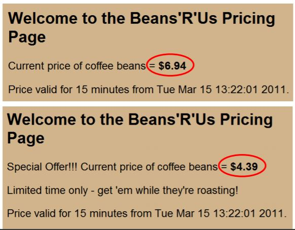
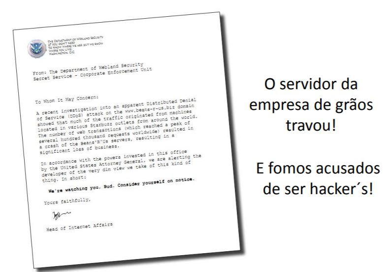
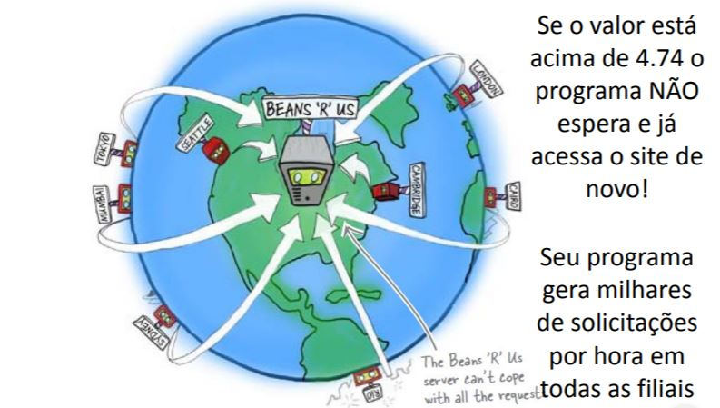

==================
Revisión de String
==================

.. image:: img/TWP10_001.jpeg
    :height: 14.925cm
    :width: 9.258cm
    :align: center
    :alt:

+ Es difícil comunicarse sin palabras.
+ Entre los diversos tipos de datos, uno de los más importantes son las cadenas o ``string``.
+ **Nota**: no es tan fácil manipular cadenas en algunos lenguajes de programación.
+ Busquemos dónde está la información en un texto.
+ Y aprenderemos uno de los conceptos más importantes de orientación a la objetos: métodos

Starbuzz Café
=============

Código Starbuzz actual
======================

.. activecode:: ac_l33_1
    :nocodelens:
    :stdin:
   
    from urllib.request import urlopen

    precios = "https://cors.bridged.cc/http://beans.itcarlow.ie/prices.html"
    pagina = urlopen(precios)
    texto = pagina.read()
    print(texto)

El CEO solo quiere el precio
============================

+ Este es el texto HTML "en bruto", que es el formato de las páginas web.
+ El precio está incrustado en HTML

.. code-block:: html

    <html><head><title>Welcome to the Beans'R'Us Pricing Page</title>
    <link rel="stylesheet" type="text/css" href="beansrus.css" />
    </head><body>
    <h2>Welcome to the Beans'R'Us Pricing Page</h2>
    
Current price of coffee beans = <strong>$6.73</strong>

    
Price valid for 15 minutes from Sun Jul 11 03:08:01 2021.

    </body></html>

Strings
=======

+ Recibimos el output anterior como una string o cadena de caracteres.

+ ¿Cómo obtener solo el precio?

Cortar
======

.. codelens:: cl_l33_1
         
    texto = "Palmeras"
    print(texto[2:5])
    print(texto[0:3])
    print(texto[4:6])

+ Corta el primer número antes del segundo.
+ ¡No incluye el segundo número!

.. activecode:: ac_l33_2
    :nocodelens:
    :stdin:
   
    from urllib.request import urlopen

    URL_PRECIOS = "https://cors.bridged.cc/http://beans.itcarlow.ie/prices.html"
    pagina = urlopen(URL_PRECIOS)
    texto = pagina.read()
    print(texto[234:238])

¡El CEO está feliz!
===================

No hay preguntas tontas
=======================

+ ¿Puedo poner alguna página web en este código?
+ Sí. Siéntete libre, pero no olvides la decodificación
+ Por ejemplo, el siguiente `sitio web <http://www.atc.uniovi.es/cgi-bin/encodings?encoding=iso-8859-1>`_ muestra caracteres con la decodificación iso8859.
+ ¿Qué hace ``urllib.request``?
+ Te permite chatear con internet.
+ ¿Puedo acceder a una página directamente en el navegador?
+ Sí ejecute el código de abajo que utiliza ``import antigravity``.

.. activecode:: ac_l33_3
    :language: python3
    :python3_interpreter: brython

    import antigravity
    # Ejecuta este codigo

Descuentos para clientes leales
===============================

Programa de fidelización
========================

.. activecode:: ac_l33_4
    :nocodelens:
    :stdin:
   
    from urllib.request import urlopen

    URL_PRECIOS_LOYALTY = "https://cors.bridged.cc/http://beans.itcarlow.ie/prices-loyalty.html"
    pagina = urlopen(URL_PRECIOS_LOYALTY)
    texto = pagina.read()
    print(texto[234:238])

+ ¡No funcionó! la cadena "Bean" apareció en lugar del precio. ¿Por qué sera?

El precio se movió
==================

+ Las páginas son diferentes y el precio cambia de posición en la cadena

Los datos de Python son inteligentes
====================================

+ Los lenguajes de programación proporcionan funcionalidades incorporadas en los datos para ayudarte.
+ Los datos de Python son inteligentes: pueden hacer cosas.

.. codelens:: cl_l33_2
         
    texto = "anita lava la tina"
    print(texto.upper())
    print(texto.split())

Método ``find``
===============

+ Método ``find`` para strings

.. codelens:: cl_l33_3
         
    texto = "Palmeras"
    print(texto.find("P"))
    print(texto.find("lmer"))
    print(texto.find("Pa"))

.. activecode:: ac_l33_5
    :nocodelens:
    :stdin:

    from urllib.request import urlopen

    URL_PRECIOS_LOYALTY = "https://cors.bridged.cc/http://beans.itcarlow.ie/prices-loyalty.html"
    pagina = urlopen(URL_PRECIOS_LOYALTY)
    texto = pagina.read()
    ubicacion = texto.find(">$")
    inicio = ubicacion + 2
    fin = inicio + 4
    print(texto[inicio:fin])

Solo cuando es inferior a 4,74
==============================

.. activecode:: ac_l33_6
    :nocodelens:
    :stdin:
   
    from urllib.request import urlopen

    URL_PRECIOS_LOYALTY = "https://cors.bridged.cc/http://beans.itcarlow.ie/prices-loyalty.html"
    pagina = urlopen(URL_PRECIOS_LOYALTY)
    texto = pagina.read()
    ubicacion = texto.find(">$")
    inicio = ubicacion + 2
    fin = inicio + 4
    if texto[inicio:fin] < 4.74:
        print(texto[inicio:fin])

Los strings son diferentes de los números
=========================================

.. image:: img/TWP33_028.jpg
    :height: 9.324cm
    :width: 17.401cm
    :align: center
    :alt:

Convertir a ``float``
=====================

.. activecode:: ac_l33_7
    :nocodelens:
    :stdin:
   
    from urllib.request import urlopen

    URL_PRECIOS_LOYALTY = "https://cors.bridged.cc/http://beans.itcarlow.ie/prices-loyalty.html"
    pagina = urlopen(URL_PRECIOS_LOYALTY)
    texto = pagina.read()
    ubicacion = texto.find(">$")
    inicio = ubicacion + 2
    fin = inicio + 4
    if float(texto[inicio:fin]) < 4.74:
        print("Comprar! precio: %5.2f" % float(texto[inicio:fin]))

¿Puede seguir probando el precio?
=================================

.. image:: img/TWP33_029.jpg
    :height: 15.444cm
    :width: 8.6cm
    :align: center
    :alt:

¿Puede seguir intentándolo?
===========================

.. activecode:: ac_l33_8
    :nocodelens:
    :stdin:
   
    from urllib.request import urlopen

    URL_PRECIOS_LOYALTY = "https://cors.bridged.cc/http://beans.itcarlow.ie/prices-loyalty.html"
    precio = 99.99
    while precio >= 4.74:
        pagina = urlopen(URL_PRECIOS_LOYALTY)
        texto = pagina.read()
        ubicacion = texto.find(">$")
        inicio = ubicacion + 2
        fin = inicio + 4
        precio = float(texto[inicio:fin])
    print("Comprar! precio: %5.2f" % precio)

¡El CEO está muy feliz!
=======================

.. image:: img/TWP33_030.jpg
    :height: 9.762cm
    :width: 11.561cm
    :align: center
    :alt:

Algo salió mal
==============

Acusación DDoS
==============

+ DDoS – Distributed Denial of Service
+ Ataque de denegación de servicio.

Recibimos un mensaje
====================

Biblioteca ``time``
===================

+ Tiempo actual en segundos ``time.clock()``
+ ¿Estoy en verano? ``time.daylight()``
+ Duerme unos segundos, ``sleep(segundos)``
+ Zona horaria ``time.timezone()``

10 minutos entre cada acceso
============================

.. activecode:: ac_l33_9
    :nocodelens:
    :stdin:
   
    from urllib.request import urlopen
    import time

    URL_PRECIOS_LOYALTY = "https://cors.bridged.cc/http://beans.itcarlow.ie/prices-loyalty.html"
    precio = 99.99
    while precio >= 4.74:
        pagina = urlopen(URL_PRECIOS_LOYALTY)
        texto = pagina.read()
        ubicacion = texto.find(">$")
        inicio = ubicacion + 2
        fin = inicio + 4
        precio = float(texto[inicio:fin])
        if precio >= 4.74:
            time.sleep(600)
    print("Comprar! precio: %5.2f" % precio)

Resumen
=======

+ Los ``string`` son cadenas de caracteres.
+ Accedemos a los caracteres individuales por el índice, que comienza con cero.
+ Los métodos son funciones integradas en variables.
+ Hay bibliotecas de programación con código listo.
+ Los datos tienen un tipo, como ``int`` o ``string``.

Herramientas de Python
======================

+ ``texto[4]`` accede al quinto carácter.
+ ``texto[4:9]`` accede del quinto al noveno carácter.
+ El método ``text.find()`` busca una subcadena.
+ ``float()`` convierte algo a un punto flotante.
+ Bibliotecas: ``urllib.request`` y ``time``.
