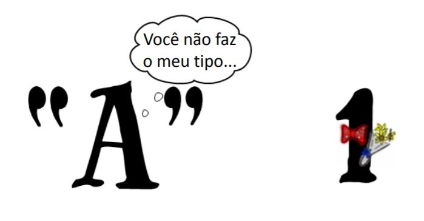

Los strings son diferentes de los números
=========================================

Convertir a ``float``
---------------------

.. activecode:: ac_l33_7a
    :nocodelens:
    :stdin:
   
    from urllib.request import urlopen

    URL_PRECIOS_LOYALTY = "https://cors.bridged.cc/http://beans.itcarlow.ie/prices-loyalty.html"
    pagina = urlopen(URL_PRECIOS_LOYALTY)
    texto = pagina.read()
    ubicacion = texto.find(">$")
    inicio = ubicacion + 2
    fin = inicio + 4
    if float(texto[inicio:fin]) < 4.74:
        print("Comprar! precio: %5.2f" % float(texto[inicio:fin]))

¿Puede seguir probando el precio?
---------------------------------

¿Puede seguir intentándolo?
---------------------------

.. activecode:: ac_l33_7b
    :nocodelens:
    :stdin:
   
    from urllib.request import urlopen

    URL_PRECIOS_LOYALTY = "https://cors.bridged.cc/http://beans.itcarlow.ie/prices-loyalty.html"
    precio = 99.99
    while precio >= 4.74:
        pagina = urlopen(URL_PRECIOS_LOYALTY)
        texto = pagina.read()
        ubicacion = texto.find(">$")
        inicio = ubicacion + 2
        fin = inicio + 4
        precio = float(texto[inicio:fin])
    print("Comprar! precio: %5.2f" % precio)

¡El CEO está muy feliz!
-----------------------

