=============================
Revisión de archivos y listas
=============================

..  image:: img/TWP10_001.jpeg
    :height: 14.925cm
    :width: 9.258cm
    :align: center
    :alt:

Campeonato de Surf de Codeville
===============================

..  image:: img/TWP37_001.jpeg
    :height: 12.571cm
    :width: 9.428cm
    :align: center
    :alt:

Campeonato de Surf de Codeville 
===============================

..  image:: img/TWP37_002.jpeg
    :height: 11.923cm
    :width: 17.85cm
    :align: center
    :alt:

Campeonato de Surf de Codeville
===============================

..  image:: img/TWP37_003.jpeg
    :height: 12.571cm
    :width: 16.762cm
    :align: center
    :alt:

Encuentra la puntuación más alta
================================

+ Las puntuaciones están en el archivo ``surf.txt``
+ ¡Selecciona la puntuación más alta para conocer al ganador!

..  image:: img/TWP37_004.jpg
    :height: 8.566cm
    :width: 10.55cm
    :align: center
    :alt:

Leer el archivo ``surf.txt``
============================

..  datafile:: surf.txt
    :hide: 
      
    Johny 8.65
    Juan 9.12
    Joseph 8.45
    Stacey 7.81
    Aideen 8.05
    Zack 7.21
    Aaron 8.31

..  activecode:: ac_l37_1
    :nocodelens:
    :datafile: surf.txt
    :stdin:

    archivo = open("surf.txt")
    for linea in archivo:
        print(linea.strip())
    archivo.close()

Fragmentador for
================

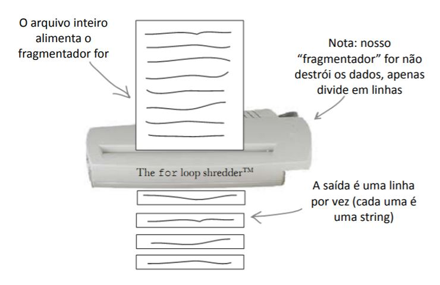

Descubre quién obtuvo la puntuación más alta
============================================

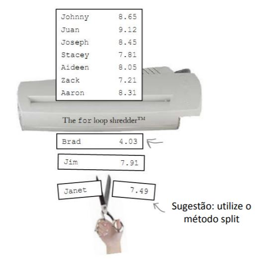

El método ``split`` corta la cadena
===================================

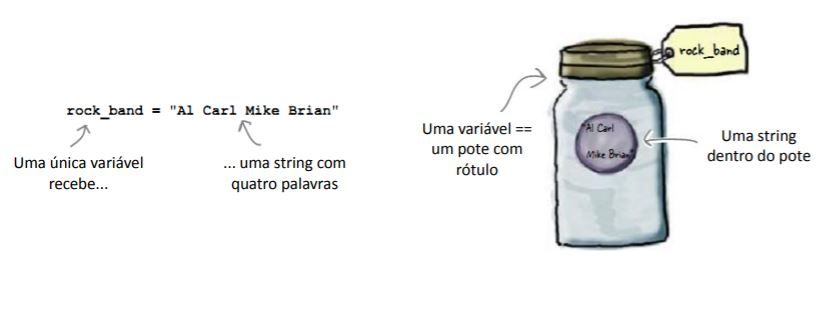

El método ``split`` corta la cadena
===================================

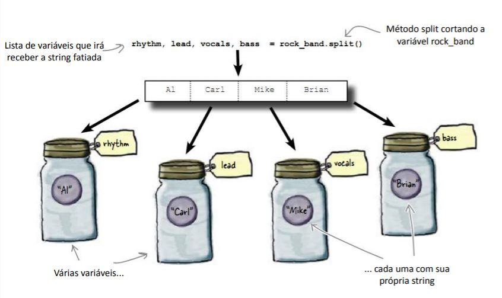

Encontrando el 1º lugar
=======================

..  activecode:: ac_l37_2
    :nocodelens:
    :datafile: surf.txt
    :stdin:
   
    archivo = open("surf.txt")
    mayor = 0
    for linea in archivo:
        nombre, puntos = linea.split()
        if float(puntos) > mayor:
            mayor = float(puntos)
    archivo.close()
    print(mayor)

El marcador...
===============

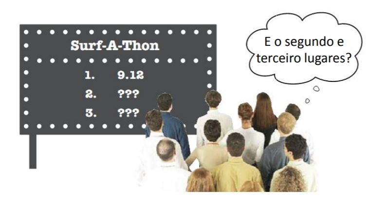

El seguimiento de 3 puntajes es complicado
==========================================

..  activecode:: ac_l37_3
    :nocodelens:
    :datafile: surf.txt
    :stdin:
   
    archivo = open("surf.txt")
    primero = 0
    segundo = 0
    tercero = 0
    for linea in archivo:
        nombre, puntos = linea.split()
        if float(puntos) > primero:
            tercero = segundo
            segundo = primero
            primero = float(puntos)
        elif float(puntos) > segundo:
            tercero = segundo
            segundo = float(puntos)
        elif float(puntos) > tercero:
            tercero = float(puntos)
    archivo.close()

    print("%.2f" % primero)
    print("%.2f" % segundo)
    print("%.2f" % tercero)

Ordenar la lista sería mejor
============================

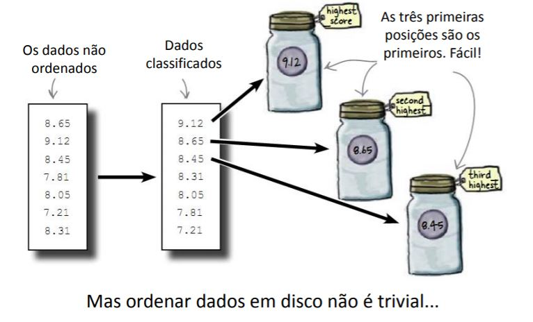

Ordenar es más fácil en la memoria
==================================

+ Los datos del disco son persistentes: si tira del cable de la toma de corriente,  la computadora no olvidará la información grabada en el disco.
+ Los datos en la memoria son mucho más rápidos, pero no persistentes: los datos en la memoria desaparecen cuando sale de su programa o cuando el la computadora está apagada.
+ Compensación de diseño: persistencia x velocidad.

Primero: lea los datos en la memoria
====================================

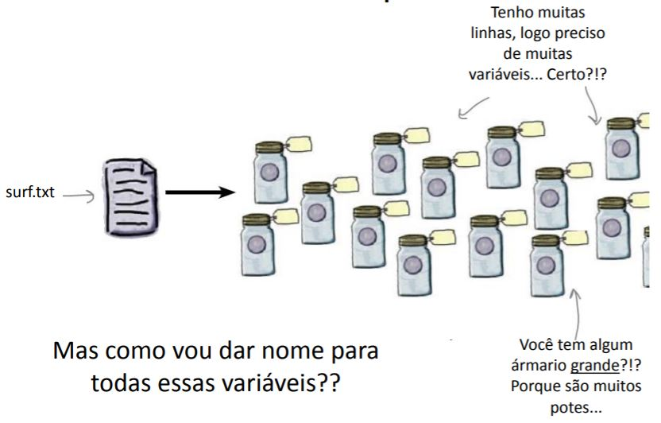

Wow, vampiro usa un tren de datos
=================================

+ Matriz, lista, vector son nombres comunes para un lote completo de datos.
+ Solo necesito una sola variable para todo el tren de datos.

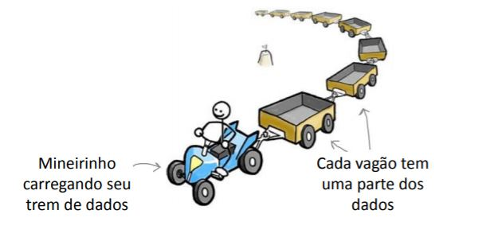

Volviendo al surf ...
=====================

+ Podemos crear una lista ``puntuaciones``.
+ Para insertar cada nueva puntuación, use ``.append()``
+ El mejor puesto serán las ``puntuaciones[0]``, ``puntuaciones[1]`` y ``puntuaciones[2]``.

Nueva puntuación
================

..  activecode:: ac_l37_4
    :nocodelens:
    :datafile: surf.txt
    :stdin:
   
    archivo = open("surf.txt")
    puntuaciones = []
    for linea in archivo:
        nombre, puntos = linea.split()
        puntuaciones.append([float(puntos), nombre])
    archivo.close()
    print(f"1. {puntuaciones[0][1]} puntaje -> {puntuaciones[0][0]:.2f}")
    print(f"2. {puntuaciones[1][1]} puntaje -> {puntuaciones[1][0]:.2f}")
    print(f"3. {puntuaciones[2][1]} puntaje -> {puntuaciones[2][0]:.2f}")

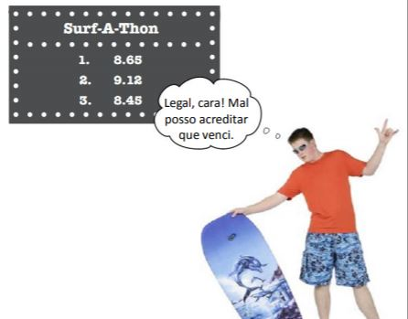

Ordenar en orden descendente
============================

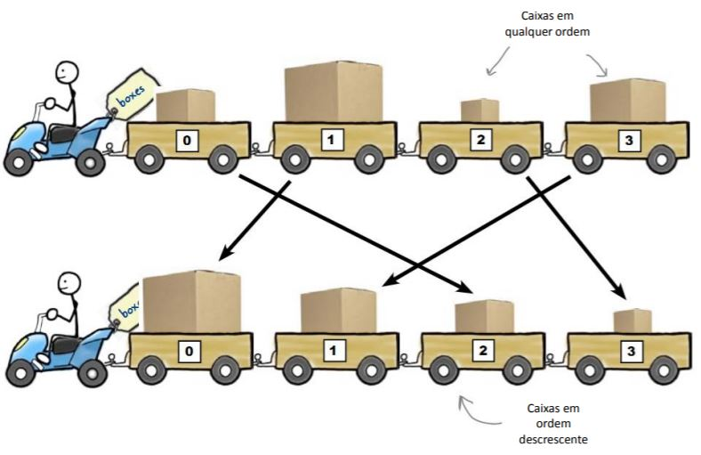

Métodos ``sort`` y ``reverse``
==============================

+ El método ``sort`` ordena los datos.
+ El uso de ``reverse`` para mantenerlos en orden descendente.
+ Es más inteligente usar ``puntuaciones.sort(reverse = True)``

Finalmente las posiciones correctas
===================================

..  activecode:: ac_l37_5
    :nocodelens:
    :datafile: surf.txt
    :stdin:
   
    archivo = open("surf.txt")
    puntuaciones = []
    for linea in archivo:
        nombre, puntos = linea.split()
        puntuaciones.append([float(puntos), nombre])
    archivo.close()

    puntuaciones.sort()
    puntuaciones.reverse()

    print(f"1. {puntuaciones[0][1]} puntaje -> {puntuaciones[0][0]:.2f}")
    print(f"2. {puntuaciones[1][1]} puntaje -> {puntuaciones[1][0]:.2f}")
    print(f"3. {puntuaciones[2][1]} puntaje -> {puntuaciones[2][0]:.2f}")

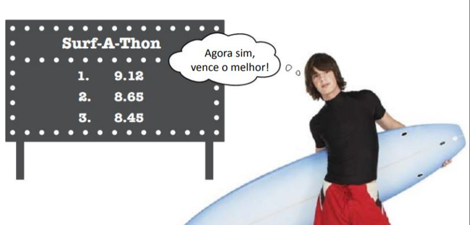
