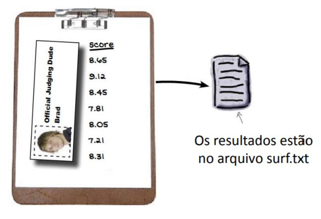

==============
Revisão Listas
==============

.. image:: img/TWP10_001.jpeg
   :height: 14.925cm
   :width: 9.258cm
   :align: center
   :alt:

.. youtube:: uEImp8vMMKE
      :height: 315
      :width: 560
      :align: center

Campeonato de Surf em Codeville
===============================

.. image:: img/TWP37_001.jpeg
   :height: 12.571cm
   :width: 9.428cm
   :align: center
   :alt: 

Campeonato de Surf em Codeville
===============================

.. image:: img/TWP37_002.jpeg
   :height: 11.923cm
   :width: 17.85cm
   :align: center
   :alt: 

Campeonato de Surf em Codeville
===============================

.. image:: img/TWP37_003.jpeg
   :height: 12.571cm
   :width: 16.762cm
   :align: center
   :alt: 

Encontre a pontuação mais alta
==============================

+ As pontuações estão no arquivo surf.txt
+ Selecione a pontuação mais alta para saber o vencedor!

Lendo o arquivo surf.txt
========================

.. .. datafile:: surf.txt
..    :hide: 
      
      Johny 8.65
      Juan 9.12
      Joseph 8.45
      Stacey 7.81
      Aideen 8.05
      Zack 7.21
      Aaron 8.3

.. .. activecode:: Example12_1
..    :nocodelens:
..    :datafile: surf.txt
..    :enabledownload:
..    :stdin:

      f = open('surf.txt')
      for linha in f:
         print(linha.strip())
      f.close()

.. code-block:: python
   
   f = open('surf.txt')
   for linha in f:
      print(linha.strip())
   f.close()

Fragmentador for
================

Descubra quem obteve a maior nota
=================================

O método split corta a string
=============================

O método split corta a string
=============================

Encontrando o 1º lugar
======================

.. code-block:: python
   
   f = open('surf.txt')
   maior = 0
   for linha in f:
      nome, pontos = linha.split()
      if float(pontos) > maior:
         maior = float(pontos)
   f.close()
   print(maior)

Sai o placar...
===============

Controlar 3 pontuações é complicado
===================================

.. code-block:: python
   
   f = open('surf.txt')
   primeiro = 0
   segundo = 0
   terceiro = 0
   for linha in f:
      nome, pontos = linha.split()
      if float(pontos) > primeiro:
         terceiro = segundo
         segundo = primeiro
         primeiro = float(pontos)
      elif float(pontos) > segundo:
         terceiro = segundo
         segundo = float(pontos)
      elif float(pontos) > terceiro:
         terceiro = float(pontos)
   f.close()

   print(primeiro)
   print(segundo)
   print(terceiro)

Ordenar a lista seria melhor
============================

Ordenação é mais fácil na memória
=================================

+ Dados em disco são persistentes: se você puxar o fio da tomada, o
  computador não esquecerá as informações gravadas no disco

+ Dados na memória são muito mais rápidos, porém não são persistentes:
  os dados na memória desaparecem quando seu programa sai ou quando o
  computador é desligado

+ Design Tradeoff: persistência x rapidez

Primeiro: ler os dados para a memória
=====================================

Uai, vamô usar um trem de dados
===============================

+ Array, lista, vetor são nomes comuns para um lote inteiro de dados

+ Preciso de apenas uma única variável para todo o trem de dados

Voltando ao surf...
===================

+ Podemos criar uma lista de notas
+ Para inserir cada nova nota use append
+ Os melhores colocados serão notas[0], notas[1] e notas[2]

Nova classificação
==================

.. youtube:: xAHvvU4N0NY
      :height: 315
      :width: 560
      :align: center

.. code-block:: python
   
   f = open('surf.txt')
   notas = []
   for linha in f:
      nome, pontos = linha.split()
      notas.append(float(pontos))
   f.close()
   print(notas[0])
   print(notas[1])
   print(notas[2])

Classificar em ordem descrescente
=================================

Métodos sort e reverse
======================

+ O método sort ordena os dados
+ Utilizo reverse para que fiquem em ordem descrescente
+ O nerd pode utilizar notas.sort(reverse = True)

Finalmente a classificação correta
==================================

.. code-block:: python
   
   f = open('surf.txt')
   notas = []
   for linha in f:
      nome, pontos = linha.split()
      notas.append(float(pontos))
   f.close()
   notas.sort()
   notas.reverse()
   print(notas[0])
   print(notas[1])
   print(notas[2])

.. youtube:: MRSLnv8jnWU
      :height: 315
      :width: 560
      :align: center

.. disqus::
   :shortname: pyzombis
   :identifier: lecture12