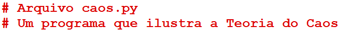
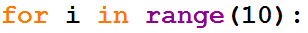
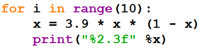

==================
Revisión general 2
==================

.. image:: img/TWP10_001.jpeg
   :height: 14.925cm
   :width: 9.258cm
   :align: center
   :alt: 

¿Qué es un programa?
====================

+ Un conjunto detallado de instrucciones, paso a paso, que le dice cuáles son las
  la computadora hará

+ Si cambiamos el programa, la computadora hará algo diferente

+ La computadora permanece igual, pero el programa ha cambiado

+ Los programas se ejecutan

¿Qué es un programa?
====================

+ El software (programas) controla el hardware

+ El proceso de creación de software se llama programación

+ Un algoritmo es la receta, paso a paso, que resuelve un problema.
   computacional

Lenguajes de programación
=========================

+ Los idiomas de bajo nivel son los más cercanos a la máquina

+ Ensamblador:

  + Cargue el número de variable A en la CPU
  + Cargue el número de variable B en la CPU
  + Agregar los dos números en la CPU
  + Almacenar el resultado en la variable C

Lenguajes de programación
=========================

+ Comando original en lenguaje de alto nivel: C = A + B

+ Los compiladores convierten el lenguaje de alto nivel al lenguaje de
   máquina informática específica

+ Los intérpretes analizan y ejecutan el programa de instrucción por
   instrucción de lenguaje de máquina

Python
======

+ El signo ">>>" indica que Python está "listo" para recibir
  comandos

.. codelens:: Example13_1
         
        print('hola mundo!')
        print(2+3)
        print('2 + 3 = ',2+3)

Python
======

+ Por lo general, queremos repetir una serie de comandos varias veces

+ Una forma de hacer esto es usar una función

.. codelens:: Example13_2
         
        def amodoispontos():
          print('Yo amo:!')
          print('Dos puntos == ":"')
        
        amodoispontos()

+ ¡No olvides los paréntesis cuando llames a la función!

+ Si olvida los paréntesis, python devolverá la dirección en
   memoria donde está el código de función

.. codelens:: Example13_3
         
        def amodoispontos():
          print('Yo amo:!')
          print('Dos puntos == ":"')
        
        print(amodoispontos)
        print(print)

Python
======

+ Podemos poner parámetros en una función

.. codelens:: Example13_4
         
        def suma(a,b):
          return a+b

        print(suma('aguacate','jabuticaba'))
        print(suma(2,3))
        print(suma(3.14,2.71))

Python
======

+ Las funciones dejan de existir en cuanto sale del intérprete
  Python

+ Por lo tanto, los programas generalmente se componen de módulos, que son
  archivos guardados en el disco

+ Un módulo es un archivo de texto que contiene un programa de Python

+ Puede editar los módulos en un entorno de desarrollo, que
  resalta palabras reservadas, realiza identificación automática, etc.

Python
======

+ Guardamos un programa llamado chaos.py

+ No olvides la extensión .py

+ Podemos ejecutar el programa con la tecla F5

.. activecode:: Example13_5
   :nocodelens:
   :stdin:

    print('Este programa ilustra el comportamiento caótico.')
    x = eval(input('Ingrese un número entre 0 y 1:'))
    for i in range(10):
      x = 3.9*x*(1-x)
      print("2.3f" %x)

Python
======

+ Las líneas que comienzan con "#" se llaman comentarios

+ Están destinados a ser leídos por humanos y Python los ignora

+ Python omite todo el texto desde el "#" hasta el final de la línea

Python
======

+ x es un ejemplo de una variable

+ En x asignaremos un valor al que se puede hacer referencia más adelante

+ Se mostrará el mensaje entre comillas y la respuesta se almacenará en x

.. image:: img/TWP38_009.png
   :height: 0.799cm
   :width: 23.316cm
   :align: center
   :alt: 

Python
======

+ Hay comandos de bucle como para

+ Un bucle se usa para repetir un bloque de comandos varias veces

+ En este ejemplo, el siguiente bloque se repetirá 10 veces

Python
======

+ Llamamos a los espacios al comienzo de la línea sangría

+ En Python, la sangría delimita el bloque que se ejecutará

+ El cálculo 3.9 * x * (1-x) se realizará en la CPU y se asignará a la variable
  x

Python
======

+ La función de caos devuelve valores muy diferentes, incluso cuando la entrada
  es similar

Ejercicio
=========

+ Cambie el programa anterior para que pueda ingresar un valor e ingresar
  correr por n veces en lugar del valor 10

Resumen
=======

+ La descripción de una secuencia de pasos para resolver un problema.
   algoritmo computacional se llama

+ Los algoritmos son programas (software) que determinan cuáles son los
   la computadora (hardware) hará

+ El proceso de creación de software se llama programación

Recuerdo
========

+ Los lenguajes de programación tienen una sintaxis formal

+ Las computadoras solo entienden el lenguaje de máquina

+ Python es un lenguaje interpretado de alto nivel

+ El intérprete de Python convierte los comandos instrucción por instrucción
   para lenguaje máquina

.. disqus::
   :shortname: pyzombis
   :identifier: lecture13

