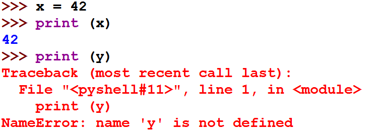
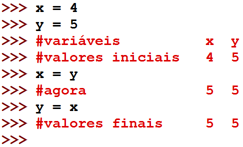
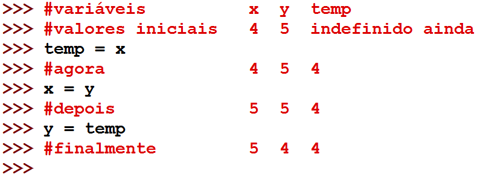

===============
Revisão Geral 3
===============

.. image:: img/TWP10_001.jpeg
   :height: 14.925cm
   :width: 9.258cm
   :align: center
   :alt: 

O processo de desenvolvimento de software
=========================================

+ Executar programas feitos por outros é uma tarefa relativamente
  simples

+ O difícil é começar a criar seus próprios programas

+ Computadores são muito rigorosos e há muitos detalhes

+ Por isso é necessário ser muito sistemático

Etapas no processo de desenvolvimento de software
=================================================

+ Analisar o problema:

  + Entender exatamente qual é o problema a ser resolvido
  + Problema bem definido, meio problema resolvido

+ Especificar o problema:

  + Descrever exatamente o que o seu programa fará
  + Nesta etapa não me devo preocupar em como irei fazer meu programa,
      mas em decidir exatamente o que ele fará
  + Quais são as entradas e saídas do programa?

Etapas no processo de desenvolvimento de software
=================================================

+ Projetar o programa:

  + Formular a estrutura geral do programa
  + Podemos usar pseudo-código nesta etapa

+ Implementar o programa:

  + Elaborar alguns testes para validar o seu programa
  + Traduzir o projeto em alguma linguagem
  + Neste curso utilizaremos Python

Exemplo: conversor de temperatura de Fahrenheit para Celsius
============================================================

+ Análise: dada uma temperatura em graus Fahrenheit obter a conversão
  para Celsius

+ Especificação do que o programa fará:

  + Entrada: temperatura em Fahrenheit
  + Saída: temperatura em Celsius
  + Saída: 5*(F-32)/9

Exemplo: conversor de temperatura de Fahrenheit para Celsius
============================================================

+ Projeto do como o programa fará:

  + Leia o valor da temperatura em Fahrenheit
  + Converta o valor usando a fórmula 5*(F-32)/9
  + Imprima o valor convertido

+ Implementação:

  + Testes: 32 f = 0 c e 100 f = 37.8 c

.. activecode:: Example14_1
   :nocodelens:
   :stdin:

   F = float(input('Fahrenheit: '))
   C = 5*(F-32)/9
   print('Celsius: %2.1f' %C)

+ Uso de variáveis com valores definidos

Variáveis com valores indefinidos
=================================

Caracter de final de linha
==========================

.. codelens:: Example14_2
         
        for x in 'abacate':
          if x in 'ae':
            print(x,end = ' ')
          else:
            print('*',end = ' ')

Atribuição de variáveis
=======================

+ <variável> = <expressão>

+ A <expressão> calculada no processador modifica a memória
  referenciada por <variável>

.. codelens:: Example14_3
         
        x = 5
        celsius = 5
        fahrenheit = 9/5*celsius + 32

Atribuição de variáveis
=======================

.. codelens:: Example14_4
         
        x = 0
        print(x)
        x = 'abacate'
        print(x)
        x = 3.14
        print(x)
        x = x*2
        print(x)

Leitura e atribuição
====================

.. activecode:: Example14_5
   :nocodelens:
   :stdin:

   string = input('Digite um texto: ')
   print(string)
   n = int(input('Digite um inteiro: '))
   print(n)
   pi = float(input('Digite o numero pi: '))
   print(pi)
   x = eval(input('Digite um numero: '))
   print(x)

Atribuição múltipla
===================

.. activecode:: Example14_6
   :nocodelens:
   :stdin:

   n1, n2, n3, n4 = eval(input('Digite 4 notas: '))
   print('Media:',(n1+n2+n3+n4)/4)
   x = 4
   y = 5
   soma, diferenca = x+y,x-y
   print(soma)
   print(diferenca)
   x,y = y,x
   print(x,y)

Atribuição múltipla
===================

Atribuição múltipla
===================

+ for <var> in <seqüência>

.. codelens:: Example14_7
         
        print(list(range(10)))
        for k in range(10):
          print(k,end = ' ')
        for k in [0,1,2,3]:
          print(k,end = ' ')
        for k in 'abacate':
          print(k+k,end=' ')

Exercício
=========

+ Nós queremos desenvolver um programa que determine o valor futuro de
  um investimento, dados o valor inicial e a taxa de juros

Exercício
=========

+ Análise:

  + Dinheiro inicial rende uma taxa de juros anual
  + Quanto ele irá valer em 10 anos?
  + Entrada: valor inicial, taxa de juros
  + Saída: valor em 10 anos

Exercício
=========

+ Especificação:

  + Usuário entra com o valor inicial investido
  + Usuário entra com a taxa de juros anual
  + Fórmula de matemática financeira valor*(1+juros)

Exercício
=========

+ Projeto:

  + Entre com o valor do investimento inicial
  + Entre com a taxa de juros
  + Repita 10 vezes:

    + valor inicial = valor inicial * (1 + taxa de juros)
  
  + –Imprima o valor atualizado

Exercício
=========

+ Implementação:

  + –Valores de teste:

    + 1000 reais e 3% de juros
    + 1000 reais e 10% de juros

.. activecode:: Example14_8
   :nocodelens:
   :stdin:

   valor = eval(input('Valor inicial investido: '))
   taxa = eval(input('Taxa de juros anual: '))
   for i in range(10):
    valor = valor*(1+taxa)
   print('Valor apos 10 anos: %5.2f' %valor)

Perguntas
=========

+ Por que definir alguns testes antes da implementação é uma boa
  prática de programação?

+ Qual é a vantagem de escrever um pseudo-código na etapa de projeto?

Números básicos
===============

.. codelens:: Example14_9
         
        print(type(3))
        print(type(3.14))
        print(type(3.0))
        x = -32
        print(type(x))
        x = 32.0
        print(type(x))
        print(int(type(x)))

Tabela de operadores
====================

.. table:: **Tabela de operadores**
   :widths: auto

   ======== ============== 
   Operador Operação       
   ======== ============== 
   \*        Multiplicação    
   /         Divisão      
   \*\*      Exponenciação
   abs()     Valor absoluto
   %        Resto da divisão
   //       Divisão inteira
   \-        Subtração
   \+        Adição

   ======== ============== 

Operadores Numéricos
====================

.. codelens:: Example14_10
         
        print(3+4)
        print(3.0+4.0)
        print(3.0*4.0)
        print(4**3)
        print(4.0**3)
        print(abs(5))
        print(abs(-5))

Divisão inteira em linguagens antigas
=====================================

+ As linguagens mais antigas geram um resultado inteiro na divisão de
  inteiros!

+ 10 / 3 será igual a 3

+ No cálculo de fahrenheit para celsius terei que modificar um pouco
  meu programa se usar C ou Java

Conversão de graus em C
=======================

.. activecode:: Example14_11
   :language: c
   :stdin: 

   
   #include <stdio.h>

   int main(void){
    float F, C;
    printf("Farenheit: ");
    scanf("%f",&F);
    C = 5.0*(F-32.0)/9.0;
    printf("Celsius: %2.1f\n",C);

   }

.. disqus::
   :shortname: pyzombis
   :identifier: lecture14
