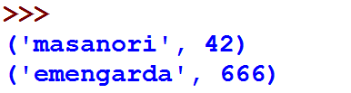

==============
Banco de Dados
==============

.. image:: img/TWP10_001.jpeg
   :height: 14.925cm
   :width: 9.258cm
   :align: center
   :alt: 

Notas de surfistas
==================

+ La Federación de Surf tiene los siguientes datos: número del surfista,
  nombre, país, grado promedio, estilo, edad.

+ ¿Cómo usar estos datos?

+ Por ejemplo, quiero conocer a todos los surfistas mayores de 25

+ ¡Usando una base de datos! En este caso, sqlite3

+ Obs .: copie surfersDB.sdb a su directorio

Usando sqlite3
==============

.. code-block :: python

   import sqlite3
   banco = sqlite3.connect("surfersDB.sdb")
   banco.row_factory = sqlite3.Row
   cursor = banco.cursor()
   cursor.execute("select * from surfers where age > 25")
   linhas = cursor.fetchall()
   for linha in linhas:
      print("Nombre :",linha['name'])
      print("Pais  :",linha['country'])
      print("Media  :",linha['average'])
      print("Estilo :",linha['board'])
      print("Edad  :",linha['age'])
      print()
   cursor.close()

+ Nota: no guarde su programa con el nombre sqlite3.py (mismo nombre que lib)

Usando sqlite3
==============

.. image:: img/TWP42_002.png
   :height: 10.741cm
   :width: 16.879cm
   :align: center
   :alt: 

Conceptos básicos de SQL
========================

Noções de Banco de Dados
========================

Nociones de bases de datos
==========================

Crear un base de estudiantes
=============================

.. code-block :: python

   import sqlite3
   con = sqlite3.connect('alunos.bd')
   cur = con.cursor()
   cur.execute('''create table alunos(login varchar(8),ra integer)''')
   cur.close()
   con.close() 

Accediendo al base alunos.bd
=============================

.. code-block :: python

   import sqlite3
   con = sqlite3.connect('alunos.bd')
   cur = con.cursor()
   cur.execute('insert into alunos values("masanori",42)')
   cur.execute('insert into alunos values("emengarda",666)')
   cur.execute('select * from alunos')
   cur.close()
   con.commit()
   con.close() 

+ Resultado:

.. disqus::
   :shortname: pyzombis
   :identifier: lecture15
