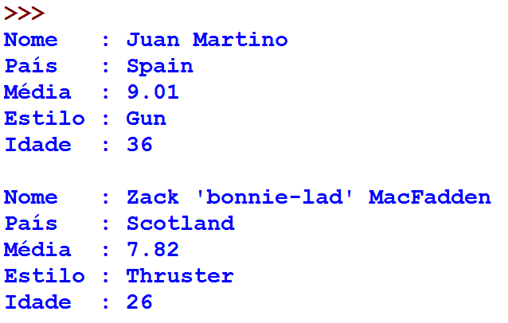

Usando sqlite3
==============

Notas de surfistas
------------------

+ La Federación de Surf tiene los siguientes datos: número del surfista,
  nombre, país, grado promedio, estilo, edad.

+ ¿Cómo usar estos datos?

+ Por ejemplo, quiero conocer a todos los surfistas mayores de 25

+ ¡Usando una base de datos! En este caso, sqlite3

+ Obs .: copie surfersDB.sdb a su directorio

.. code-block :: python

   import sqlite3
   base_datos = sqlite3.connect("surfersDB.sdb")
   base_datos.row_factory = sqlite3.Row
   cursor = base_datos.cursor()
   cursor.execute("select * from surfers where age > 25")
   linhas = cursor.fetchall()
   for linha in linhas:
      print("Nombre :",linha['name'])
      print("Pais  :",linha['country'])
      print("Media  :",linha['average'])
      print("Estilo :",linha['board'])
      print("Edad  :",linha['age'])
      print()
   cursor.close()

+ Nota: no guarde su programa con el nombre sqlite3.py (mismo nombre que lib)

