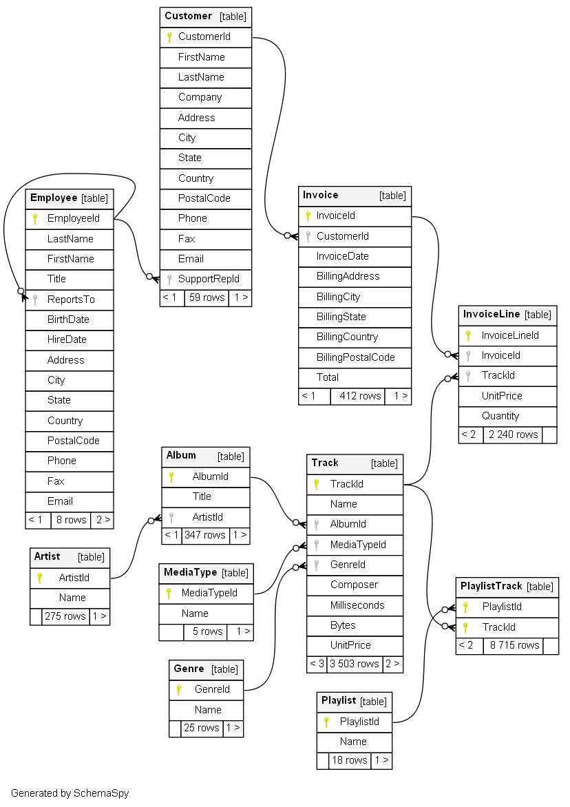

Más conceptos de SQL
====================

.. raw:: html

   

   

Esquema de base de datos chinook
--------------------------------   

+ The Chinook data model represents a digital media store, including tables for artists, albums, media tracks, invoices, and customers.   

Seleccionando diferentes tablas de las bases de datos
-----------------------------------------------------
.. activecode:: ac_42_3a
   :language: python3
   :python3_interpreter: brython

   
   ~~~~
   import sys
   sys.path.append("../../_static")

   ^^^^
   from sqlite3 import connect

   # conectarse a la base de datos chinook
   base_datos = connect('Chinook_Sqlite.sqlite')
   cursor = base_datos.cursor()

   # elegir una columna en particular de una tabla
   # limitar los resultados a las primeras 30 filas
   query = 'select * from Track limit 30;'
   
   cursor.execute(query)
   # obtener los datos
   linhas = cursor.fetchall()
   # imprimir los datos
   if linhas:
      for i in range(len(linhas)):
         for k in linhas[i].keys():
               print(k,":",linhas[i][k])
         print()
  
   # cerrar el cursor
   cursor.close()

Ordenar filas
-------------
.. activecode:: ac_42_3b
   :language: python3
   :python3_interpreter: brython

   La cláusula ``ORDER BY`` se utiliza para ordenar un conjunto de resultados de una consulta. SQLite almacena datos en las tablas en
   un orden no especificado. Significa que las filas de la tabla pueden o no estar en el orden en que fueron insertadas. Si usa la
   declaración ``SELECT`` para consultar datos de una tabla, el orden de las filas en el conjunto de resultados no se especifica. Para 
   ordenar el conjunto de resultados, agregue la cláusula ``ORDER BY`` a la declaración ``SELECT`` de la siguiente manera:

   ``ORDER BY column_name [ASC | DESC]``
   ~~~~
   import sys
   sys.path.append("../../_static")

   ^^^^
   from sqlite3 import connect

   # conectarse a la base de datos chinook
   base_datos = connect('Chinook_Sqlite.sqlite')
   cursor = base_datos.cursor()

   # ordenar las filas según la columna de miliseconds
   query = '''select name, milliseconds, albumid from Track 
   ORDER BY milliseconds ASC limit 30;'''
   
   cursor.execute(query)
   # obtener los datos
   linhas = cursor.fetchall()
   # imprimir los datos
   if linhas:
      for i in range(len(linhas)):
         for k in linhas[i].keys():
               print(k,":",linhas[i][k])
         print()
  
   # cerrar el cursor
   cursor.close()    

Filtrado de datos
-----------------

+ Ya hemos visto algunas formas de archivar datos, por ej. Cláusula LIMIT.
+ En la siguiente sección, veremos algunas formas más de filtrar datos, específicamente las cláusulas WHERE, IN, BETWEEN y LIKE.

.. activecode:: ac_42_3c1
   :language: python3
   :python3_interpreter: brython

   En este bloque aprenderemos a usar la cláusula ``WHERE``. La cláusula ``WHERE`` es una cláusula opcional de la instrucción SELECT.
   Aparece después de la cláusula ``FROM`` como la siguiente declaración:

   ``WHERE column_name [= | != | < | <= | > | >=] value``
   ~~~~
   import sys
   sys.path.append("../../_static")

   ^^^^
   from sqlite3 import connect

   # conectarse a la base de datos chinook
   base_datos = connect('Chinook_Sqlite.sqlite')
   cursor = base_datos.cursor()

   query = '''select name, milliseconds, bytes, albumid 
   from Track WHERE albumid=1 limit 30;'''
   
   cursor.execute(query)
   # obtener los datos
   linhas = cursor.fetchall()
   # imprimir los datos
   if linhas:
      for i in range(len(linhas)):
         for k in linhas[i].keys():
               print(k,":",linhas[i][k])
         print()
  
   # cerrar el cursor
   cursor.close()    

.. activecode:: ac_42_3c2
   :language: python3
   :python3_interpreter: brython

   En este bloque aprenderemos a usar la cláusula ``BETWEEN``. El operador ``BETWEEN`` es un operador lógico que comprueba
   si un valor está dentro del rango de valores. Si el valor está en el rango especificado, el operador ``BETWEEN`` devuelve
   verdadero. El operador ``BETWEEN`` se puede utilizar en la cláusula ``WHERE`` de las instrucciones ``SELECT``, ``DELETE``, ``UPDATE`` y ``REPLACE``.
   La siguiente declaración muestra un ejemplo de la cláusula ``BETWEEN``:
   
   ``BETWEEN value1 AND value2``
   ~~~~
   import sys
   sys.path.append("../../_static")

   ^^^^
   from sqlite3 import connect

   # conectarse a la base de datos chinook
   base_datos = connect('Chinook_Sqlite.sqlite')
   cursor = base_datos.cursor()

   query = '''select InvoiceId, BillingAddress,Total from
   Invoice WHERE Total BETWEEN 14.91 and 18.86 ORDER BY Total;'''
   
   cursor.execute(query)
   # obtener los datos
   linhas = cursor.fetchall()
   # imprimir los datos
   if linhas:
      for i in range(len(linhas)):
         for k in linhas[i].keys():
               print(k,":",linhas[i][k])
         print()
  
   # cerrar el cursor
   cursor.close()

.. activecode:: ac_42_3c3
   :language: python3
   :python3_interpreter: brython
   
   En este bloque, aprenderemos a usar el operador IN de SQLite para determinar si un valor coincide con algún valor en una lista 
   de valores o con el resultado de una subconsulta. El operador SQLite IN determina si un valor coincide con cualquier valor en una
   lista o una subconsulta. La sintaxis del operador IN es la siguiente:

   ``IN (value1, value2, ..., valueN)``
   ~~~~
   import sys
   sys.path.append("../../_static")

   ^^^^
   from sqlite3 import connect

   # conectarse a la base de datos chinook
   base_datos = connect('Chinook_Sqlite.sqlite')
   cursor = base_datos.cursor()

   query = '''select TrackId, Name, AlbumId from Track 
   WHERE AlbumId IN (16, 17, 18) ORDER BY AlbumId;'''
   
   cursor.execute(query)
   # obtener los datos
   linhas = cursor.fetchall()
   # imprimir los datos
   if linhas:
      for i in range(len(linhas)):
         for k in linhas[i].keys():
               print(k,":",linhas[i][k])
         print()
  
   # cerrar el cursor
   cursor.close() 

.. activecode:: ac_42_3c4
   :language: python3
   :python3_interpreter: brython
   
   En esta parte aprenderemos sobre la cláusula LIKE. La cláusula LIKE es un operador de búsqueda que permite buscar una cadena de caracteres
   dentro de una cadena de caracteres. La sintaxis de la cláusula LIKE es la siguiente:

   ``LIKE '%value%'``
   ~~~~
   import sys
   sys.path.append("../../_static")

   ^^^^
   from sqlite3 import connect

   # conectarse a la base de datos chinook
   base_datos = connect('Chinook_Sqlite.sqlite')
   cursor = base_datos.cursor()

   query = '''select TrackId, Name from Track WHERE name LIKE 'Wild%';'''
   
   cursor.execute(query)
   # obtener los datos
   linhas = cursor.fetchall()
   # imprimir los datos
   if linhas:
      for i in range(len(linhas)):
         for k in linhas[i].keys():
               print(k,":",linhas[i][k])
         print()
  
   # cerrar el cursor
   cursor.close() 

Agrupación de datos
-------------------

.. activecode:: ac_42_4a
   :language: python3
   :python3_interpreter: brython
   
   En esta sección, aprenderemos a usar la cláusula ``GROUP BY`` de SQLite para crear un conjunto de filas de resumen a partir de un conjunto de filas.
   La cláusula ``GROUP BY`` es una cláusula opcional de la instrucción ``SELECT``. La cláusula ``GROUP BY`` un grupo seleccionado de filas en filas de resumen
   por valores de una o más columnas. La cláusula ``GROUP BY`` devuelve una fila para cada grupo. Para cada grupo, puede aplicar una función agregada como
   ``MIN``, ``MAX``, ``SUM``, ``COUNT`` o ``AVG`` para proporcionar más información sobre cada grupo. La siguiente declaración ilustra la sintaxis de la cláusula
   ``GROUP BY`` de SQLite:

   ``GROUP BY column1, column2, ...``
   ~~~~
   import sys
   sys.path.append("../../_static")

   ^^^^
   from sqlite3 import connect

   # conectarse a la base de datos chinook
   base_datos = connect('Chinook_Sqlite.sqlite')
   cursor = base_datos.cursor()

   query = 'select albumid, COUNT(trackid) FROM Track GROUP BY albumid;'
   
   cursor.execute(query)
   # obtener los datos
   linhas = cursor.fetchall()
   # imprimir los datos
   if linhas:
      for i in range(len(linhas)):
         for k in linhas[i].keys():
               print(k,":",linhas[i][k])
         print()
  
   # cerrar el cursor
   cursor.close() 

.. activecode:: ac_42_4b
   :language: python3
   :python3_interpreter: brython
   
   Aquí aprenderemos a usar la cláusula ``HAVING`` de SQLite para especificar una condición de filtro para un grupo o un agregado. 
   La cláusula SQLite ``HAVING`` es una cláusula opcional de la declaración ``SELECT``. La cláusula ``HAVING`` especifica una condición de 
   búsqueda para un grupo. A menudo usamos la cláusula ``HAVING`` con la cláusula ``GROUP BY``. La cláusula ``GROUP BY`` agrupa un conjunto
   de filas en un conjunto de filas o grupos de resumen. Luego, la cláusula ``HAVING`` filtra grupos en función de una condición 
   específica. Si usamos la cláusula HAVING, debemos incluir la cláusula ``GROUP BY``; de lo contrario, se producirá un error.

   A continuación se ilustra la sintaxis de la cláusula ``HAVING``:

   ``HAVING condition``
   ~~~~
   import sys
   sys.path.append("../../_static")

   ^^^^
   from sqlite3 import connect

   # conectarse a la base de datos chinook
   base_datos = connect('Chinook_Sqlite.sqlite')
   cursor = base_datos.cursor()

   query = '''select albumid, COUNT(trackid) FROM Track GROUP BY albumid 
   HAVING COUNT(albumid) BETWEEN 18 AND 20;'''
   
   cursor.execute(query)
   # obtener los datos
   linhas = cursor.fetchall()
   # imprimir los datos
   if linhas:
      for i in range(len(linhas)):
         for k in linhas[i].keys():
               print(k,":",linhas[i][k])
         print()
  
   # cerrar el cursor
   cursor.close() 

.. poll:: TWP42
   :scale: 4
   :allowcomment:

   En una escala del 1 (a mejorar) al 4 (excelente), 
   ¿como calificaría este cápitulo?   