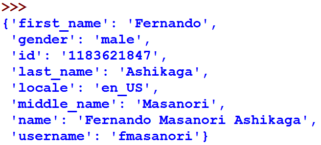
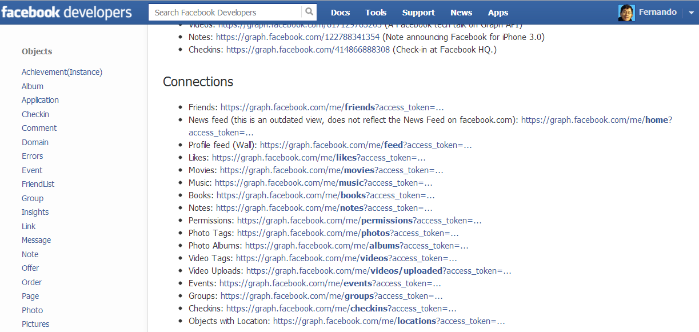
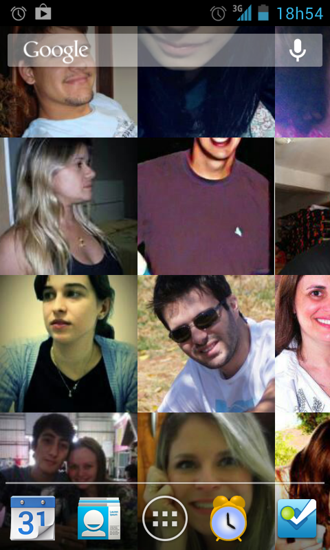
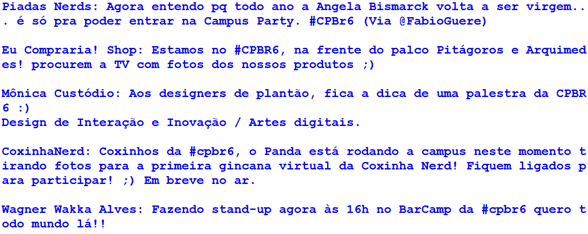
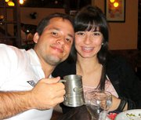
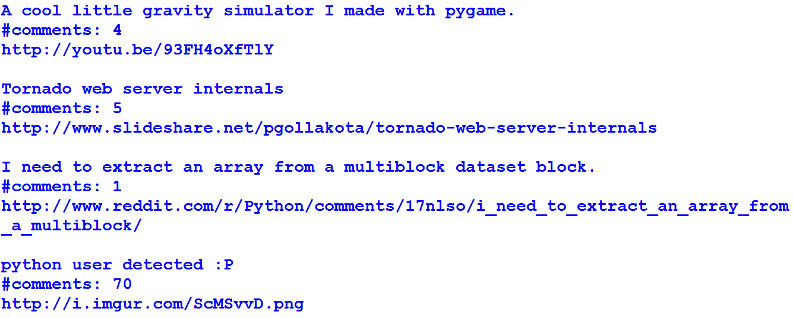
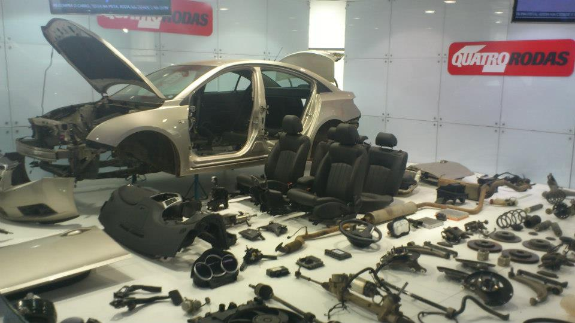
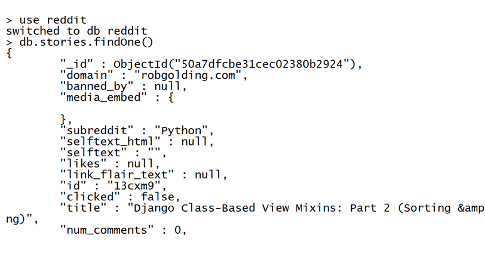

=============================
Hackeando Facebook con Python
=============================

.. image:: img/TWP10_001.jpeg
   :height: 14.925cm
   :width: 9.258cm
   :align: center
   :alt:

Facebook Hacking
================

+ Los hackers no son "malvados"?

Facebook Profile Photo
======================

.. code-block :: python

   import urllib.request
   import json

   user = 'fmasanori'
   url = 'https://graph.facebook.com/'+user+'/picture?type=large'
   figura = urllib.request.urlopen(url).read()

   arquivo = user + '.jpg'
   f = open (archivo, 'wb')
   f.write(figura)
   f.close()

   print (archivo, 'gravado no seu diretório...')

+ Resultado

+ `Link <https://developers.facebook.com/docs/reference/api/examples/>`_
+ Objetos JSON
+ Enlaces autenticados
+ Obs.: access_token caduca
+ Autenticar nuevamente en este caso

.. code-block :: python

   import urllib.request
   import json

   url = 'copie aqui o link Connections Friends'
   resp = urllib.request.urlopen(url).read()
   data = json.loads(resp.decode('utf-8'))
   for amigo in data['data']:
      print(amigo['name'])

.. code-block :: python

   import urllib.request
   import json

   def grava_imagem(amigo):
      size = '/picture?width=200&height=200'
      url = 'https://graph.facebook.com/' + amigo['id']+size
      figura = urllib.request.urlopen(url).read()
      f = open(amigo['name']+'.jpg','wb')
      f.write(figura)
      f.close()
      print(amigo['name']+'.jpg impresso')

   url = 'copie aqui o link Connections Friends'
   resp = urllib.request.urlopen(url).read()
   dados = json.loads(resp.decode('utf-8'))

   for amigo in dados['data']:
      grava_imagem(amigo)

Android Wallpaper
=================

.. image:: img/TWP45_010.png
   :height: 17.668cm
   :width: 10.6cm
   :align: center
   :alt: 

.. code-block:: python

   
   import urllib.request
   import json

   def search(texto):
      url = 'https://graph.facebook.com/search?q='
      tail = '&type=post&access_token=<copie aqui o access_token>'
      resp = urllib.request.urlopen(url+texto+tail).read()
      data = json.loads(resp.decode('utf-8'))
      return data['data']

   for resp in seach('cpbr6'):
      if 'message' in resp:
         print(resp['from']['name']+':'+resp['message']+'\n')

+ ¿Sabes lo que se siente despertarse temprano el domingo para estudiar?
+ Bueno, tampoco sé cómo explicarlo, pero eso es lo que siento en el
  momento .-.
+ Bora Casdinho!
+ Hackear participantes del evento creado en Facebook
+ Insertar enlace a perfil personal en Facebook
+ Obs .: solo algunos participantes y con la foto en la fecha del evento

.. image:: img/TWP45_025.jpeg
   :height: 3.749cm
   :align: center
   :width: 5cm
   :alt: 

.. image:: img/TWP45_039.jpeg
   :height: 3.749cm
   :width: 4.6cm
   :align: center
   :alt: 

.. code-block:: python

   
   import urllib.request
   import json

   url = 'http://www.reddit.com/r/Python/.json'
   resp = urllib.request.urlopen(url).read()

   parsed = json.loads(resp.decode('utf-8'))

   for item in parsed['data']['children']:
      doc = item['data']
      print(doc['title'])
      print('#comments: %d' %doc['num_comments'])
      print(doc['url'])
      print()

.. code-block:: python

   
   import json
   import pymongo
   import urllib.request

   connection = pymongo.Connection('mongo://localhost',safe = True)

   db = connection.reddit
   stories = db.stories

   url = 'http://www.reddit.com/r/Python/.json'
   reddit_page = urrlib.request.urlopen(url)

   parsed = json.loads(reddit_page.read().decode('utf-8'))

   for item in parsed['data']['children']:
      print(item['data'])
      stories.insert(item['data'])

.. disqus::
   :shortname: pyzombis
   :identifier: lecture16
