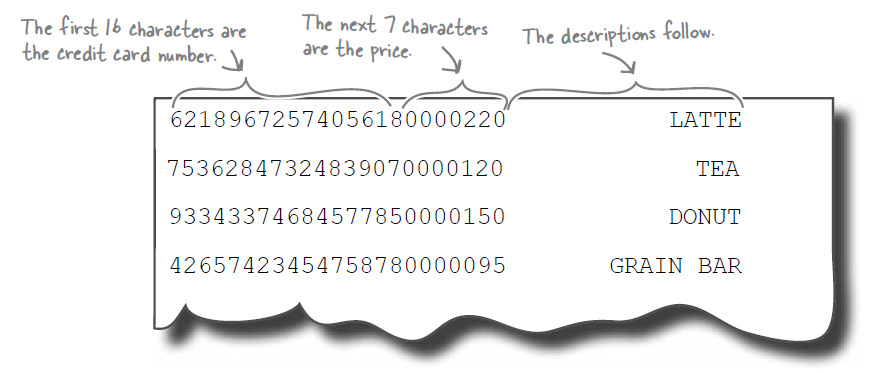
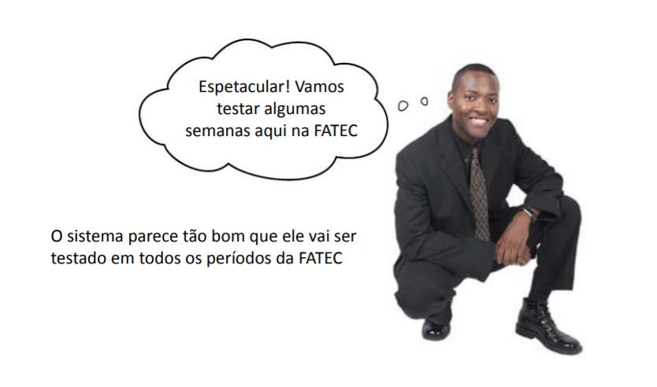
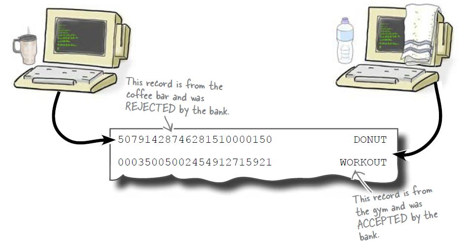
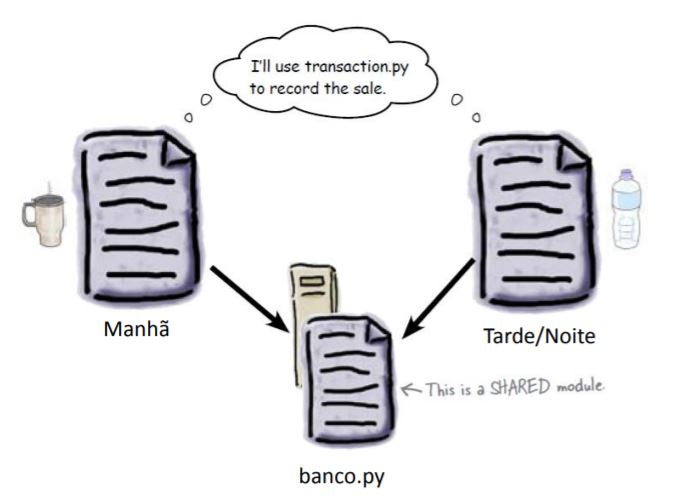
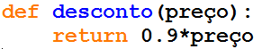
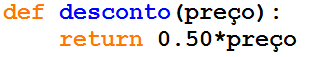
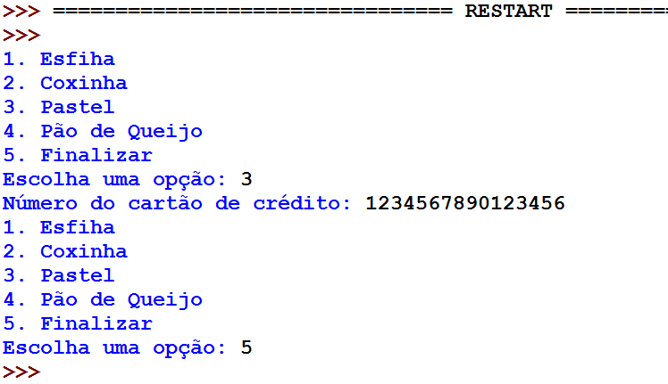
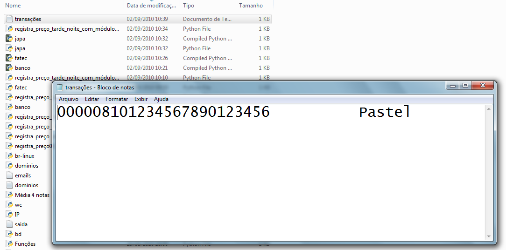

=======
Módulos
=======

.. image:: img/TWP10_001.jpeg
   :height: 14.925cm
   :width: 9.258cm
   :align: center
   :alt: 

Programacion Modular
====================

.. image:: img/TWP47_001.png
   :height: 11.865cm
   :width: 21.001cm
   :align: center
   :alt: 

Archivo Transactions.txt
========================

Venta Salgados
==============

.. code-block:: python

   def salva_transacao(precio, tarjeta_de_credito, descripcion):
      file = open('transacoes.txt',"a")
      file.write("%16s%07d%16s\n" %(tarjeta_de_credito,precio*100,descripcion))
      file.close()

   articulos = ["Sfiha","Cocina","Pastel","Pan de queso"]
   precios = [1.50,2.20,1.80,1.20]
   corriendo = True

   while corriendo:
      opción = 1
      for elegir in alrticulos					:
         print(str(opcion) + "." + elegir)
         opcao += 1
      print(str(opcion) + ".Finalizar")
      elegir = int(input("Escoja una opción: "))
      if elegir == opcion:
         #escolheu a ultima opcion Finalizar
         corriendo = False
      else:
         credito = input("Número de tarjeta de crédito: ")
         guardar_transacción(precios[elegir-1],tarjeta,articulos[elegir-1]) 

Venta Salgados
==============

Venta Salgados
==============

+ Problemas: el banco rechazó el archivo de transacción completo para el período
  ¡de mañana!
+ Todas las tarjetas no eran válidas
+ ¡Los precios eran demasiado altos: donut vendido por R $ 50.791,42!
+ En los otros períodos no hubo problema. Que paso

.. image:: img/TWP47_005.png
   :height: 5.952cm
   :width: 10.08cm
   :align: center
   :alt: 

Venta Salgados
==============

Venta Salgados
==============

+ ¡El banco cambió el orden de los datos! [Precio / Tarjeta / Artículo]

.. image:: img/TWP47_007.png
   :height: 4.001cm
   :width: 22.802cm
   :align: center
   :alt: 

Venta Salgados
==============

.. image:: img/TWP47_008.jpg
   :height: 12.571cm
   :width: 19.998cm
   :align: center
   :alt: 

Venta Salgados Tarde / Noche
============================

.. code-block:: python
   
   def guardar_transacción(precio, tarjeta_de_credito, descripcion):
      file = open('transacoes.txt',"a")
      file.write("%16s%07d%16s\n" %(tarjeta_de_credito,precio*100,descripcion))
      file.close()

   articulos = ["Esfiha","Cocina","Pastel","Pan de queso"]
   precios = [1.50,2.20,1.80,1.20]
   corriendo = True

   while corriendo:
      opcion = 1
      for elegir in articulos:
         print(str(opcion) + "." + elegir)
         opcion	 += 1
      print(str(opcion) + ".Finalizar")
      elegir = int(input("eliga una opcion "))
      if elegir == opcion:
         #la última opción Finalizar
         corriendo = False
      else:
         tarjeta = input("Número de tarjeta de crédit")
         guardar_transacción(precios[elegir-1],tarjeta,articulos[elegir-1]) 

+ Formato corregido por el alumno!

Venta Salgados Mañana
=====================

.. code-block:: python
   
   def guardar_transacción(precio, tarjeta_de_credito, descripcion):
      file = open('transacoes.txt',"a")
      file.write("%16s%07d%16s\n" %(tarjeta_de_credito,precio*100,descripcion))
      file.close()

   articulos = ["Sfiha","Cocina","Pastel","Pan de queso"]
   precios = [1.50,2.20,1.80,1.20]
   corriendo = True

   while corriendo:
      opcion = 1
      for elegir in articulos:
         print(str(opcion) + "." + elegir)
         opcion += 1
      print(str(opcion) + ".Finalizar")
      elegir = int(input("Eliga una opcion: "))
      if elegir == opcion:
         #eligió la última opción
         corriendo = False
      else:
         tarjeta = input("Número de tarjeta de crédito: ")
         guardar_transacción(precios[elegir-1],tarjeta,articulos[elegir-1]) 

+ Productos modificados, ¡pero olvidé el formato!

Módulo banco.py
===============

Módulo banco.py
===============

.. code-block:: python
   
   def salva_transacao(precio, tarjeta_de_credito, descripcion):
      file = open('transacoes.txt',"a")
      file.write("%16s%07d%16s\n" %(tarjeta_de_credito,precio*100,descripcion))
      file.close()

+ Nota: dejar en el mismo directorio que los programas de mañana y tarde / noche

Nuevo programa de la mañana
===========================

.. code-block:: python
   
   from banco import *

   articulos = ["Bauru","X ensalada","Calafrango"]
   precios = [2.50,3.0,2.20]
   corriendo = True

   while corriendo:
      opcion = 1
      for elegir in articulos:
         print(str(opcion) + "." + elegir)
         opcao += 1
      print(str(opcion) + ".Finalizar")
      elegir = int(input("Elija una opcion: "))
      if elegir == opcion:
         # eligió la última opción Finalizar
         corriendo = False
      else:
         tarjeta = input("Número de tarjeta de crédito: ")
         guardar_transacción(precios[elegir-1],tarjeta,articulos[elegir-1]) 

Nuevo programa de tarde / noche
===============================

.. code-block:: python
   
   from banco import *

   articulos = ["Sfiha","Cocina","Pastel","Pan de queso"]
   precios = [1.50,2.20,1.80,1.20]
   corriendo = True

   while corriendo:
      opcion = 1
      for elegir in articulos:
         print(str(opcion) + "." + elegir)
         opcion += 1
      print(str(opcion) + ".Finalizar")
      elegir = int(input("Elige una opcion: "))
      if elegir == opcion:
        # eligió la última opción Finalizar
         corriendo = False
      else:
         tarjeta = input("Número de tarjeta de crédito: ")
         guardar_transacción(precios[elegir-1],cartao,articulos[elegir-1]) 

Descuentos
==========

+ ¡Ahora bajo una nueva dirección, las sales en FATEC tendrán un 10% de descuento!
+ Para esto, se creará un módulo fatec.py
+ Inicialmente, el descuento será del 10% para todos los bocadillos

Descuentos
==========

.. code-block:: python
   
   from banco import *
   from fatec import *

   articulos = ["Sfiha","Cocina","Pastel","Pan de queso"]
   precios = [1.50,2.20,1.80,1.20]
   corriendo = True

   while corriendo:
      opcion = 1
      for elegir in articulos:
         print(str(opcion) + "." + elegir)
         opcion += 1
      print(str(opcion) + ".Finalizar")
      elegir = int(input("Elige una opcion"))
      if elegir == opcion:
         # eligió la última opción Finalizar
         corriendo = False
      else:
         tarjeta = input("Numero de tarjeta de credito: ")
         precio = descuento(precios[elegir-1]) 
         guardar_transacción(precio,tarjeta,articulos[elegir-1])

Descuentos
==========

+ Tendremos un descuento adicional del 50% para pasteles a causa de
  colonia japonesa
+ Nuevo módulo japa.py

¡Los nombres son iguales! ¿Y ahora?
===================================

Nombres completos
=================

+ La solución es adoptar los nombres completos

.. code-block:: python
   
   from banco import *
   import fatec
   import japa

   articulos = ["Sfiha","Cocina","Pastel","Pan de queso"]
   precios = [1.50,2.20,1.80,1.20]
   corriendo = True

   while corriendo:
      opcion = 1
      for elegir in articulos:
         print(str(opcion) + "." + elegir)
         opcion += 1
       print(str(opcion) + ".Finalizar")
       elegir = int(input("Elige una opcion"))
         if elegir == opcion:
       # eligió la última opción Finalizar
          corriendo = False
     else:
         tarjeta = input("Número de tarjeta de crédito: ")
         precio = fatec.descento(precios[elegir - 1])
         if itens[elegir - 1] == "Pastel":
            precio = japa.descento(precio)
         (precio,tarjeta,articulos[elegir-1])

Nombres completos
=================

+ Resultado - 

.. disqus::
   :shortname: pyzombis
   :identifier: lecture17
