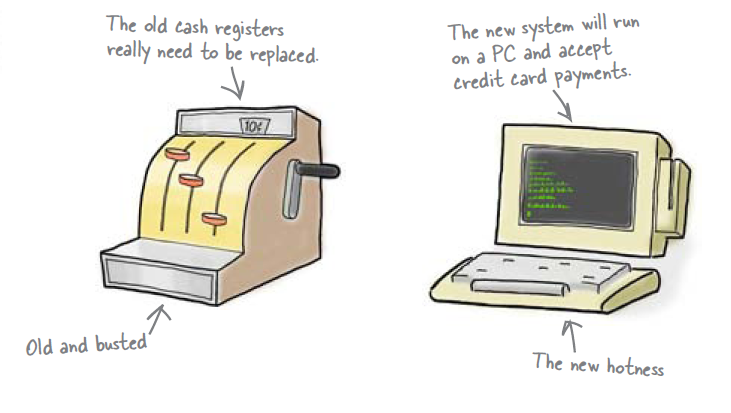
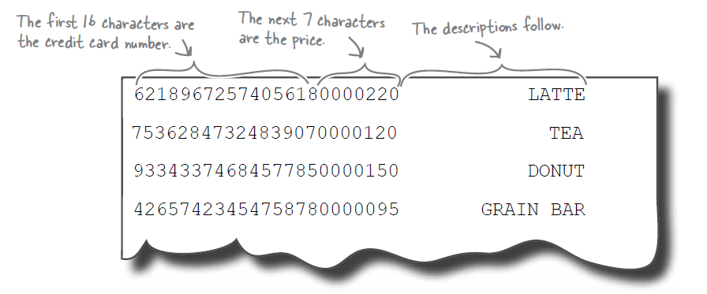
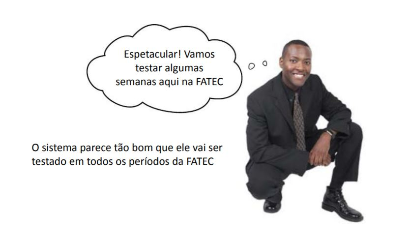
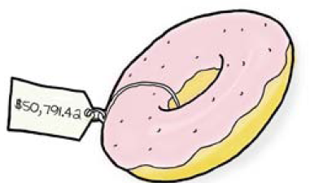
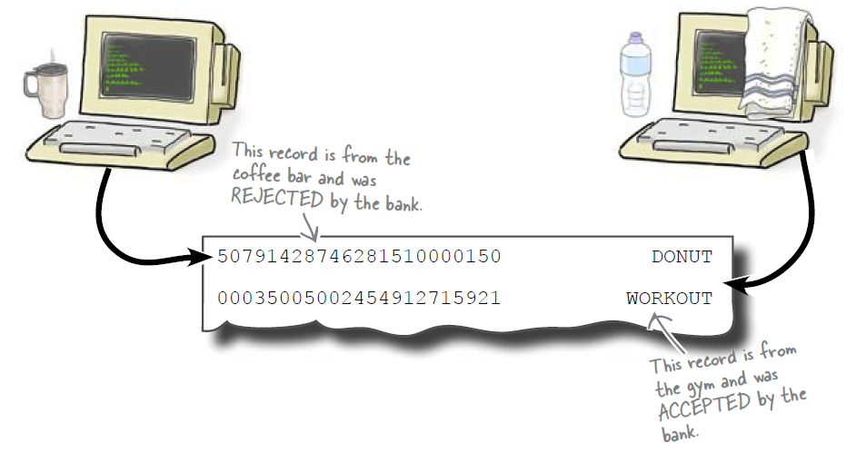
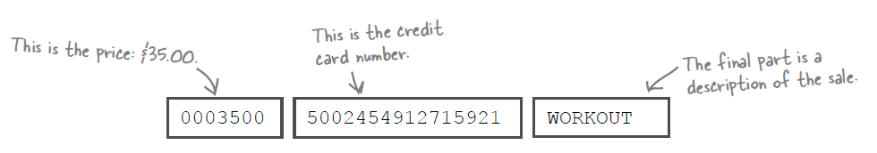
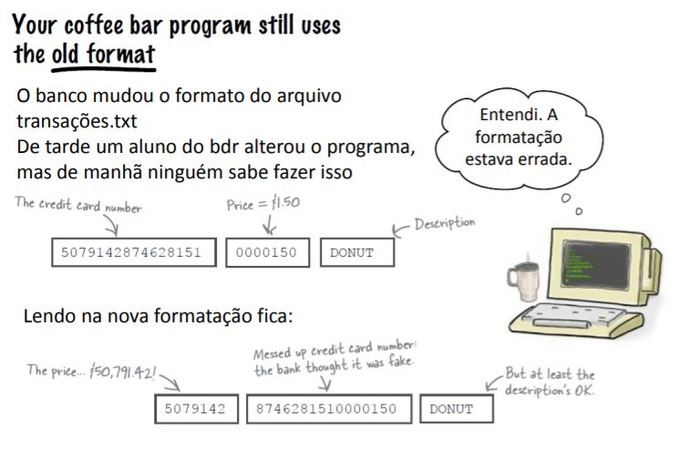

Programacion Modular
====================

Archivo Transactions.txt
------------------------

Venta Salgados
--------------

.. datafile:: transacoes.txt
   :rows: 10
   :cols: 20
   :edit:
   :hide:

.. activecode:: ac_l47_01
   :nocodelens:
   :datafile: transacoes.txt
   :stdin:

   def salva_transacao(file,precio, tarjeta_de_credito, descripcion):
      file.write("%16s %07d %16s\n" %(tarjeta_de_credito,precio*100,descripcion))

   file = open('transacoes.txt',"a")
   articulos = ["Sfiha","Cocina","Pastel","Pan de queso"]
   precios = [1.50,2.20,1.80,1.20]
   corriendo = True

   opcion = 1
   for elegir in articulos:
      print(str(opcion) + "." + elegir)
      opcion += 1
   print(str(opcion) + ".Finalizar")

   while corriendo:
      elegir = int(input("Escoja una opción: "))
      if elegir == 5:
         #escolheu a ultima opcion Finalizar
         corriendo = False
      else:
         credito = input("Número de tarjeta de crédito: ")
         salva_transacao(file,precios[elegir-1],credito,articulos[elegir-1])
      print()

   file.close()

+ Problemas: el banco rechazó el archivo de transacción completo para el período
  ¡de mañana!
+ Todas las tarjetas no eran válidas
+ ¡Los precios eran demasiado altos: donut vendido por R $ 50.791,42!
+ En los otros períodos no hubo problema. Que paso

+ ¡El banco cambió el orden de los datos! [Precio / Tarjeta / Artículo]

