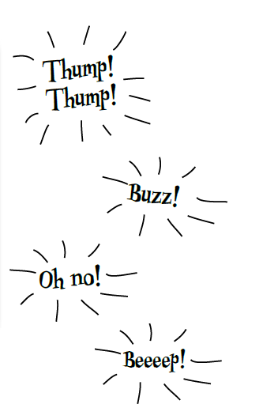
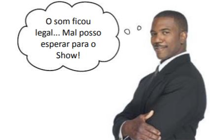
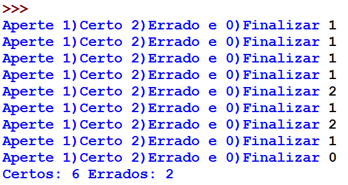
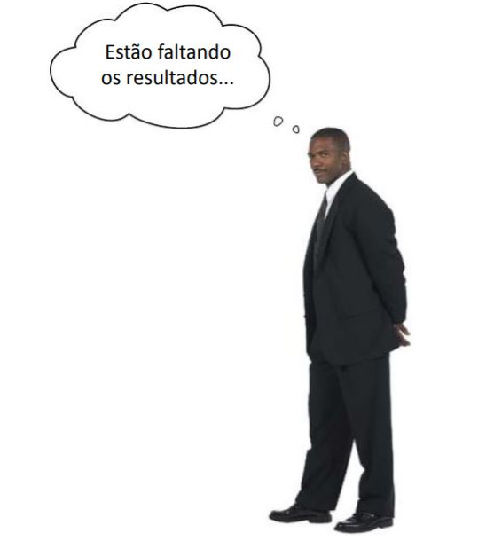
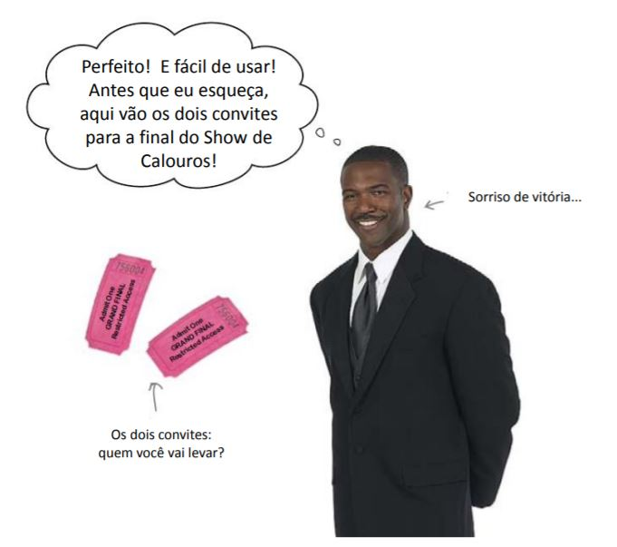

================
Interfaz gráfica
================

.. image:: img/TWP10_001.jpeg
    :height: 14.925cm
    :width: 9.258cm
    :align: center
    :alt:

+ En la programación no basta con hacer solamente el código.
+ No es suficiente para trabajar, también debe ser atractivo para el usuario.
+ Las interfaces basadas en texto funcionan, pero son limitadas y antiguas.
+ Motivado a esto, se necesita crear interfaces gráficas de usuario, también conocida por sus iniciales del inglés GUI *graphical user interface*
+ Las interfaces gráficas de usuario podemos encontrarlas en diferentes sitios:
    + En programas para la computadora, por ejemplo, una muy conocida es el programa Office. Estas interfaces las podemos llamar *interfaces de escritorio*.
    + También podemos encontrar interfaces que se ven dentro del navegador, como por ejemplo la página de Facebook, estas interfaces podemos llamarlas *interfaces web*.
    + Por último, encontramos interfaces en las aplicaciones para nuestros teléfonos inteligentes, un ejemplo es la aplicación Whatsapp, representando a las *interfaces móviles*.
+ En Python existen diferentes herramientas y librerías para la creación de interfaces, entre las conocidas para crear interfaces de escritorio se encuentran las librerías ``tkinter`` y ``PyQt``.
+ Ya que nuestro objetivo es crear interfaces dentro del navegador, utilizaremos nuevamente ``brython``.
+ Brython permite a través de su sintaxis la capacidad de crear interfaces gráficas simples.
+ Crearemos en este ejercicio el **Show de preguntas Zombis**.

Show de preguntas Zombis
========================

+ Es un juego con diferentes opciones.
+ La *opción 1* es para la respuesta correcta y la *opción 2* para la respuesta incorrecta.
+ El programa tendrá un efecto de sonido para cada respuesta.
+ El programa debe contar cuántas respuestas correctas e incorrectas hubo.
+ Finalmente presione 0 para terminar.

Reproduciendo un audio
======================

+ Comencemos hacer la lógica de reproducir un audio.
+ Hay diversas formas de hacerlo, una opción puede ser con la librería ``pygame`` entre otras.
+ Nuevamente usaremos el modulo de Brython.
+ El código de abajo genera un elemento de HTML llamado ``audio``.
+ En está `página <https://bigsoundbank.com/UPLOAD/ogg/>`_ puedes obtener sonidos libres que puedes usar en el programa.
    + Solo necesitas copiar y pegar la url del sónido que te guste.

.. activecode:: ac_lgui_1
    :nocodelens:
    :language: python3
    :python3_interpreter: brython

    from browser import document, html

    url_audio = "" # Agrega un enlace de un audio para reproducirlo
    print("Creando el elemento audio")
    document <= html.AUDIO(id="audio", src=url_audio, controls=True)

+ Notaste que se creó el elemento de audio con los controles para reproducirlo y detenerlo.
+ Puedes agregar cuantos sonidos quieras.
+ ¿Pero cómo manejo por el programa cuándo se reproduce y cuándo se detiene el sonido?
    + Vamos a enlazar eventos para poder lograrlo.

.. activecode:: ac_lgui_2
    :nocodelens:
    :language: python3
    :python3_interpreter: brython

    from browser import document, html, timer

    def crear_elemento(url_audio, nombre_audio):
        print(f"Creando el elemento audio {url_audio}")
        document <= html.AUDIO(id=nombre_audio, src=url_audio)

    # Función para iniciar el audio
    def iniciar_audio(elemento):
        document[elemento].play()

    # Función para pausar el audio
    def pausar_audio(elemento):
        document[elemento].pause()

    # Sonido de campana
    crear_elemento("https://bigsoundbank.com/UPLOAD/ogg/0001.ogg", "audio_1")
    # Sonido de golpeteo
    crear_elemento("https://bigsoundbank.com/UPLOAD/ogg/0005.ogg", "audio_2")

    # Iniciar los audios
    iniciar_audio("audio_1")
    iniciar_audio("audio_2")

    # Reproduce solamente 10 segundos del audio luego se detiene
    timer.set_timeout(pausar_audio, 10000, "audio_1")

    # Reproduce solamente 5 segundos del audio luego se detiene
    timer.set_timeout(pausar_audio, 5000, "audio_2")

+ Se oyen muy bien los audios.
+ Ahora que el audio está funcionando, ¡hagamos el Show de preguntas Zombis!

Show de preguntas Zombis
========================

+ Comencemos con la lógica del programa utilizando una interfaz de texto.
+ Recuerda los requerimientos:
    + La *opción 1* es para la respuesta correcta y la *opción 2* para la respuesta incorrecta.
    + Contar cuántas respuestas correctas e incorrectas hubo.
    + La *opción 0* es para terminar.

.. activecode:: ac_lgui_3
    :nocodelens:

    correctas = incorrectas = 0

    opcion = int(input("Seleccione: 1) Correcto 2) Incorrecto 0) Terminar"))

    # Mientras la opción no se cero acumular los valores
    while opcion != 0:
        if opcion == 1:
            correctas = correctas + 1
        if opcion == 2:
            incorrectas = incorrectas + 1
        opcion = int(input("Seleccione: 1) Correcto 2) Incorrecto 0) Terminar"))

    print(f"Correctas:{correctas} Incorrectas:{incorrectas}")

+ Resultado

.. image:: img/TWP50_003.png
    :height: 7.01cm
    :width: 6.825cm
    :align: center
    :alt:

+ ¡Perfecto! el jefe está contento funciona de maravilla.
+ Faltaría el requerimiento de los sonidos.
+ Sin embargo... ¿La interfaz de texto es nueva?

.. image:: img/TWP50_008.jpg
    :height: 13.801cm
    :width: 12.79cm
    :align: center
    :alt:

+ La interfaz de texto funciona, pero es muy limitada y antigua.
+ Por tanto, ahora que la lógica detrás del show funciona, creemos una interfaz de usuario y mejorar esta de texto.
+ Comencemos con una interfaz básica, nuevamente usando el modulo de ``brython``.
    + Usaremos unas herramientas o widgets que se encuentran en Brython.
    + Estas herramientas ya se encuentran implementadas.
    + Permiten la creación de diálogos o pequeñas ventanas para interactuar con el usuario.

Ventana básica
==============

.. activecode:: ac_lgui_4
    :nocodelens:
    :language: python3
    :python3_interpreter: brython

    from browser import document, html
    from browser.widgets.dialog import Dialog

    # Creación de un dialogo con el título
    d = Dialog("Show de preguntas Zombis", top=20, left=20)

    # Agrega elementos como botones y títulos
    d.panel <= html.H3("Aprieta los botones", id="titulo_ventana", style=dict(textAlign="center"))
    d.panel <= html.BUTTON("Correcto", id="btn_correcto")
    d.panel <= html.BUTTON("Incorrecto", id="btn_incorrecto", style=dict(marginLeft="5em"))

+ Pudiste notar que en la ventana básica los botones no hacían nada.
+ Es necesario enlazar un evento a cada botón.
+ Esto se denomina programación orientada a eventos.
+ Esperar a las acciones del usuario.

Capturando un evento
====================

+ Para capturar un evento de un botón es necesario crear una función.
+ En la función se encontrará toda la lógica que se quiere para el botón.
+ Crearemos una ventana nueva con un botón y vamos a capturar o enlazar un evento.
+ Mostraremos en pantalla un mensaje cada vez que el usuario presione el botón.

.. activecode:: ac_lgui_5
    :nocodelens:
    :language: python3
    :python3_interpreter: brython

    from browser import document, html
    from browser.widgets.dialog import Dialog

    d = Dialog("Prueba capturando un evento", top=20, left=20)

    d.panel <= html.BUTTON("¡Apriétame!", id="btn_apretar", style=dict(margin="auto", display="block"))

    # Función controladora del evento, mostrando un mensaje
    def apretar_boton(ev):
        print("Apretaste el botón")

    document["btn_apretar"].bind("click", apretar_boton)

+ Perfecto ya sabes como capturar eventos.
+ Puedes capturar eventos usando la función ``.bind()`` especificando el evento o utilizando una intrucción ``@bind`` también llamado decorador o *decorator*.
    + Esta instrucción se escribe en una línea anterior a la función que realiza el botón.
+ Sabiendo está lógica podemos terminar el Show de preguntas Zombis.
+ Recuerda la reproducción de los sonidos y la lógica de las diferentes opciones.

Show de preguntas Zombis
========================

.. activecode:: ac_lgui_6
    :nocodelens:
    :language: python3
    :python3_interpreter: brython

    from browser import document, html
    from browser.widgets.dialog import Dialog

    def crear_elemento(url_audio, nombre_audio):
        print(f"Creando el elemento audio {url_audio}")
        document <= html.AUDIO(id=nombre_audio, src=url_audio)

    def iniciar_audio(elemento):
        document[elemento].play()

    def pausar_audio(elemento):
        document[elemento].pause()

    correctas = incorrectas = 0

    # Sonido de correcto
    crear_elemento("http://www.superluigibros.com/downloads/sounds/SNES/SMRPG/wav/smrpg_correct.wav", "correcto")
    # Sonido de incorrecto
    crear_elemento("https://bigsoundbank.com/UPLOAD/ogg/1684.ogg", "incorrecto")

    d = Dialog("Show de preguntas Zombis", top=20, left=20)

    d.panel <= html.H4("Aprieta los botones", id="titulo_ventana", style=dict(textAlign="center"))
    d.panel <= html.BUTTON("Correcto", id="btn_correcto")
    d.panel <= html.BUTTON("Incorrecto", id="btn_incorrecto", style=dict(marginLeft="5em"))

    def apretar_boton_correcto(ev):
        global correctas
        iniciar_audio("correcto")
        correctas = correctas + 1
        print("Apretaste el botón correcto")

    def apretar_boton_incorrecto(ev):
        global incorrectas
        iniciar_audio("incorrecto")
        incorrectas = incorrectas + 1
        print("Apretaste el botón incorrecto")

    document["btn_correcto"].bind("click", apretar_boton_correcto)
    document["btn_incorrecto"].bind("click", apretar_boton_incorrecto)

+ Falta algo importante.
+ ¡Los resultados de cada una de las opciones!

+ Cambiemos la ventana para agregar una etiqueta que cambie su valor.
+ El valor aumentará cada vez que se presione el botón respectivo

.. activecode:: ac_lgui_7
    :nocodelens:
    :language: python3
    :python3_interpreter: brython

    from browser import document, html, bind
    from browser.widgets.dialog import Dialog

    def crear_elemento(url_audio, nombre_audio):
        print(f"Creando el elemento audio {url_audio}")
        document <= html.AUDIO(id=nombre_audio, src=url_audio)

    def iniciar_audio(elemento):
        document[elemento].play()

    def pausar_audio(elemento):
        document[elemento].pause()

    correctas = incorrectas = 0

    # Sonido de correcto
    crear_elemento("http://www.superluigibros.com/downloads/sounds/SNES/SMRPG/wav/smrpg_correct.wav", "correcto")
    # Sonido de incorrecto
    crear_elemento("https://bigsoundbank.com/UPLOAD/ogg/1684.ogg", "incorrecto")

    d = Dialog("Show de preguntas Zombis", top=20, left=20)

    d.panel <= html.H4(
        "Aprieta los botones", id="titulo_ventana", style=dict(textAlign="center")
    )
    d.panel <= html.SPAN(
        str(correctas), id="contador_correctas", style=dict(paddingRight="2em")
    ) + html.BUTTON("Correcto", id="btn_correcto")
    d.panel <= html.BUTTON(
        "Incorrecto", id="btn_incorrecto", style=dict(marginLeft="5em")
    ) + html.SPAN(
        str(incorrectas), id="contador_incorrectas", style=dict(paddingLeft="2em")
    )

    @bind(document["btn_correcto"], "click")
    def apretar_boton_correcto(ev):
        global correctas
        iniciar_audio("correcto")
        correctas += 1
        document["contador_correctas"].textContent = str(correctas)
        print("Apretaste el botón correcto")

    @bind(document["btn_incorrecto"], "click")
    def apretar_boton_incorrecto(ev):
        global incorrectas
        iniciar_audio("incorrecto")
        incorrectas += 1
        document["contador_incorrectas"].textContent = str(incorrectas)
        print("Apretaste el botón incorrecto")

+ ¡Muy bien! ya todo funciona perfectamente.
+ Puedes cambiar el audio para cada opción.
+ El jefe está feliz por el Show de preguntas Zombis.

Recuerda
========

+ Uso de las funcionalidades con el componente de ``brython``.
+ No es la única forma de crear interfaces gráficas.
    + Uso de la biblioteca de terceros: ``pygame`` y ``tkinter``.
+ Para manejar los eventos se usa un controlador de eventos.
    + Controlador de eventos: función que se ejecuta cuando ocurre el evento.
