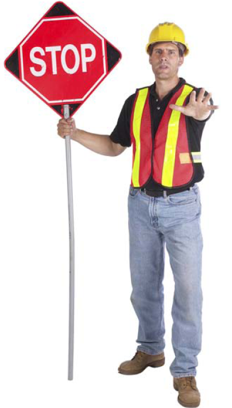
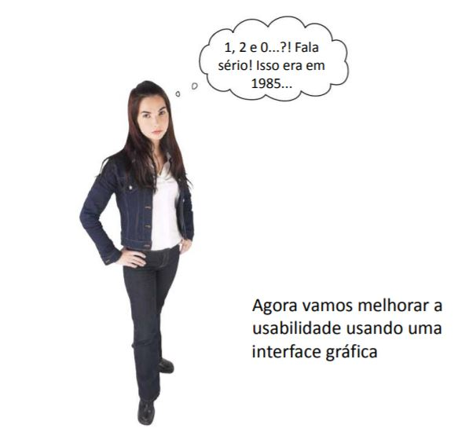
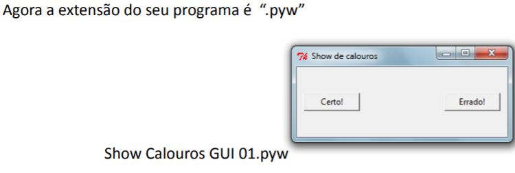
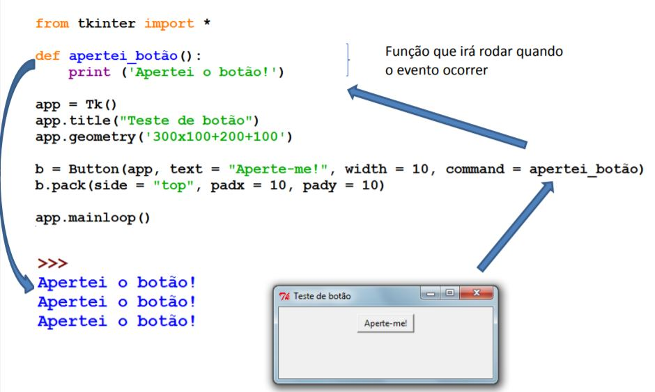
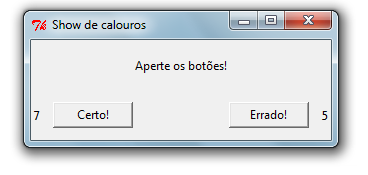

================
Interfaz gráfica
================

.. image:: img/TWP10_001.jpeg
   :height: 14.925cm
   :width: 9.258cm
   :align: center
   :alt: 

Interfaz gráfica
================

+ No es suficiente para trabajar, también debe ser hermoso
+ La interfaz de texto funciona, pero es pobre
+ GUI - Interfaz gráfica de usuario
+ Show de primer año

Show de primer año
==================

+ Opción 1 para respuesta correcta y 2 para respuesta incorrecta
+ Tendremos un efecto de sonido para cada respuesta
+ El programa debe contar cuántas respuestas correctas e incorrectas hubo
+ Finalmente presione 0 para terminar

Show de primer año
==================

+ Atención: instale Pygame y descargue los archivos de audio para continuar la lección

Show de primer año
==================

.. code-block :: python

   import pygame.mixer
   sounds = pygame.mixer
   sounds.init()

   def espera_tocar(canal):
      while canal.get_busy():
         pass

   s = sounds.Sound("heartbeat.wav")
   espera_tocar(s.play())
   s2 = sounds.Sound("buzz.wav")
   espera_tocar(s2.play())
   s3 = sounds.Sound("ohno.wav")
   espera_tocar(s3.play())
   s4 = sounds.Sound("carhorn.wav")
   espera_tocar(s4.play())

Show de primer año
==================

.. image:: img/TWP50_003.png
   :height: 7.01cm
   :width: 6.825cm
   :align: center
   :alt: 

+ Ahora que el audio está funcionando, ¡hagamos el programa Freshman Show!

Show de Calouros
================

.. code-block :: python

   import pygame.mixer
   sounds = pygame.mixer
   sounds.init()

   def espera_tocar(canal):
      while canal.get_busy():
         pass

   cierto = 0
   errores = 0
   opcion = int(input("Apretar 1)Esta bien 2)Error e 0) Terminar"))

   while opcion != 0:
      if opcion == 1:
         s = sounds.Sound("correct.wav")
         espera_tocar(s.play())
         cierto = ciertos + 1
      if opcion == 2"
         s2 = sounds.Sound("wrong.wav")
         espera_tocar(s2.play())
         errores = errores + 1
      opcion = int(input("Apretar 1)Esta bien 2)Error e 0) Terminar"))

   print("Cierto:",cierto,"Terminar:",errores)

Show de primer año
==================

+ Resultado -

Show de primer año
==================

Ventana básica
==============

.. code-block :: python

   from tkinter import *
   app = Tk()
   app.title("Show de primer año")
   app.geometry('300x100+200+100')

   b1 = Button(app,text = "Ok!", width = 10)
   b1.pack(side = "left",padx = 10,pady = 10)

   b2 = Button(app,text = "Mal!", width = 10)
   b2.pack(side = "right",padx = 10,pady = 10)

Capturando un evento
====================

Show de primer año
==================

.. code-block :: python

   from tkinter import *

   app = Tk()
   app.title("Show de primer año")
   app.geometry('300x100+200+100')

   import pygame.mixer

   sounds = pygame.mixer
   sounds.init()
   cierto = 0
   errores = 0

   def espera_tacor(canal):
      while canal.get_busy():
         pass

   def musica_certa():
      global certos
      s = sounds.Sound("correct.wav")
      espera_tocar(s.play())
      certos += 1

   def musica errados():
      global errados
      s = sounds.Sound("wrong.wav")
      espera_tocar(s.play())
      errados += 1

   b1 = Button(app,text = "Certo!", width = 10)
   b1.pack(side = "left",padx = 10,pady = 10)

   b2 = Button(app,text = "Errado!", width = 10)
   b2.pack(side = "right",padx = 10,pady = 10)

   app.mainloop()

Show de primer año
==================

.. image:: img/TWP50_013.jpg
   :height: 15.793cm
   :width: 11.6cm
   :align: center
   :alt: 

Etiquetas agregadas
===================

.. code-block :: python

   from tkinter import *
   app = Tk()
   app.title("como estudiantes de primer año")
   app.geometry('300x100+200+100')

   import pygame.mixer
   sounds = pygame.mixer
   sounds.init()
   cierto = IntVar()
   cierto.set(0)
   errores = IntVar()
   errores.set(0)

   def espera_tacor(canal):
      while canal.get_busy():
         pass

   def musica_certa():
      s = sounds.Sound("correct.wav")
      espera_tocar(s.play())
      cierto.set(certos.get() + 1)

   def musica errores():
      s = sounds.Sound("wrong.wav")
      espera_tocar(s.play())
      errores.set(errores.get() + 1)

Agregar etiquetas
=================

.. code-block :: python

   lab = Label(app,text = '¡Aprieta los botones!',height = 3)
   lab.pack()

   lab1 = Label(app, textvariable = cierto)
   lab1.pack(side = 'left')
   lab1 = Label(app, textvariable = errores)
   lab1.pack(side = 'right')

   b1 = Button(app,text = "Cierto!", width = 10, command = musica_certa)
   b1.pack(side = "left",padx = 10,pady = 10)

   b2 = Button(app,text = "Error!", width = 10, command = musica_certa)
   b2.pack(side = "right",padx = 10,pady = 10)

   app.mainloop

Show de primer año
==================

.. image:: img/TWP50_017.jpg
   :height: 14.861cm
   :width: 15.801cm
   :align: center
   :alt: 

Revisar
=======

+ Uso de la biblioteca de terceros: pygame
+ Bucle de eventos: responde solo cuando se produce el evento
+ Controlador de eventos: rutina que se ejecuta cuando ocurre el evento
+ pass - código de python para no hacer nada
+ Tkinter: biblioteca para interfaz gráfica

.. disqus::
   :shortname: pyzombis
   :identifier: lecture18
