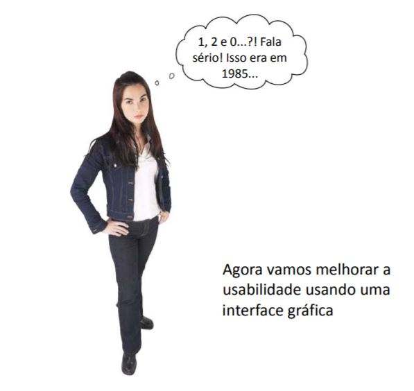

Ventana básica
==============

+ La interfaz de texto funciona, pero es muy limitada y antigua.
+ Por tanto, ahora que la lógica detrás del show funciona, creemos una interfaz de usuario y mejorar esta de texto.
+ Comencemos con una interfaz básica, nuevamente usando el modulo de ``brython``.
    + Usaremos unas herramientas o widgets que se encuentran en Brython.
    + Estas herramientas ya se encuentran implementadas.
    + Permiten la creación de diálogos o pequeñas ventanas para interactuar con el usuario.

Ventana con Brython
-------------------

.. activecode:: ac_l50_3a
    :nocodelens:
    :language: python3
    :python3_interpreter: brython

    from browser import document, html
    from browser.widgets.dialog import Dialog

    # Creación de un dialogo con el título
    d = Dialog("Show de preguntas Zombis", top=20, left=20)

    # Agrega elementos como botones y títulos
    d.panel <= html.H3("Aprieta los botones", id="titulo_ventana", style=dict(textAlign="center"))
    d.panel <= html.BUTTON("Correcto", id="btn_correcto")
    d.panel <= html.BUTTON("Incorrecto", id="btn_incorrecto", style=dict(marginLeft="5em"))

+ Pudiste notar que en la ventana básica los botones no hacían nada.
+ Es necesario enlazar un evento a cada botón.
+ Esto se denomina programación orientada a eventos.
+ Esperar a las acciones del usuario.

Capturando un evento
--------------------

+ Para capturar un evento de un botón es necesario crear una función.
+ En la función se encontrará toda la lógica que se quiere para el botón.
+ Crearemos una ventana nueva con un botón y vamos a capturar o enlazar un evento.
+ Mostraremos en pantalla un mensaje cada vez que el usuario presione el botón.

.. activecode:: ac_l50_3b
    :nocodelens:
    :language: python3
    :python3_interpreter: brython

    from browser import document, html
    from browser.widgets.dialog import Dialog

    d = Dialog("Prueba capturando un evento", top=20, left=20)

    d.panel <= html.BUTTON("¡Apriétame!", id="btn_apretar", style=dict(margin="auto", display="block"))

    # Función controladora del evento, mostrando un mensaje
    def apretar_boton(ev):
        print("Apretaste el botón")

    document["btn_apretar"].bind("click", apretar_boton)

+ Perfecto ya sabes como capturar eventos.
+ Puedes capturar eventos usando la función ``.bind()`` especificando el evento o utilizando una intrucción ``@bind`` también llamado decorador o *decorator*.
    + Esta instrucción se escribe en una línea anterior a la función que realiza el botón.
+ Sabiendo está lógica podemos terminar el Show de preguntas Zombis.
+ Recuerda la reproducción de los sonidos y la lógica de las diferentes opciones.
