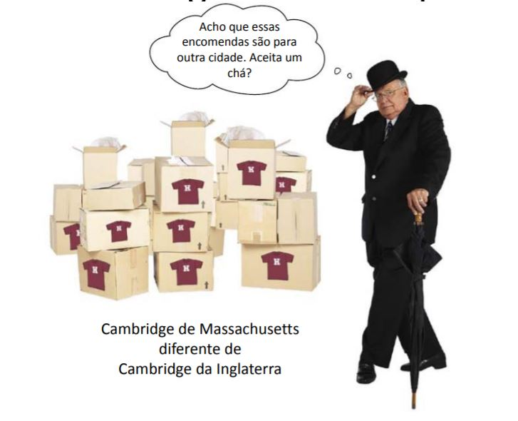
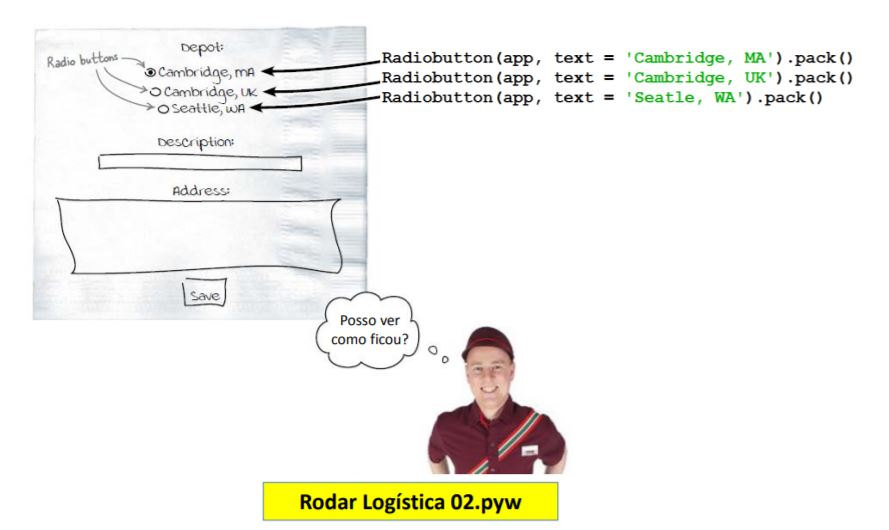
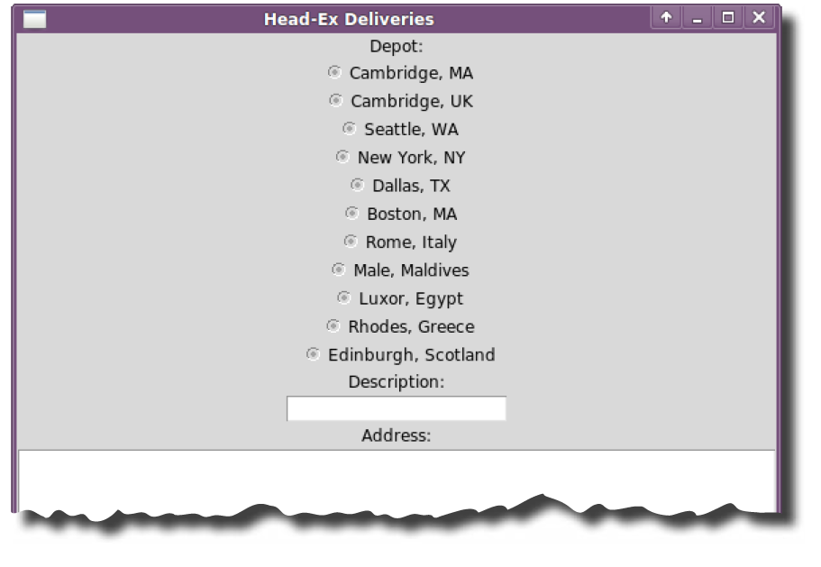

===
MVC
===

.. image:: img/TWP10_001.jpeg
   :height: 14.925cm
   :width: 9.258cm
   :align: center
   :alt: 

HEAD-Ex Logística e Transporte
==============================

.. image:: img/TWP52_001.jpg
   :height: 11.207cm
   :width: 15.193cm
   :align: center
   :alt: 

HEAD-Ex Logística e Transporte
==============================

.. code-block :: python

   
   def salvar_dados():
      fileD = open('encomendas.txt','a')
      fileD.write('Destino: ')
      fileD.write('%s\n' %destino.get())
      fileD.write('Descricao: ')
      fileD.write('%s\n' %descricao.get())
      fileD.write('Endereco: ')
      fileD.write('%s\n' %endereco.get('1.0',END))
      destino.delete(0,END)
      descricao.delete(0,END)
      endereco.delete('1.0',END)

HEAD-Ex Logística e Transporte
==============================

.. code-block :: python

   from tkinter import *

   app = Tk()
   app.title('Head-Ex Logistica e Transportes')
   app.geometry("250x180+200+100")

   Label(app,text = "Destino: ").pack()
   destino = Entry(app)
   destino.pack()

   Label(app,text = "Descricao: ").pack()
   descricao = Entry(app)
   descricao.pack()

   Label(app,text = "Endereco: ").pack()
   endereco = Entry(app)
   endereco.pack()

   Button(app, text = "Salvar" , command = salvar_dados).pack()
   app.mainloop()

HEAD-Ex Logística e Transporte
==============================

HEAD-Ex Logística e Transporte
==============================

.. image:: img/TWP52_006.jpg
   :height: 15.565cm
   :width: 17.401cm
   :align: center
   :alt: 

HEAD-Ex Logística e Transporte
==============================

+ Radio Buttons

.. image:: img/TWP52_007.png
   :height: 13.973cm
   :width: 15.801cm
   :align: center
   :alt: 

HEAD-Ex Logística e Transporte
==============================

HEAD-Ex Logística e Transporte
==============================

.. image:: img/TWP52_009.jpg
   :height: 12.571cm
   :width: 15.212cm
   :align: center
   :alt: 

HEAD-Ex Logística e Transporte
==============================

.. image:: img/TWP52_013.jpg
   :height: 9.048cm
   :width: 18.123cm
   :align: center
   :alt: 

HEAD-Ex Logística e Transporte
==============================

.. image:: img/TWP52_014.png
   :height: 4.176cm
   :width: 13cm
   :align: center
   :alt:

+ Modelo é o dado armazenado
+ Visão é o radio button apresentado
+ Controle é o código tkinter que gerencia tudo isso

.. code-block :: python

   Label(app, text = 'Destino: ').pack()
   destino = StringVar()
   destino.set(None)
   Radiobutton(app, variable = destino , text = 'Cambridge , MA', value = 'Cambridge , MA').pack()
   Radiobutton(app, variable = destino , text = 'Cambridge , UK', value = 'Cambridge , UK').pack()
   Radiobutton(app, variable = destino , text = 'Seattle, WA', value = 'Seattle , WA').pack()

HEAD-Ex Logística e Transporte
==============================

.. image:: img/TWP52_016.jpg
   :height: 14.578cm
   :width: 20.401cm
   :align: center
   :alt: 

HEAD-Ex Logística e Transporte
==============================

+ E agora??

HEAD-Ex Logística e Transporte
==============================

.. code-block :: python

   
   def salvar_dados():
      fileD = open('encomendas.txt','a')
      fileD.write('Destino: ')
      fileD.write('%s\n' %destino.get())
      fileD.write('Descricao: ')
      fileD.write('%s\n' %descricao.get())
      fileD.write('Endereco: ')
      fileD.write('%s\n' %endereco.get('1.0',END))
      destino.delete(0,END)
      descricao.delete(0,END)
      endereco.delete('1.0',END)

   def ler_destinos(arquivo):
      destinos = []
      f = open(arquivo)
      for linha in f:
         destinos.append(linha.rstrip())
      return destinos

HEAD-Ex Logística e Transporte
==============================

.. code-block :: python

   from tkinter import *

   app = Tk()
   app.title('Head-Ex Logistica e Transportes')
   Label(app,text = "Destino: ").pack()
   destino = StringVar()
   destino.set(None)

   opcoes = ler_destinos("cidades.txt")
   OptionMenu(app,destino,*opcoes).pack()

   Label(app,text = "Descricao: ").pack()
   descricao = Entry(app)
   descricao.pack()
   Label(app,text = "Endereco: ").pack()
   endereco = Entry(app)
   endereco.pack()
   Button(app, text = "Salvar" , command = salvar_dados).pack()
   app.mainloop()

HEAD-Ex Logística e Transporte
==============================

.. image:: img/TWP52_020.jpg
   :height: 12.571cm
   :width: 17.025cm
   :align: center
   :alt: 

Revisão
=======

+ MVC – Modelo, Visão, Controle
+ Entry()
+ Text()
+ StringVar()
+ RadioButton()
+ OptionMenu()

Links de Palestras em Vídeo:
============================

.. youtube:: SnVbanjubbw
      :height: 315
      :width: 560
      :align: center

.. disqus::
   :shortname: pyzombis
   :identifier: lecture19
