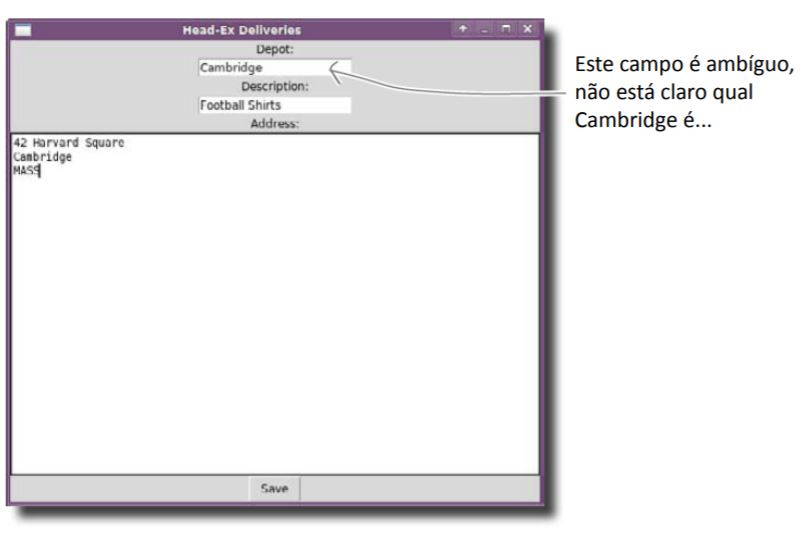
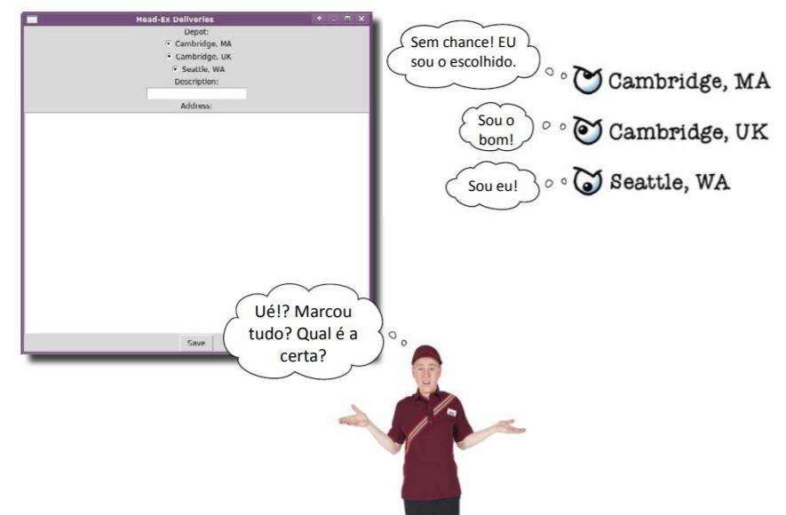
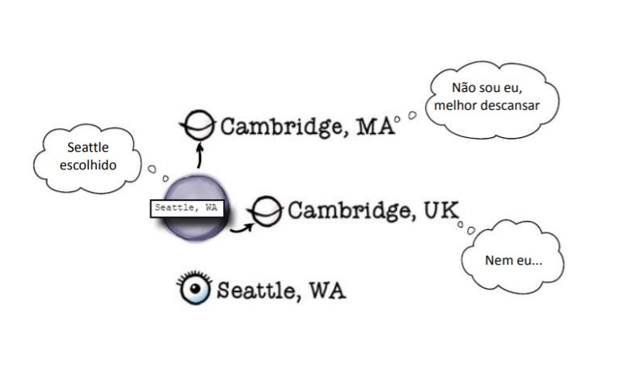
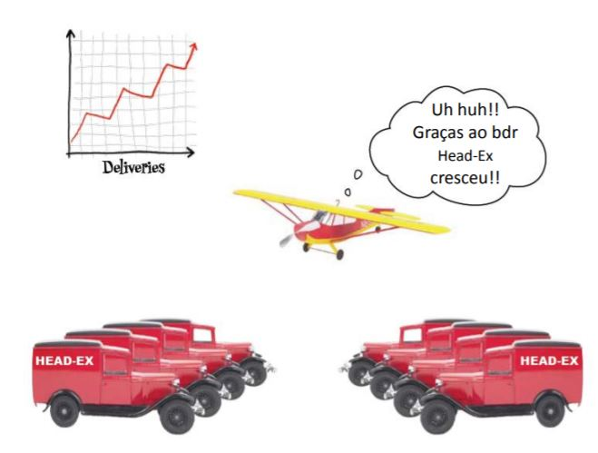

===
MVC
===

.. image:: img/TWP10_001.jpeg
   :height: 14.925cm
   :width: 9.258cm
   :align: center
   :alt: 

HEAD-Ex Logística y Transporte
==============================

.. image:: img/TWP52_001.jpg
   :height: 11.207cm
   :width: 15.193cm
   :align: center
   :alt: 

HEAD-Ex Logística y Transporte
==============================

.. activecode:: ac_l52_1a
   :nocodelens:
   :language: python3
   :python3_interpreter: brython

   from browser import document, html

   def guardar_datos(evento):
      # Agrega tu lógica para guardar datos aquí
      print(f"Destino: {destino.value}, Descripción: {descripcion.value}, Hablar a: {direccion.value}")

   app = html.DIV()
   app <= html.H2('HEAD-Ex Logística y Transporte')

   app <= html.LABEL('Destino: ')
   destino = html.INPUT()
   app <= destino

   app <= html.LABEL('Descripción: ')
   descripcion = html.INPUT()
   app <= descripcion

   app <= html.LABEL('Hablar a: ')
   direccion = html.INPUT()
   app <= direccion

   boton = html.BUTTON('Guardar')
   boton.bind('click', guardar_datos)
   app <= boton

   document <= app

HEAD-Ex Logística e Transporte
==============================

.. image:: img/TWP52_005.jpg
   :height: 12.571cm
   :width: 19.302cm
   :align: center
   :alt: 

HEAD-Ex Logística y Transporte
==============================

HEAD-Ex Logística y Transporte
==============================

+ Radio Buttons

.. image:: img/TWP52_007.png
   :height: 13.973cm
   :width: 15.801cm
   :align: center
   :alt: 

HEAD-Ex Logística y Transporte
==============================

.. image:: img/TWP52_008.jpg
   :height: 8.254cm
   :width: 7.831cm
   :align: center
   :alt: 

HEAD-Ex Logística y Transporte
==============================

HEAD-Ex Logística y Transporte
==============================

HEAD-Ex Logística y Transporte
==============================

.. image:: img/TWP52_014.png
   :height: 4.176cm
   :width: 13cm
   :align: center
   :alt:

+ Modelo son los datos almacenados
+ Vision es el botón de radio presentado
+ Control es el código tkinter que gestiona todo esto

.. activecode:: ac_l52_1b
   :nocodelens:
   :language: python3
   :python3_interpreter: brython

   from browser import document, html

   def al_cambiar(evento):
      print(f"Destino: {evento.target.value}")

   app = html.DIV()

   app <= html.LABEL('Destino: ')

   destinos = ['Cambridge, MA', 'Cambridge, UK', 'Seattle, WA']
   for destino in destinos:
      radio = html.INPUT(Type="radio", name="destino", value=destino)
      radio.bind('change', al_cambiar)
      app <= radio
      app <= html.LABEL(destino)
      app <= html.BR()

   document <= app

HEAD-Ex Logística e Transporte
==============================

.. image:: img/TWP52_016.jpg
   :height: 14.578cm
   :width: 20.401cm
   :align: center
   :alt: 

HEAD-Ex Logística e Transporte
==============================

.. image:: img/TWP52_017.png
   :height: 12.571cm
   :width: 18.208cm
   :align: center
   :alt: 

+ Y ahora??

HEAD-Ex Logística e Transporte
==============================

.. activecode:: ac_l52_1c
   :nocodelens:
   :language: python3
   :python3_interpreter: brython

   from browser import document, html, window

   def guardar_datos(evento):
      window.localStorage['Destino'] = destino.value
      window.localStorage['Descripción'] = descripcion.value
      window.localStorage['Dirección'] = direccion.value
      destino.value = ''
      descripcion.value = ''
      direccion.value = ''

   def leer_destinos():
      destinos = []
      for clave in window.localStorage:
         destinos.append(window.localStorage[clave])
      return destinos

   app = html.DIV()

   app <= html.LABEL('Destino: ')
   destino = html.INPUT()
   app <= destino

   app <= html.LABEL('Descripción: ')
   descripcion = html.INPUT()
   app <= descripcion

   app <= html.LABEL('Dirección: ')
   direccion = html.TEXTAREA()
   app <= direccion

   boton = html.BUTTON('Guardar')
   boton.bind('click', guardar_datos)
   app <= boton

   document <= app

HEAD-Ex Logística e Transporte
==============================

.. activecode:: ac_l52_1d
   :nocodelens:
   :language: python3
   :python3_interpreter: brython

   from browser import document, html, window, console

   def guardar_datos(evento):
      window.localStorage['Destino'] = destino.value
      window.localStorage['Descripción'] = descripcion.value
      window.localStorage['Dirección'] = direccion.value
      console.log(f"Datos guardados: Destino - {destino.value}, Descripción - {descripcion.value}, Dirección - {direccion.value}")
      destino.value = ''
      descripcion.value = ''
      direccion.value = ''

   app = html.DIV()
   app <= html.H2('HEAD-Ex Logística y Transporte')

   app <= html.LABEL('Destino: ')
   destino = html.SELECT()
   opciones = ["Opción 1", "Opción 2", "Opción 3"]  # Reemplaza con tus opciones
   for opcion in opciones:
      destino <= html.OPTION(opcion)
   app <= destino

   app <= html.LABEL('Descripción: ')
   descripcion = html.INPUT()
   app <= descripcion

   app <= html.LABEL('Hablar a: ')
   direccion = html.INPUT()
   app <= direccion

   boton = html.BUTTON('Guardar')
   boton.bind('click', guardar_datos)
   app <= boton

   document <= app

HEAD-Ex Logística y Transporte
==============================

revisión
========

+ MVC - Modelo, Vista, Controlador
+ Entry()
+ Texto()
+ StringVar()
+ RadioButton()
+ OptionMenu()

.. disqus::
   :shortname: pyzombis
   :identifier: lecture19
