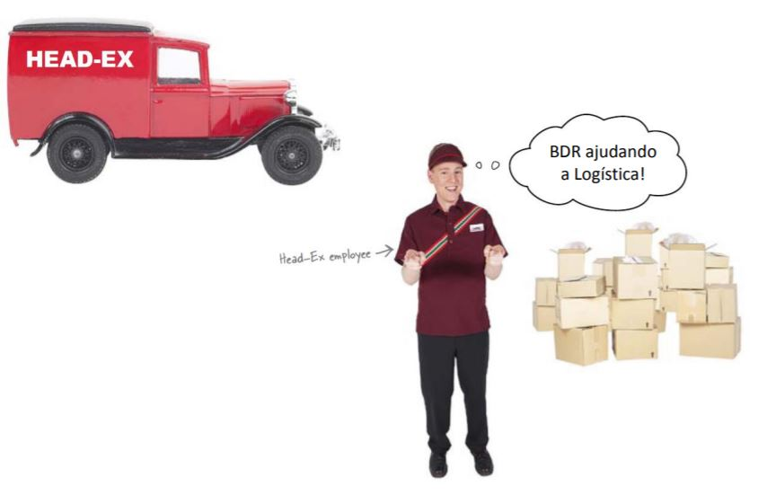

===
MVC
===

.. image:: img/TWP10_001.jpeg
   :height: 14.925cm
   :width: 9.258cm
   :align: center
   :alt: 

HEAD-Ex Logistics and Transportation
====================================

HEAD-Ex Logistics and Transportation
====================================

.. activecode:: ac_l52_1a_en
   :nocodelens:
   :language: python3
   :python3_interpreter: brython

   from browser import document, html

   def save_data(event):
      # Add your save data logic here
      print(f"Destination: {destination.value}, Description: {description.value}, Speak to: {address.value}")
  
   app = html.DIV()
   app <= html.H2('HEAD-Ex Logistics and Transport')

   app <= html.LABEL('Destination: ')
   destination = html.INPUT()
   app <= destination

   app <= html.LABEL('Description: ')
   description = html.INPUT()
   app <= description

   app <= html.LABEL('Speak to: ')
   address = html.INPUT()
   app <= address

   button = html.BUTTON('Save')
   button.bind('click', save_data)
   app <= button

   document <= app

HEAD-Ex Logistics and Transportation
====================================

.. image:: img/TWP52_005.jpg
   :height: 12.571cm
   :width: 19.302cm
   :align: center
   :alt: 

HEAD-Ex Logistics and Transportation
====================================

.. image:: img/TWP52_006.jpg
   :height: 15.565cm
   :width: 17.401cm
   :align: center
   :alt: 

HEAD-Ex Logistics and Transportation
====================================

+ Radio Buttons

HEAD-Ex Logistics and Transportation
====================================

.. image:: img/TWP52_008.jpg
   :height: 8.254cm
   :width: 7.831cm
   :align: center
   :alt: 

HEAD-Ex Logistics and Transportation
====================================

.. image:: img/TWP52_009.jpg
   :height: 12.571cm
   :width: 15.212cm
   :align: center
   :alt: 

HEAD-Ex Logistics and Transportation
====================================

.. image:: img/TWP52_013.jpg
   :height: 9.048cm
   :width: 18.123cm
   :align: center
   :alt: 

HEAD-Ex Logistics and Transportation
====================================

+ Model is the stored data
+ Vision is the featured radio button
+ Control is the tkinter code that manages all this

.. activecode:: ac_l52_1b_en
   :nocodelens:
   :language: python3
   :python3_interpreter: brython

   from browser import document, html

   def on_change(event):
      print(f"Destination: {event.target.value}")

   app = html.DIV()

   app <= html.LABEL('Destination: ')

   destinations = ['Cambridge, MA', 'Cambridge, UK', 'Seattle, WA']
   for destination in destinations:
      radio = html.INPUT(Type="radio", name="destination", value=destination)
      radio.bind('change', on_change)
      app <= radio
      app <= html.LABEL(destination)
      app <= html.BR()

   document <= app

HEAD-Ex Logistics and Transportation
====================================

.. image:: img/TWP52_016.jpg
   :height: 14.578cm
   :width: 20.401cm
   :align: center
   :alt: 

HEAD-Ex Logistics and Transportation
====================================

.. image:: img/TWP52_017.png
   :height: 12.571cm
   :width: 18.208cm
   :align: center
   :alt: 

+ And now??

HEAD-Ex Logistics and Transportation
====================================

.. activecode:: ac_l52_1c_en
   :nocodelens:
   :language: python3
   :python3_interpreter: brython

   
   from browser import document, html, window

   def save_data(event):
      window.localStorage['Destination'] = destination.value
      window.localStorage['Description'] = description.value
      window.localStorage['Address'] = address.value
      destination.value = ''
      description.value = ''
      address.value = ''

   def read_destinations():
      destinations = []
      for key in window.localStorage:
         destinations.append(window.localStorage[key])
      return destinations

   app = html.DIV()

   app <= html.LABEL('Destination: ')
   destination = html.INPUT()
   app <= destination

   app <= html.LABEL('Description: ')
   description = html.INPUT()
   app <= description

   app <= html.LABEL('Address: ')
   address = html.TEXTAREA()
   app <= address

   button = html.BUTTON('Save')
   button.bind('click', save_data)
   app <= button

   document <= app

HEAD-Ex Logistics and Transportation
====================================

.. activecode:: ac_l52_1d_en
   :nocodelens:
   :language: python3
   :python3_interpreter: brython

   from browser import document, html, window, console

   def save_data(event):
      window.localStorage['Destination'] = destination.value
      window.localStorage['Description'] = description.value
      window.localStorage['Address'] = address.value
      console.log(f"Saved data: Destination - {destination.value}, Description - {description.value}, Address - {address.value}")
      destination.value = ''
      description.value = ''
      address.value = ''

   app = html.DIV()
   app <= html.H2('HEAD-Ex Logistics and Transport')

   app <= html.LABEL('Destination: ')
   destination = html.SELECT()
   options = ["Option 1", "Option 2", "Option 3"]  # Replace with your options
   for option in options:
      destination <= html.OPTION(option)
   app <= destination

   app <= html.LABEL('Description: ')
   description = html.INPUT()
   app <= description

   app <= html.LABEL('Speak to: ')
   address = html.INPUT()
   app <= address

   button = html.BUTTON('Save')
   button.bind('click', save_data)
   app <= button

   document <= app

HEAD-Ex Logistics and Transportation
====================================

.. image:: img/TWP52_020.jpg
   :height: 12.571cm
   :width: 17.025cm
   :align: center
   :alt: 

Review
======

+ MVC - Model, View, Control
+ Entry()
+ Texto()
+ StringVar()
+ RadioButton()
+ OptionMenu()

.. raw:: html

    <iframe src="https://dev.python.org.ar/mod/scorm/player.php?a=7&scoid=16" width="100%" height="600px">
      Your browser does not support iframes.
   </iframe>

.. disqus::
   :shortname: pyzombis
   :identifier: lecture19
