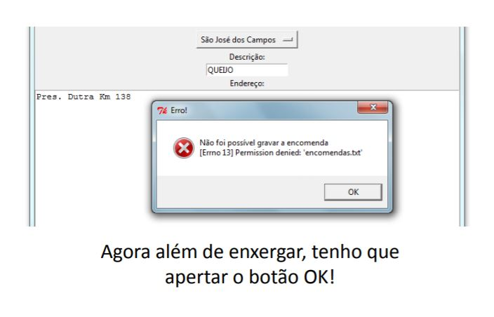

Using a messagebox
====================

.. activecode:: ac_l54_3a_en
   :nocodelens:
   :language: python3
   :python3_interpreter: brython

   from browser import document, alert, window, html

   def save_data(event):
      try:
         destination = destination_input.value
         description = description_input.value
         address = address_input.value

         if not destination or not description or not address:
            raise ValueError("All fields must be filled")

         window.sessionStorage["Destination"] = destination
         window.sessionStorage["Description"] = description
         window.sessionStorage["Address"] = address
      except Exception as exception:
         alert(f'Error: {exception}')

   app = html.DIV()

   app <= html.LABEL('Destination: ')
   destination_input = html.INPUT()
   app <= destination_input

   app <= html.LABEL('Description: ')
   description_input = html.INPUT()
   app <= description_input

   app <= html.LABEL('Address: ')
   address_input = html.INPUT()
   app <= address_input

   button = html.BUTTON('Save')
   button.bind('click', save_data)
   app <= button

   document <= app

.. poll:: TWP54E
   :scale: 3
   :allowcomment:

   On a scale from 1 (needs improvement) to 3 (excellent),
   how would you rate this chapter?
