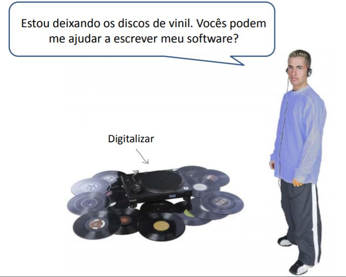

DJ Mix
======

.. activecode:: lecture_56_1_es
   :nocodelens:
   :language: python3
   :python3_interpreter: brython

   from browser import document, html

   audio_url = 'https://bigsoundbank.com/UPLOAD/mp3/0751.mp3'

   def start():
      document['track'].play()
      print("Audio iniciado")

   def stop():
      document['track'].pause()
      document['track'].currentTime = 0
      print("Audio detenido")

   audio_element = html.AUDIO(id='track', src=audio_url)
   document <= audio_element

   start_button = html.BUTTON('Iniciar')
   start_button.bind('click', lambda ev: start())

   stop_button = html.BUTTON('Detener')
   stop_button.bind('click', lambda ev: stop())

   document <= start_button
   document <= stop_button