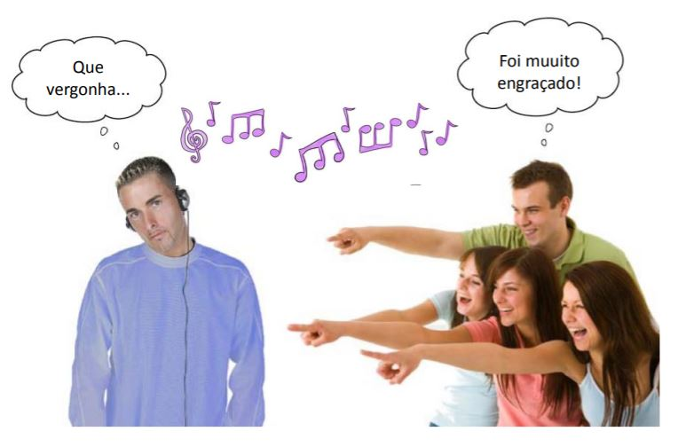
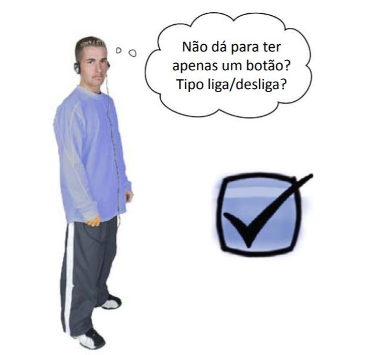

But the song never ends...
===========================

.. activecode:: lecture_56_2_en
   :nocodelens:
   :language: python3
   :python3_interpreter: brython

   from browser import document, html

   sound = 'https://bigsoundbank.com/UPLOAD/mp3/0751.mp3'

   def start():
      track.play()
      print("Audio started")

   def stop():
      track.pause()
      track.currentTime = 0
      print("Audio stopped")

   def terminate(ev):
      track.pause()
      if app_div in document:
         app_div.remove()
      print("Application terminated")

   audio_element = html.AUDIO(src=sound)

   start_button = html.BUTTON('Start')
   start_button.bind('click', lambda ev: start())

   stop_button = html.BUTTON('Stop')
   stop_button.bind('click', lambda ev: stop())

   app_div = html.DIV()
   app_div <= audio_element
   app_div <= start_button
   app_div <= stop_button

   document <= app_div

   document.bind('beforeunload', terminate)

   track = audio_element

One button only
---------------

.. activecode:: lec56esdgdbf
   :nocodelens:
   :language: python3
   :python3_interpreter: brython

   from browser import document, html

   sound = 'https://bigsoundbank.com/UPLOAD/mp3/0751.mp3'

   def terminate():
      track.pause()
      if app_div in document:
         app_div.remove()

   def switch(ev):
      if ev.target.checked:
         track.play()
      else:
         track.pause()

   audio_element = html.AUDIO(src=sound)

   play_button = html.INPUT(type='checkbox')
   play_label = html.LABEL('Play Sound', style={'margin-left': '10px'})
   play_label <= play_button

   app_div = html.DIV()
   app_div <= audio_element
   app_div <= play_label

   document <= app_div

   play_button.bind('change', switch)

   document.bind('beforeunload', terminate)

   track = audio_element

