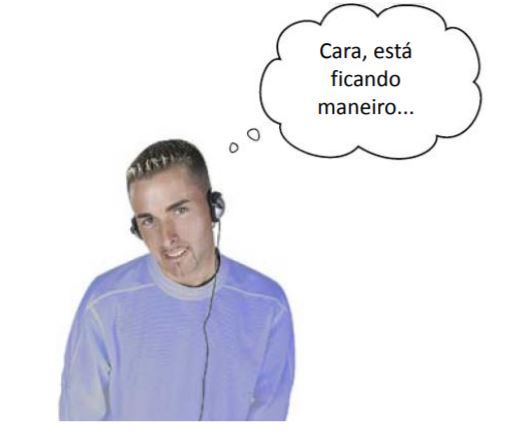
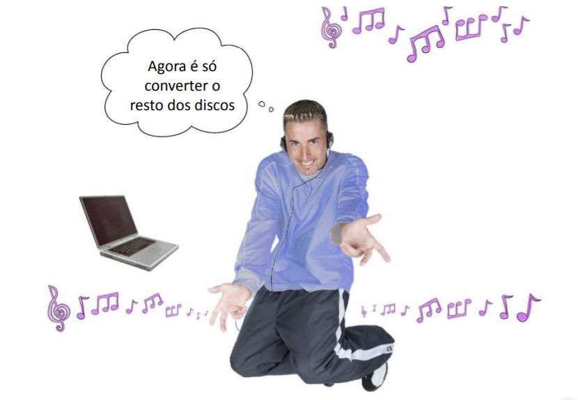

Se ve genial, ¡ahora agreguemos un volumen!
===========================================

.. code-block :: python

   from tkinter import *
   import pygame.mixer

   app = Tk()
   app.title('DJ Mix')
   app.geometry('250x100+200+100')

   som = '50459_M_RED_Nephlimizer.wav'
   mixer = pygame.mixer
   mixer.init()

   def termina():
      track.stop()
      app.destroy()
   def muda():
      if tocando.get() == 1:
         track.play(loops = -1)
      else:
         track.stop()
   def muda_volume(v):
      track.set_volume(volume.get())

   track = mixer.Sound(som)
   tocando = IntVar()
   tocar = Checkbutton(app,variable = tocando, command = muda, text = som)
   tocar.pack(side = LEFT)
   volume = DoubleVar()
   volume.set(track.get_volume())
   escala = Scale(variable = volume , from = 0.0 , to = 1.0 , resolution = 0.1, command = muda_volume, label = 'Volume',orient = HORIZONTAL)

   escala.pack(side = RIGHT)
   app.protocol('WM_DELETE_WINDOW',terminal)
   app.mainloop()

Recuerda
--------

+ app.destroy()
+ DoubleVar()
+ Checkbutton()
+ Scale()
