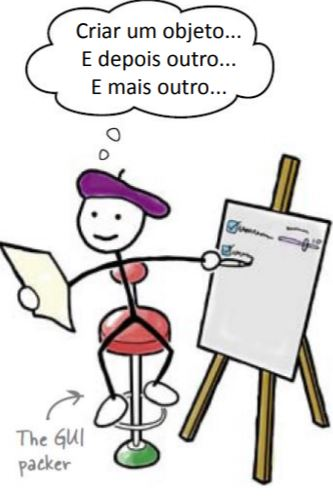
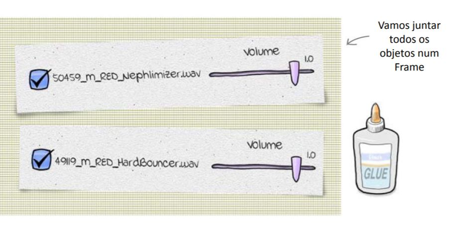
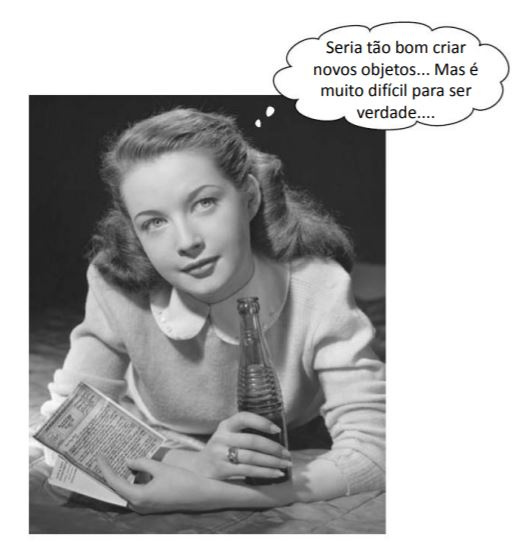

=====================================
DJ Mix 2 Revisão Orientação à Objetos
=====================================

.. image:: img/TWP58_001.jpeg
   :height: 12.501cm
   :width: 7.754cm
   :align: center
   :alt: 

.. youtube:: hoA4d3-CezI
      :height: 315
      :width: 560
      :align: center

POO – Programação Orientada à Objetos
=====================================

.. image:: img/TWP58_002.jpeg
   :height: 4.629cm
   :width: 13.81cm
   :align: center
   :alt: 

+ Temos DJ Mix para uma música
+ Agora precisamos para várias
+ KISS – Kept It Simple Stupid
+ Não duplicaremos código!

Programação Orientada à Objetos
===============================

Programação Orientada à Objetos
===============================

Classe = fábrica de objetos
===========================

.. image:: img/TWP58_006.jpg
   :height: 12.514cm
   :width: 22.7cm
   :align: center
   :alt: 

Programação Orientada à Objetos
===============================

.. image:: img/TWP58_007.jpg
   :height: 9.471cm
   :width: 22.647cm
   :align: center
   :alt: 

Programação Orientada à Objetos
===============================

.. code-block :: python

   from tkinter import *
   import pygame.mixer

   class SoundPanel(Frame):
      def track_toggle(self):
         if self.track_playing.get() == 1:
            self.track.play(loops = -1)
         else:
            self.track.stop()
      def change_volume(self,v):
         self.track.set_volume(self.volume.get())
      def __init__(self,app,mixer,sound_file):
         Frame.__init__(self,app)
         self.track = mixer.Sound(sound_file)
         self.track_playing = IntVar()
         track_button = Checkbutton(self,variable = self.track_playing,command = self.track_toggle,text = sound_file)
         track_button.pack(side = LEFT)
         self.volume = DoubleVar()
         self.volume.set(self.track.get_volume())
         volume_scale = Scale(self,variable = self.volume, from_ = 0.0, to = 1.0, resolution = 0.1, command = self.change_volume, label = "Volume", orient = HORIZONTAL)
         volume_scale.pack(side = RIGHT)

Programação Orientada à Objetos
===============================

.. code-block :: python

   from tkinter import *
   from sound_panel import *
   import pygame.mixer
   import os

   app = Tk()
   app.title("Head First Mix")

   mixer = pygame.mixer
   mixer.init()

   dirList = os.listdir(".")
   for fname in dirList:
      if fname.endswith(".wav") and fname[0] in '345':
         SoundPanel(app,mixer,fname).pack()

   def shutdown():
      mixer.stop()
      app.destroy()

   app.protocol("WM_DELETE_WINDOW",shutdown)
   app.mainloop()

+ Parabéns! Agora você sabe criar programas complexos com pouco código

.. image:: img/TWP58_010.png
   :height: 14.125cm
   :width: 19.746cm
   :align: center
   :alt: 

.. image:: img/TWP58_011.png
   :height: 5.45cm
   :width: 3.91cm
   :align: center
   :alt: 

Recordação
==========

+ Classes são fábricas de objetos
+ Classe = métodos + dados
+ Criar objetos = instanciar uma classe
+ class – inicia a definição de uma classe
+ self – atribuído ao objeto corrente
+ __init__() método chamado na criação do objeto

.. disqus::
   :shortname: pyzombis
   :identifier: lecture22

