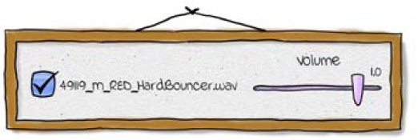
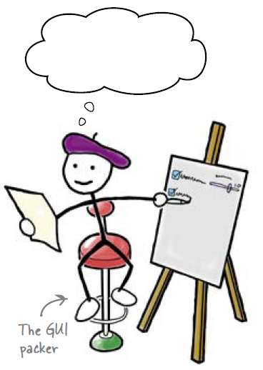
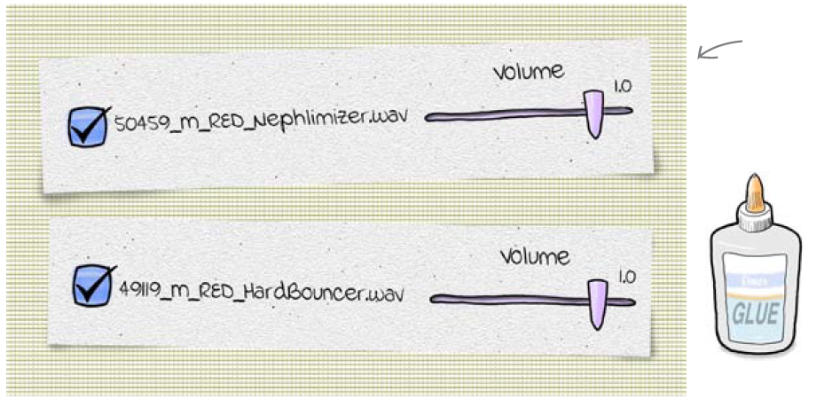
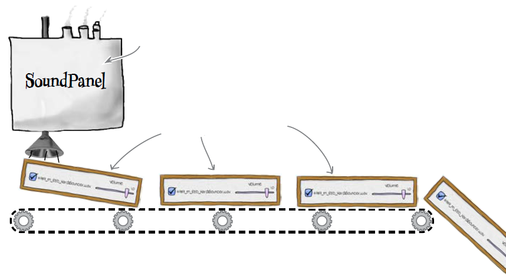
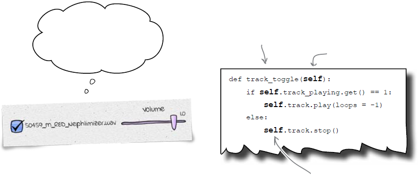
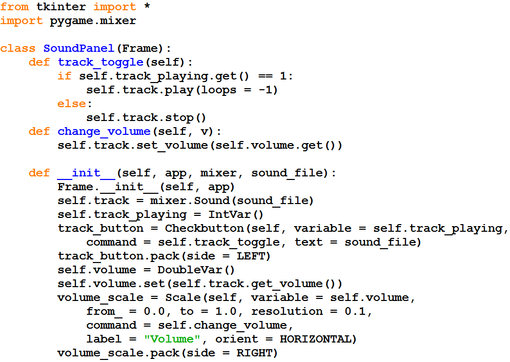
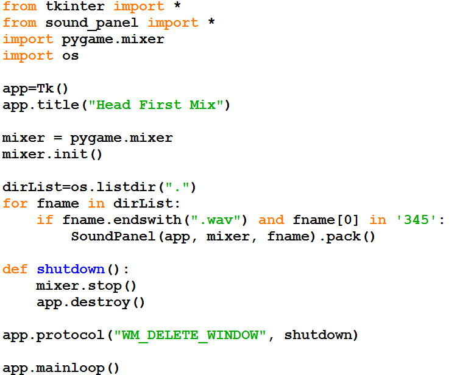

=====================================
DJ Mix 2 Revisão Orientação à Objetos
=====================================

.. image:: img/TWP58_001.jpeg
   :height: 12.501cm
   :width: 7.754cm
   :alt: 

<número>

POO – Programação Orientada à Objetos
=====================================

+ Temos DJ Mix para uma música
+ Agora precisamos para várias
+ KISS – Kept It Simple Stupid
+ Não duplicaremos código!

Programação Orientada à Objetos
===============================

Programação Orientada à Objetos
===============================

Classe = fábrica de objetos
===========================

Programação Orientada à Objetos
===============================

Programação Orientada à Objetos
===============================

Programação Orientada à Objetos
===============================

Parabéns! Agora você sabe criar programas complexos com pouco código

.. image:: img/TWP58_010.png
   :height: 14.125cm
   :width: 19.746cm
   :alt: 

.. image:: img/TWP58_011.png
   :height: 5.45cm
   :width: 3.91cm
   :alt: 

Recordação
==========

+ Classes são fábricas de objetos
+ Classe = métodos + dados
+ Criar objetos = instanciar uma classe
+ class – inicia a definição de uma classe
+ self – atribuído ao objeto corrente
+ __init__() método chamado na criação do objeto

Video Lectures Links:
=====================

.. youtube:: vkysyHaxDnU
      :height: 315
      :width: 560
      :align: left
.. youtube:: SqTpxne2daE
      :height: 315
      :width: 560
      :align: left
.. youtube:: b3UTOJ9k6ws
      :height: 315
      :width: 560
      :align: left
.. youtube:: 34BS1Tj6nNU
      :height: 315
      :width: 560
      :align: left
.. youtube:: NZYF5t-wVdA
      :height: 315
      :width: 560
      :align: left
.. youtube:: elbDnrogsuM
      :height: 315
      :width: 560
      :align: left
.. youtube:: pIQ47HQlCa0
      :height: 315
      :width: 560
      :align: left
.. youtube:: LnBah4wYJP0
      :height: 315
      :width: 560
      :align: left

