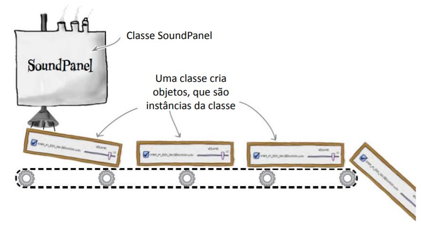
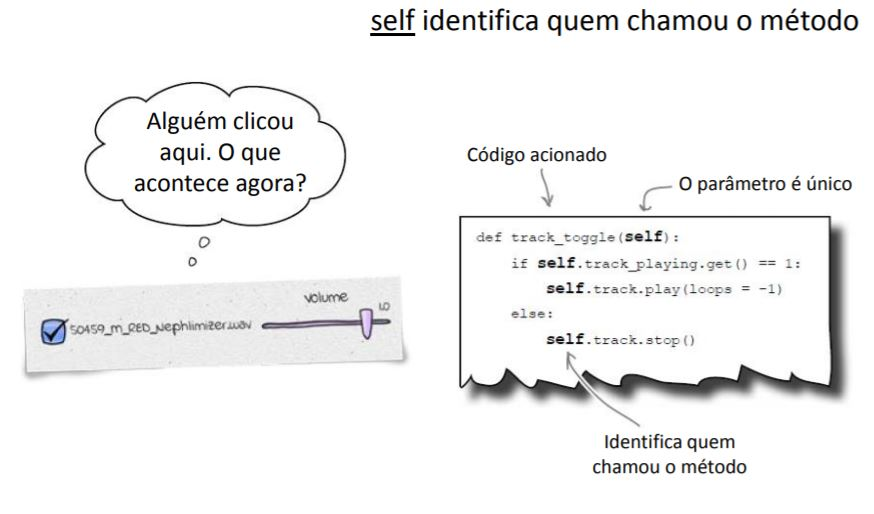

Clase = fábrica de objetos
==========================

Clase SoundPanel
----------------

.. code-block :: python

   from tkinter import *
   import pygame.mixer

   class SoundPanel(Frame):
      def track_toggle(self):
         if self.track_playing.get() == 1:
            self.track.play(loops = -1)
         else:
            self.track.stop()
      def change_volume(self,v):
         self.track.set_volume(self.volume.get())
      def __init__(self,app,mixer,sound_file):
         Frame.__init__(self,app)
         self.track = mixer.Sound(sound_file)
         self.track_playing = IntVar()
         track_button = Checkbutton(self,variable = self.track_playing,command = self.track_toggle,text = sound_file)
         track_button.pack(side = LEFT)
         self.volume = DoubleVar()
         self.volume.set(self.track.get_volume())
         volume_scale = Scale(self,variable = self.volume, from_ = 0.0, to = 1.0, resolution = 0.1, command = self.change_volume, label = "Volume", orient = HORIZONTAL)
         volume_scale.pack(side = RIGHT)

Programa principal
------------------

.. code-block :: python

   from tkinter import *
   from sound_panel import *
   import pygame.mixer
   import os

   app = Tk()
   app.title("Head First Mix")

   mixer = pygame.mixer
   mixer.init()

   dirList = os.listdir(".")
   for fname in dirList:
      if fname.endswith(".wav") and fname[0] in '345':
         SoundPanel(app,mixer,fname).pack()

   def shutdown():
      mixer.stop()
      app.destroy()

   app.protocol("WM_DELETE_WINDOW",shutdown)
   app.mainloop()

+ ¡Felicidades! Ahora sabes cómo crear programas complejos con poco código.

Recuerda
--------

+ Las clases son fábricas de objetos
+ Classe = métodos + datos
+ Crear objetos =  instanciar una clase
+ class – comienza la definición de una clase
+ self – autoasignado al objeto actual
+ __init__() Se llama al crear el objeto
