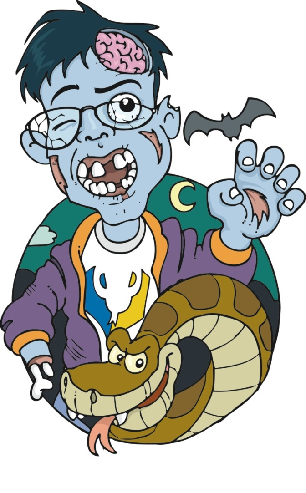
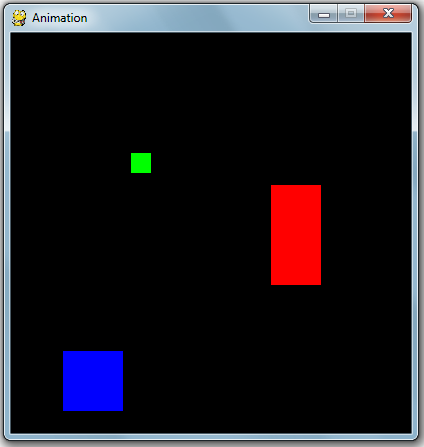
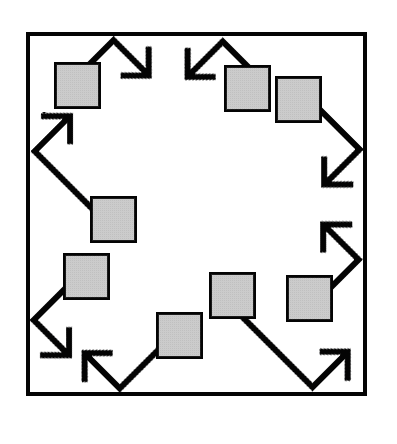
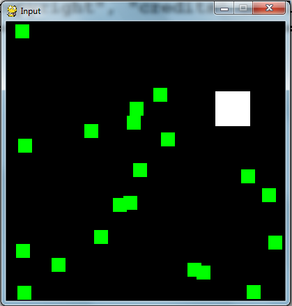

======
Pygame
======

Bibliografía
============

.. image:: img/TWP60_001.jpeg
   :height: 11.25cm
   :width: 9cm
   :align: center
   :alt: 

+ `Book Link <http://inventwithpython.com/>`_ 

.. image:: img/TWP60_002.jpeg
   :height: 6cm
   :width: 5.97cm
   :align: center
   :alt: 

Pygame Hello World
==================

+ No tenemos entrada con input ()
+ Entrada de mouse y teclado a través de eventos
+ Pygame usa tuplas en lugar de listas
+ Las tuplas son listas inmutables, por lo que el procesamiento es más
   eficiente
+ Las tuplas son listas entre paréntesis en lugar de corchetes
+ Ej .: (255, 255, 255)

Pygame Hello World
==================

.. code-block:: python

   import pygame, sys
   from pygame.locals import *

   #set up pygame
   pygame.init()

   #set up the window
   windowSurface = pygame.display.set_mode((500,400),0,32)
   pygame.display.set_caption('Hello world!')

   #set up the colors
   BLACK = (0,0,0)
   WHITE = (255,255,255)
   RED = (255,0,0)
   GREEN = (0,255,0)
   BLUE = (0,0,255)

   #set up fonts
   basicFont = pygame.font.SysFont(None,48)

Pygame Hello World
==================

+ pygame.locals incluiye constantes como QUIT o K_ESCAPE
+ Utilizamos sys.exit() para salir “suavemente” del programa

Pygame Hello World
==================

.. code-block :: python

   #set up the text
   text = basicFont.render('Hello world!',True,WHITE,BLUE)
   textRect = text.get_rect()
   textRect.centerx = windowSurface.get_rect().centerx
   textRect.centery = windowSurface.get_rect().centery

   #draw the white background onto the surface
   windowSurface.fill(WHITE)

   #draw a green polygon onto the surface
   pygame.draw.polygon(windowSurface,GREEN,((146,0),(291,106),(236,277)))

   #draw some blue lies onto the surface
   pygame.draw.line(windowSurface,BLUE,(60,60),(120,60),4)
   pygame.draw.line(windowSurface,BLUE,(120,60),(60,120))
   pygame.draw.line(windowSurface,BLUE,(60,120),(120,120),4)

   #draw a blue circle onto the surface
   pygame.draw.circle(windowSurface,BLUE,(300,50),20,0)

Pygame Hello World
==================

.. image:: img/TWP60_005.png
   :height: 9.727cm
   :width: 10.2cm
   :align: center
   :alt: 

Pygame Hello World
==================

.. code-block::python

   #get a pixel array of the surface
   pixArray = pygame.PixelArray(windowSurface)
   pixArray[480][380] = BLACK
   del pixArray

   #draw the text onto the surface 
   windowSurface.blit(text, textRect)

   #draw the window onto the screen 
   pygame.display.update()

   #run the game loop
   while True:
      for event in pygame.event.get():
         if event.type == QUIT:
            pygame.quit()
            sys.exit()

Pygame Hello World
==================

+ Si no elimino pixArray, estará en estado bloqueado
+ Elimino pixArray para poder manejar el objeto Surface a través del método
   blit ()
+ El blit () solo modifica la memoria, pero para actualizar la pantalla debo
   dar display.update ()
+ No olvides dar pygame.quit ()

Animación Pygame
================

Pygame Animación
================

Pygame Animación
================

.. code-block:: python

   import pygame, sys , time
   from pygame.locals import *

   # set up pygame
   pygame.init()

   # set up the window
   WINDOWWIDTH = 400
   WINDOWHEIGHT = 400
   windowSurface = pygame.display.set_mode((WINDOWWIDNTH,WINDOWHEIGHT),0,32)
   pygame.display.set_caption('Animation')

   # set up the direction variables
   DOWNLEFT = 1
   DOWNRIGHT = 3
   UPLEFT = 7
   UPRIGHT = 9

   MOVESPEED = 4

Pygame Animación
================

.. code-block:: python

   # set up the block data structure
   b1 = {'rect':pygame.Rect(300,80,50,100),'color':RED,'dir':UPRIGHT}
   b2 = {'rect':pygame.Rect(200,200,20,20),'color':BLUE,'dir':UPLEFT}
   b3 = {'rect':pygame.Rect(100,150,60,60),'color':GREEN,'dir':DOWNLEFT}
   blocks = [b1,b2,b3]

+ Tenga en cuenta que en los diccionarios b1, b2 y b3 tengo objetos y direcciones
   incrustado
+ Crea una lista de bloques con los tres diccionarios

Pygame Animación
================

.. code-block:: python

   while True:
      # check for the QUIT event
      for event in pygame.event.get():
         if event.type == QUIT:
            pygame.quit()
            sys.exit()

      # draw the black background onto the surface
      windowSurface.fill(BLACK)

      for b in blocks:
         # move the block data structure
         if b['dir'] == DOWNLEFT:
            b['rect'].left -= MOVESPEED
            b['rect'].top += MOVESPEED

         if b['dir'] == DOWNRIGHT:
            b['rect'].left += MOVESPEED
            b['rect'].top += MOVESPEED

         # check if the block has moved out of the window
         if b['rect'].top < 0:
            # block has moved past the top
            if b['dir'] == UPLEFT:
               b['dir'] = DOWNLEFT
            if b['dir'] == UPRIGHT:
               b['dir'] = DOWNRIGHT

         if b['rect'].bottom > WINDOWHEIGHT:
            # block has moved past the bottom
            if b['dir'] == DOWNLEFT:
               b['dir'] = UPLEFT
            if b['dir'] == DOWNRIGHT:
               b['dir'] = UPRIGHT

         if b['rect'].left < 0:
            # block has moved past the left side
            if b['dir'] == DOWNLEFT:
               b['dir'] = DOWNRIGHT
            if b['dir'] == UPLEFT:
               b['dir'] = UPRIGHT

         if b['rect'].right > WINDOWWIDTH:
            # block has moved past the right side
            if b['dir'] == DOWNRIGHT:
               b['dir'] = DOWNLEFT
            if b['dir'] == UPRIGHT:
               b['dir'] = UPLEFT

         # draw the block onto the surface
         pygame.draw.rect(windowSurface, b['color'],b['rect'])

      # draw the window onto the screen
      pygame.display.update()
      time.sleep(0.02)

Pygame Collision Detection
==========================

.. image:: img/TWP60_014.png
   :height: 8.492cm
   :width: 12.117cm
   :align: center
   :alt: 

Pygame Collision Detection
==========================

.. image:: img/TWP60_015.png
   :height: 7.381cm
   :width: 11.244cm
   :align: center
   :alt: 

Pygame Collision Detection
==========================

.. code-block:: python

   def doRectsOverlap(rect1,rect2):
      for a,b in [(rect1,rect2),(rect2,rect1)]:
         # Check if a's corners are inside b
         if ((isPointInsideRect(a.left,a.top,b)) or (isPointInsideRect(a.left,a.bottom,b)) or (isPointInsideRect(a.right,a.top,b)) or (isPointInsideRect(a.right,a.bottom,b))):
            return True

      return False

   def isPointInsideRect(x,y,rect):
      if (x > rect.left) and (x < rect.right) and (y > rect.top) and (y < rect.bottom):
         return True
      else:
         return False

Pygame Input
============

Pygame Input
============

.. code-block:: python
   
   import pygame, sys, random
   from pygame.locals import *

   # set up pygame
   pygame.init()
   mainClock = pygame.time.Clock()

   # set up the window
   WINDOWWIDTH = 400
   WINDOWHEIGHT = 400
   windowSurface = pygame.display.set_mode((WINDOWWIDTH,WINDOWHEIGHT),0,32)
   pygame.display.set_caption('Input')

   # set up the colors
   BLACK = (0,0,0)
   GREEN = (0,255,0)
   WHITE = (255,255,255)

   # set up the player and food data structure
   foodCounter = 0
   NEWFOOD = 40
   FOODSIZE = 20
   player = pygame.Rect(300,100,50,50)

   foods = []
   for i in range(20):
      foods.append(pygame.Rect(random.randint(0,WINDOWWIDTH - FOODSIZE),random.randint(0,WINDOWHEIGHT - FOODSIZE),FOODSIZE,FOODSIZE))

   # set up the movement variables

   moveLeft = False
   moveRight = False
   moveUp = False
   moveDown = False

   MOVESPEED = 6

   while True:
      # check for events
      for event in pygame.event.get():
         if event.type == QUIT:
            pygame.quit()
            sys.exit()
         if event.type == KEYDOWN:
            # change the keyboard variables
            if event.key == K_LEFT or event.key == ord('a'):
               moveRight = False
               moveLeft = True
            if event.key == K_RIGHT or event.key == ord('d'):
               moveLeft = False
               moveRight = True
            if event.key == K_UP or event.key == ord('w'):
               moveDown = False
               moveUp = True

   # draw the player onto the surface
   pygame.draw.rect(windowSurface,WHITE,player)

   # check if the player has intersected with any food squares.
   for food in foods[:]:
      if player.colliderect(food):
         foods.remove(food)

   # draw the food
   for i in range(len(foods)):
      pygame.draw.rect(windowSurface,GREEN,foods[i])

   # draw the window onto the screen
   pygame.display.update()
   mainClock.tick(40)

Sounds and Sprites
==================

.. image:: img/TWP60_022.png
   :height: 6.164cm
   :width: 13.202cm
   :align: center
   :alt: 

.. image:: img/TWP60_023.png
   :height: 11.561cm
   :width: 13.546cm
   :align: center
   :alt: 

Sounds and Sprites
==================

.. code-block:: python

   # set up the block data structure
   player = pygame.Rect(300,100,40,40)
   playerImage = pygame.image.load('player.png')
   plyaerStretchedImage = pygame.transform.scale(playerImage(40,40))
   foodImage = pygame.image.load('cherry.png')
   foods = []
   for i in range(20):
      foods.append(pygame.Rect(random.randint(0,WINDOWWIDTH - 20),random.randint(0,WINDOWHEIGHT - 20),20,20))

+ Player.png aparece en la escala deseada
+ Genero aleatoriamente 20 cerezas iniciales

Sounds and Sprites
==================

.. code-block:: python

   # set up music

   pickUpSound = pygame.mixer.Sound('pickup.wav')
   pygame.mixer.music.load('background.mid')
   pygame.mixer.music.play(-1,0.0)
   musicPlaying = True

+ Uso dos canales, uno para música de fondo y uno para cada
   cereza escogida

Sounds and Sprites
==================

.. code-block:: python

   if event.key == ord('m'):
      if musicPlaying:
         pygame.mixer.music.stop()
      else:
         pygame.mixer.music.play(-1,0,0)
      musicPlaying = not musicPlaying

   if event.type == MOUSEBUTTONUP:
      foods.append(pygame.Rect(event.pos[0]-10,event.pos[1] - 10,20,20))

+ Tecla ‘m’ pausa o fundo musical e o click do mouse planta uma
  cerejinha na posição clicada

Sounds and Sprites
==================

.. code-block:: python
   
   foodCounter += 1
   if foodCounter >= NEWFOOD:
      #add new food
      foodCounter = 0
      foods.append(pygame.Rect(random.randint(0,WINDOWWIDTH-20),random.randint(0,WINDOWHEIGHT - 20),20,20))

+ Las cerezas se generan aleatoriamente con cada pasada en el bucle.
   principal

Sounds and Sprites
==================

.. code-block:: python

   # check if the block has intersected with any food squares.
   for food in foods[:]:
      if player.colliderect(food):
         foods.remove(food)
         player = pygame.Rect(player.left,player.top,player.right,player.down)
         playerStretchedImage = pygame.transform.scale(player.left,player.top,player.right,player.down)
         if musicPlaying:
            pickUpSound.play()

   # draw the food
   for food in foods:
      windowSurface.blit(foodImage,food)

+ Removo cerejas “comidas”, claro engordando!
+ Todas as “blitadas” aparecem no update

Sounds and Sprites
==================

+ FPS == Frames Per Second
+ Variável que controla o mainClock.tick()
+ Os monstrinhos possuem um tamanho mínimo e máximo e sua velocidade é
  controlada

Sounds and Sprites
==================

.. code-block:: python

   if baddieAddCounter == ADDNEWBADDIERATE:
      baddieAddCounter = 0
      baddieSize = random.randint(BADDIEMINSIZE,BADDIEMAXSIZE)
      newBaddie = {'rect':pygame.Rect(random.randint(0,WINDOWWIDTH-baddieSize),0-baddieSize,baddieSize,baddieSize),'speed':random.randint(BADDIEMINSPEED,BADDIEMAXSPEED),'surface':pygame.transform.scale(baddieImage,(baddieSize,baddieSize))}

      baddies.append(newBaddie)

.. disqus::
   :shortname: pyzombis
   :identifier: lecture23

