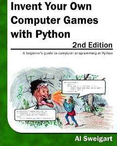
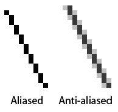

Pygame Hello World
==================

Bibliografía
------------

+ `Book Link <http://inventwithpython.com/>`_ 

Pygame Hello World
------------------

+ No tenemos entrada con input ()
+ Entrada de mouse y teclado a través de eventos
+ Pygame usa tuplas en lugar de listas
+ Las tuplas son listas inmutables, por lo que el procesamiento es más
   eficiente
+ Las tuplas son listas entre paréntesis en lugar de corchetes
+ Ej .: (255, 255, 255)

.. code-block:: python

   import pygame, sys
   from pygame.locals import *

   #set up pygame
   pygame.init()

   #set up the window
   windowSurface = pygame.display.set_mode((500,400),0,32)
   pygame.display.set_caption('Hello world!')

   #set up the colors
   BLACK = (0,0,0)
   WHITE = (255,255,255)
   RED = (255,0,0)
   GREEN = (0,255,0)
   BLUE = (0,0,255)

   #set up fonts
   basicFont = pygame.font.SysFont(None,48)

+ pygame.locals incluiye constantes como QUIT o K_ESCAPE
+ Utilizamos sys.exit() para salir “suavemente” del programa

.. code-block :: python

   #set up the text
   text = basicFont.render('Hello world!',True,WHITE,BLUE)
   textRect = text.get_rect()
   textRect.centerx = windowSurface.get_rect().centerx
   textRect.centery = windowSurface.get_rect().centery

   #draw the white background onto the surface
   windowSurface.fill(WHITE)

   #draw a green polygon onto the surface
   pygame.draw.polygon(windowSurface,GREEN,((146,0),(291,106),(236,277)))

   #draw some blue lies onto the surface
   pygame.draw.line(windowSurface,BLUE,(60,60),(120,60),4)
   pygame.draw.line(windowSurface,BLUE,(120,60),(60,120))
   pygame.draw.line(windowSurface,BLUE,(60,120),(120,120),4)

   #draw a blue circle onto the surface
   pygame.draw.circle(windowSurface,BLUE,(300,50),20,0)

.. code-block::python

   #get a pixel array of the surface
   pixArray = pygame.PixelArray(windowSurface)
   pixArray[480][380] = BLACK
   del pixArray

   #draw the text onto the surface 
   windowSurface.blit(text, textRect)

   #draw the window onto the screen 
   pygame.display.update()

   #run the game loop
   while True:
      for event in pygame.event.get():
         if event.type == QUIT:
            pygame.quit()
            sys.exit()

+ Si no elimino pixArray, estará en estado bloqueado
+ Elimino pixArray para poder manejar el objeto Surface a través del método
   blit ()
+ El blit () solo modifica la memoria, pero para actualizar la pantalla debo
   dar display.update ()
+ No olvides dar pygame.quit ()
