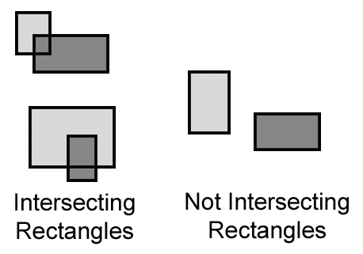
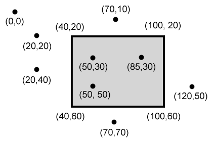

Pygame Collision Detection
==========================

.. code-block:: python

   def doRectsOverlap(rect1,rect2):
      for a,b in [(rect1,rect2),(rect2,rect1)]:
         # Check if a's corners are inside b
         if ((isPointInsideRect(a.left,a.top,b)) or (isPointInsideRect(a.left,a.bottom,b)) or (isPointInsideRect(a.right,a.top,b)) or (isPointInsideRect(a.right,a.bottom,b))):
            return True

      return False

   def isPointInsideRect(x,y,rect):
      if (x > rect.left) and (x < rect.right) and (y > rect.top) and (y < rect.bottom):
         return True
      else:
         return False
