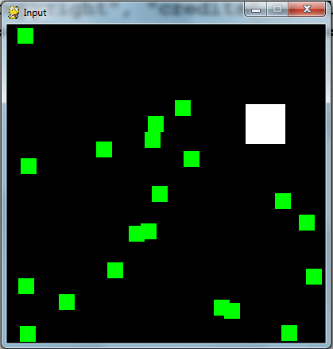

Pygame Input
============

.. activecode:: ac_l60_4
    :language: python3
    :python3_interpreter: brython

    from browser import load, document,timer
    load('../../_static/game.js')
    load('../../_static/pygame.brython.js')

    ^^^^
    import pygame, sys, random
    from pygame.locals import *
 
    # set up pygame
    pygame.init()
    gamejs = window.gamejs
    gamejs.ready()
 
    # set up the window
    WINDOWWIDTH = 500
    WINDOWHEIGHT = 300
    windowSurface = pygame.display.set_mode((WINDOWWIDTH,WINDOWHEIGHT),0,32)
    #pygame.display.set_caption('Input')
 
    # set up the colors
    BLACK = pygame.color.Color(0,0,0)
    GREEN = pygame.color.Color(0,255,0)
    WHITE = pygame.color.Color(255,255,255)
 
    # set up the player and food data structure
    foodCounter = 0
    NEWFOOD = 40
    FOODSIZE = 20
    player = pygame.Rect(300,100,50,50)
 
    foods = []
    for i in range(20):
       foods.append(pygame.Rect(random.randint(0,WINDOWWIDTH - FOODSIZE),random.randint(0,WINDOWHEIGHT - FOODSIZE),FOODSIZE,FOODSIZE))
 
    # set up the movement variables
 
    moveLeft = False
    moveRight = False
    moveUp = False
    moveDown = False
 
    MOVESPEED = 6
 
    def func():
       windowSurface.fill(BLACK)
       # check for events
       global moveLeft, moveRight, moveUp, moveDown
       for event in pygame.event.get():
          if event.type == KEYDOWN:
                # change the keyboard variables
                if event.key == K_LEFT or event.key == ord('a'):
                   moveRight = False
                   moveLeft = True
                if event.key == K_RIGHT or event.key == ord('d'):
                   moveLeft = False
                   moveRight = True
                if event.key == K_UP or event.key == ord('w'):
                   moveDown = False
                   moveUp = True    
                if event.key == K_DOWN or event.key == ord('s'):
                   moveDown = True
                   moveUp = False
       if moveRight:
          player.left += MOVESPEED 
       if moveLeft:
          player.left -= MOVESPEED
       if moveUp:
          player.top -= MOVESPEED
       if moveDown:
          player.top += MOVESPEED
                
       pygame.draw.rect(windowSurface,WHITE,player)
 
       # check if the player has intersected with any food squares.
       for food in foods[:]:
          if player.colliderect(food):
             foods.remove(food)
 
       # draw the food
       for i in range(len(foods)):
          pygame.draw.rect(windowSurface,GREEN,foods[i])
 
       # draw the window onto the screen
       pygame.display.update()
 
       
    timer.set_interval(func,30)

.. code-block:: python
   
   import pygame, sys, random
   from pygame.locals import *

   # set up pygame
   pygame.init()
   mainClock = pygame.time.Clock()

   # set up the window
   WINDOWWIDTH = 400
   WINDOWHEIGHT = 400
   windowSurface = pygame.display.set_mode((WINDOWWIDTH,WINDOWHEIGHT),0,32)
   pygame.display.set_caption('Input')

   # set up the colors
   BLACK = (0,0,0)
   GREEN = (0,255,0)
   WHITE = (255,255,255)

   # set up the player and food data structure
   foodCounter = 0
   NEWFOOD = 40
   FOODSIZE = 20
   player = pygame.Rect(300,100,50,50)

   foods = []
   for i in range(20):
      foods.append(pygame.Rect(random.randint(0,WINDOWWIDTH - FOODSIZE),random.randint(0,WINDOWHEIGHT - FOODSIZE),FOODSIZE,FOODSIZE))

   # set up the movement variables

   moveLeft = False
   moveRight = False
   moveUp = False
   moveDown = False

   MOVESPEED = 6

   while True:
      # check for events
      for event in pygame.event.get():
         if event.type == QUIT:
            pygame.quit()
            sys.exit()
         if event.type == KEYDOWN:
            # change the keyboard variables
            if event.key == K_LEFT or event.key == ord('a'):
               moveRight = False
               moveLeft = True
            if event.key == K_RIGHT or event.key == ord('d'):
               moveLeft = False
               moveRight = True
            if event.key == K_UP or event.key == ord('w'):
               moveDown = False
               moveUp = True

   # draw the player onto the surface
   pygame.draw.rect(windowSurface,WHITE,player)

   # check if the player has intersected with any food squares.
   for food in foods[:]:
      if player.colliderect(food):
         foods.remove(food)

   # draw the food
   for i in range(len(foods)):
      pygame.draw.rect(windowSurface,GREEN,foods[i])

   # draw the window onto the screen
   pygame.display.update()
   mainClock.tick(40)
