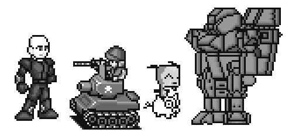
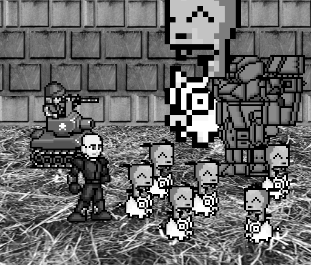

Sounds and Sprites
==================

.. code-block:: python

   # set up the block data structure
   player = pygame.Rect(300,100,40,40)
   playerImage = pygame.image.load('player.png')
   plyaerStretchedImage = pygame.transform.scale(playerImage(40,40))
   foodImage = pygame.image.load('cherry.png')
   foods = []
   for i in range(20):
      foods.append(pygame.Rect(random.randint(0,WINDOWWIDTH - 20),random.randint(0,WINDOWHEIGHT - 20),20,20))

+ Player.png aparece en la escala deseada
+ Genero aleatoriamente 20 cerezas iniciales

.. code-block:: python

   # set up music

   pickUpSound = pygame.mixer.Sound('pickup.wav')
   pygame.mixer.music.load('background.mid')
   pygame.mixer.music.play(-1,0.0)
   musicPlaying = True

+ Uso dos canales, uno para música de fondo y uno para cada
   cereza escogida

.. code-block:: python

   if event.key == ord('m'):
      if musicPlaying:
         pygame.mixer.music.stop()
      else:
         pygame.mixer.music.play(-1,0,0)
      musicPlaying = not musicPlaying

   if event.type == MOUSEBUTTONUP:
      foods.append(pygame.Rect(event.pos[0]-10,event.pos[1] - 10,20,20))

+ Tecla ‘m’ pausa o fundo musical e o click do mouse planta uma
  cerejinha na posição clicada

.. code-block:: python
   
   foodCounter += 1
   if foodCounter >= NEWFOOD:
      #add new food
      foodCounter = 0
      foods.append(pygame.Rect(random.randint(0,WINDOWWIDTH-20),random.randint(0,WINDOWHEIGHT - 20),20,20))

+ Las cerezas se generan aleatoriamente con cada pasada en el bucle.
   principal

.. code-block:: python

   # check if the block has intersected with any food squares.
   for food in foods[:]:
      if player.colliderect(food):
         foods.remove(food)
         player = pygame.Rect(player.left,player.top,player.right,player.down)
         playerStretchedImage = pygame.transform.scale(player.left,player.top,player.right,player.down)
         if musicPlaying:
            pickUpSound.play()

   # draw the food
   for food in foods:
      windowSurface.blit(foodImage,food)

+ Removo cerejas “comidas”, claro engordando!
+ Todas as “blitadas” aparecem no update
+ FPS == Frames Per Second
+ Variável que controla o mainClock.tick()
+ Os monstrinhos possuem um tamanho mínimo e máximo e sua velocidade é
  controlada

.. code-block:: python

   if baddieAddCounter == ADDNEWBADDIERATE:
      baddieAddCounter = 0
      baddieSize = random.randint(BADDIEMINSIZE,BADDIEMAXSIZE)
      newBaddie = {'rect':pygame.Rect(random.randint(0,WINDOWWIDTH-baddieSize),0-baddieSize,baddieSize,baddieSize),'speed':random.randint(BADDIEMINSPEED,BADDIEMAXSPEED),'surface':pygame.transform.scale(baddieImage,(baddieSize,baddieSize))}

      baddies.append(newBaddie)
