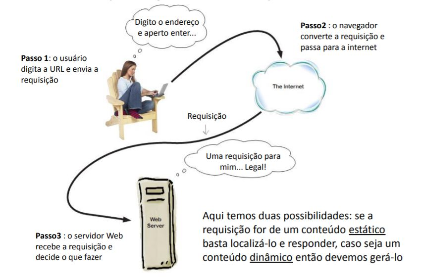

=========================
Desenvolvimento Web Intro
=========================

.. image:: img/TWP10_001.jpeg
   :height: 14.925cm
   :width: 9.258cm
   :align: center
   :alt: 

Requisições e respostas
=======================

.. image:: img/TWP65_002.jpg
   :height: 16.017cm
   :width: 15.601cm
   :align: center
   :alt: 

Desenvolvimento Web
===================

+ “Python: a única linguagem com mais frameworks web do que keywords”
+ Frameworks: Plone, Django, Web2py, Pyramid
+ Micro Frameworks: CherryPy, Bottle, Flask
+ WSGI (Web Server Gateway Interface)

  + Padrões de acesso e comunicação entre servidores Web e aplicações Python
  + Não é J2EE ;-)

Web2py
======

+ InfoWorld: best full-stack Python framework
+ Bossie: Best Open Source Development Software
+ MVC:

  + Modelo: dados
  + Controladores: regras do negócio
  + Visões: apresentação

+ Autocontido == full-stack framework
+ Seguro
+ DAL (Data Access Layer)
+ Deploy rápido e distribuição fácil

Web2py
======

+ Princípios Python

  + DRY – Don’t Repeat Yourself
  + Deve existir apenas uma única maneira óbvia de fazer algo
  + Explícito é melhor que implícito (não segue)

Hello World
===========

+ Habilitar a opção “Não usar servidor proxy para servidores locais”
+ web2py.exe no diretório descompactado
+ Definir uma senha para administrador
+ Clicar em “Administrative Interface”
+ Coloque a senha que você definiu
+ Três opções: admin, examples e welcome
+ Depois iremos aprender a utilizar appliances

Hello World
===========

+ Nova aplicação básica: “Hello World”
+ Editar o controlador default.py

.. code-block:: python

  def index():
    return "Minha primeira mensagem"

+ ctrl+S
+ Voltar e clicar no Hello World

Hello World
===========

+ Editar novamente o controlador default.py

.. code-block:: python
    
  def index():
    return dict(msg="FATEC SJC")

+ ctrl+S
+ Agora vamos editar a visão default/index

Hello World
===========

+ Apagar tudo e trocar na visão default/index

.. code-block:: html

  <html>

    <head></head>

    <body>

      <h1>{{=msg}}</h1>

    </body>

  </html>

+ ctrl+S

Contar visitantes
=================

+ Editar controlador default.py

.. code-block:: python
  

  def index():

    if not session.counter:

      session.counter = 1

    else:

      session.counter += 1

    return dict(msg="Python Zumbi", cont=session.counter)

Contar visitantes
=================

+ Visão default/index

.. code-block:: html

  <html>

    <head></head>

    <body>

      <h1>{{=msg}}</h1>

      <h2>Visitantes: {{=cont}}</h2>

    </body>

  </html>

+ Visitantes diferentes possuem contadores diferentes

Duas páginas
============

+ Iremos criar duas páginas
+ A primeira solicita o nome em um formulário
+ Seremos então redirecionados para a segunda
+ A segunda irá dar uma saudação com o nome

Duas páginas
============

+ Incluir no controlador default.py

.. code-block:: python

  def primeira():

    return dict()

  def segunda():

    return dict()

Duas páginas
============

+ Criar a visão default/primeira

{{extend 'layout.html'}}

Qual é o seu nome?

<form action="segunda">

<input name="nome" />

<input type="submit" />

</form>

Duas páginas
============

+ Criar a visão default/segunda

{{extend 'layout.html'}}

<h1>Olá {{=request.vars.nome}}</h1>

Appliances
==========

+ `Web2py Appliances <http://www.web2py.com/appliances>`_
+ Email Contact Form
+ Sudoku Solver
+ Train Counter Game
+ Quiz Builder
+ EcardsOnMap (é grande...)

.. disqus::
   :shortname: pyzombis
   :identifier: lecture24
